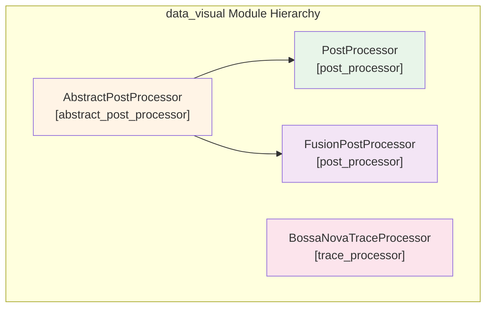
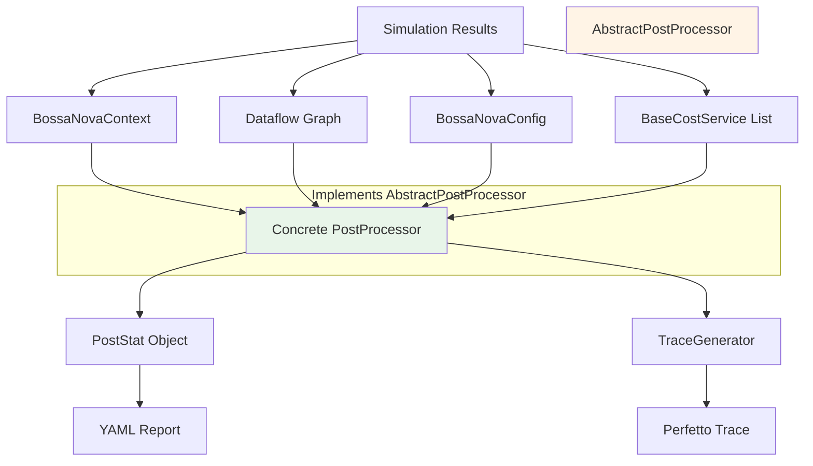
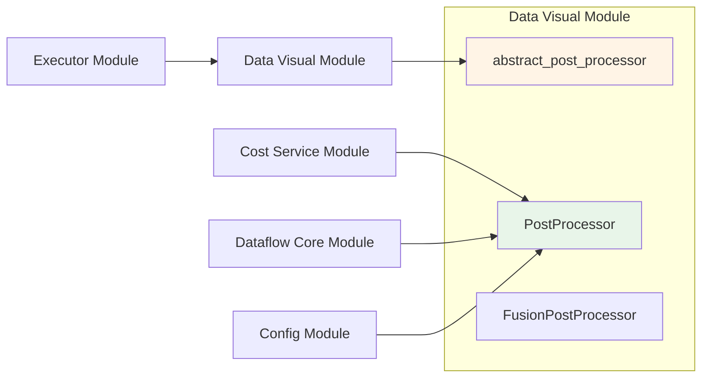
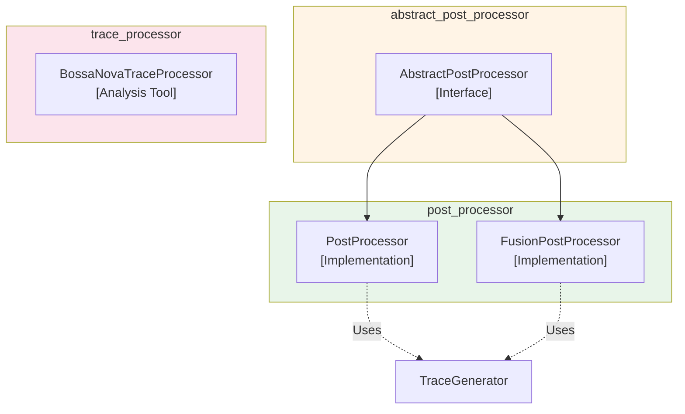
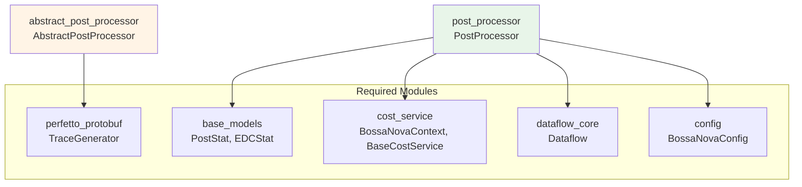

# Abstract Post Processor Module

## Overview

The `abstract_post_processor` module defines the foundational interface for post-processing simulation results in the Nova Platform. It provides the abstract base class `AbstractPostProcessor` that establishes the contract for all concrete post-processor implementations.

This module is part of the larger [data_visual](data_visual.md) module hierarchy and serves as the entry point for the post-processing pipeline, enabling standardized access to trace generation capabilities across different post-processor implementations.

## Module Context

The abstract_post_processor module sits at the top of the post-processing hierarchy:



## Architecture

### Core Component

#### AbstractPostProcessor

**File**: `nova-platform/nova_platform/data_visual/__init__.py`

**Purpose**: Defines the interface contract for all post-processor implementations.

**Key Method**:
- `get_trace_generator() -> TraceGenerator`: Returns the trace generator instance used for creating Perfetto-compatible trace files

**Design Pattern**: This class uses the **Template Method** pattern, where the interface is defined but concrete implementations provide the actual behavior.

```python
class AbstractPostProcessor:
    def get_trace_generator(self) -> TraceGenerator:
        raise NotImplementedError()
```

## Implementation Hierarchy

The abstract_post_processor module is implemented by two concrete classes in the [post_processor](post_processor.md) module:

### 1. PostProcessor
- **Purpose**: Single-GCU post-processing
- **Responsibilities**:
  - Calculate performance statistics (latency, utilization, bandwidth)
  - Generate Perfetto trace files
  - Prepare key frames for visualization
  - Aggregate service-specific reports
  - Analyze power consumption and EDC metrics

### 2. FusionPostProcessor
- **Purpose**: Multi-GCU result fusion
- **Responsibilities**:
  - Merge statistics from multiple GCUs
  - Combine EDC reports across devices
  - Aggregate service reports
  - Generate unified fusion reports

## Data Flow



## Dependencies

### Required Components

The abstract_post_processor module depends on the following modules and components:

#### 1. perfetto_protobuf Module
- **TraceGenerator**: `nova-platform.nova_platform.perfetto_protobuf._tgen.TraceGenerator`
- **Purpose**: Provides the interface for generating Perfetto-compatible trace files
- **Usage**: Returned by `get_trace_generator()` method

#### 2. base_models Module
- **PostStat**: `nova-platform.nova_platform.base_model.PostStat`
- **EDCStat**: `nova-platform.nova_platform.base_model.EDCStat`
- **Purpose**: Data structures for storing post-processing statistics
- **Usage**: Used by concrete implementations to store and return results

#### 3. cost_service Module
- **BossaNovaContext**: `nova-platform.nova_platform.cost_service.compute.base_compute_model.BossaNovaContext`
- **BaseCostService**: `nova-platform.nova_platform.cost_service.compute.base_compute_model.BaseCostService`
- **Purpose**: Provides simulation context and cost data
- **Usage**: Input to concrete post-processors

#### 4. dataflow_core Module
- **Dataflow**: `nova-platform.nova_platform.dataflow.dataflow.Dataflow`
- **Purpose**: Execution graph structure
- **Usage**: Input to concrete post-processors

#### 5. config Module
- **BossaNovaConfig**: `nova-platform.nova_platform.config.BossaNovaConfig`
- **Purpose**: System configuration
- **Usage**: Input to concrete post-processors

## Integration Points

### Upstream Dependencies



### Downstream Consumers

- **PostProcessor**: Uses `AbstractPostProcessor` as base class
- **FusionPostProcessor**: Uses `AbstractPostProcessor` as base class
- **BossaNovaTraceProcessor**: Independent trace processor in the same module hierarchy

## Usage Pattern

The abstract_post_processor module is not used directly but provides the foundation for concrete implementations:

```python
from nova_platform.data_visual import AbstractPostProcessor
from nova_platform.data_visual.post_processor import PostProcessor

# Concrete implementation
processor = PostProcessor(outdir="./results")

# Interface method from AbstractPostProcessor
trace_gen = processor.get_trace_generator()

# Use trace generator
report = processor.generate_report(
    context=bossa_context,
    dataflow=dataflow,
    config=config,
    service_list=[compute_svc, cache_svc, power_svc]
)
```

## Design Principles

### 1. Interface Segregation
The abstract class provides a minimal interface (`get_trace_generator()`) that all implementations must satisfy, while allowing flexibility in other methods.

### 2. Extensibility
New post-processor implementations can be added without modifying existing code, following the Open/Closed Principle.

### 3. Consistency
All post-processors share a common interface, enabling polymorphic usage in higher-level code.

## Module Relationships

### Within data_visual Module



### Cross-Module Dependencies



## Key Features

### 1. Minimal Interface
- Single method requirement: `get_trace_generator()`
- Easy to implement and extend

### 2. Trace Generation Access
- Provides standardized access to trace generation capabilities
- Enables performance visualization across implementations

### 3. Foundation for Specialization
- Supports both single-GCU and multi-GCU processing
- Enables specialized implementations for different scenarios

## Implementation Details

### File Structure

```
nova-platform/nova_platform/data_visual/
├── __init__.py              # AbstractPostProcessor definition
├── post_processor.py        # PostProcessor & FusionPostProcessor
└── trace_post_processor.py  # BossaNovaTraceProcessor
```

### Class Hierarchy

```
AbstractPostProcessor (abstract base class)
├── PostProcessor (concrete implementation)
└── FusionPostProcessor (concrete implementation)
```

## Best Practices

### When to Extend AbstractPostProcessor

1. **New Processing Strategy**: When implementing a different post-processing algorithm
2. **Custom Output Format**: When generating reports in different formats (JSON, CSV, etc.)
3. **Specialized Analysis**: When adding domain-specific analysis capabilities
4. **Performance Optimization**: When optimizing for specific workload patterns

### Implementation Guidelines

1. **Implement Required Methods**: Always implement `get_trace_generator()`
2. **Maintain Compatibility**: Follow the established interface patterns
3. **Document Behavior**: Clearly document any deviations from standard behavior
4. **Test Thoroughly**: Ensure compatibility with existing consumers

## Related Documentation

- [data_visual.md](data_visual.md) - Parent module overview
- [post_processor.md](post_processor.md) - Concrete implementations
- [trace_processor.md](trace_processor.md) - Trace analysis tools
- [cost_service.md](cost_service.md) - Input data sources
- [base_models.md](base_models.md) - Data structures

## Future Enhancements

Potential extensions to the abstract interface:

1. **Additional Interface Methods**:
   - `get_report_formatter()` - For custom report formatting
   - `get_analyzer()` - For specialized analysis tools

2. **Configuration Support**:
   - `configure(**kwargs)` - For runtime configuration

3. **Validation Methods**:
   - `validate_input()` - For input data validation
   - `validate_output()` - For output data verification

## Summary

The abstract_post_processor module provides the foundational interface for the Nova Platform's post-processing capabilities. By defining a minimal, focused contract through `AbstractPostProcessor`, it enables flexible and extensible implementations while maintaining consistency across the system. This design supports both single-GCU and multi-GCU scenarios, making it a critical component in the simulation and analysis pipeline.
