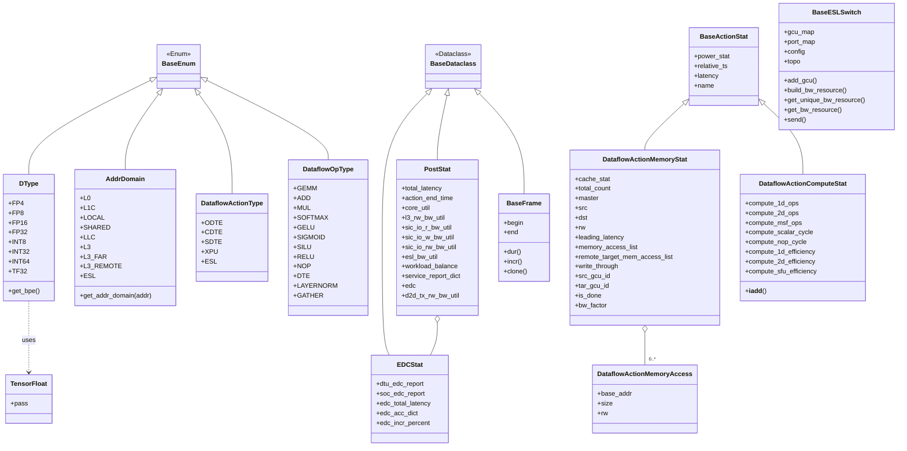
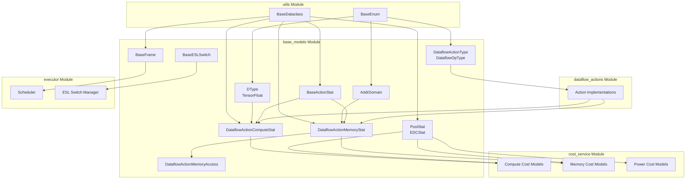
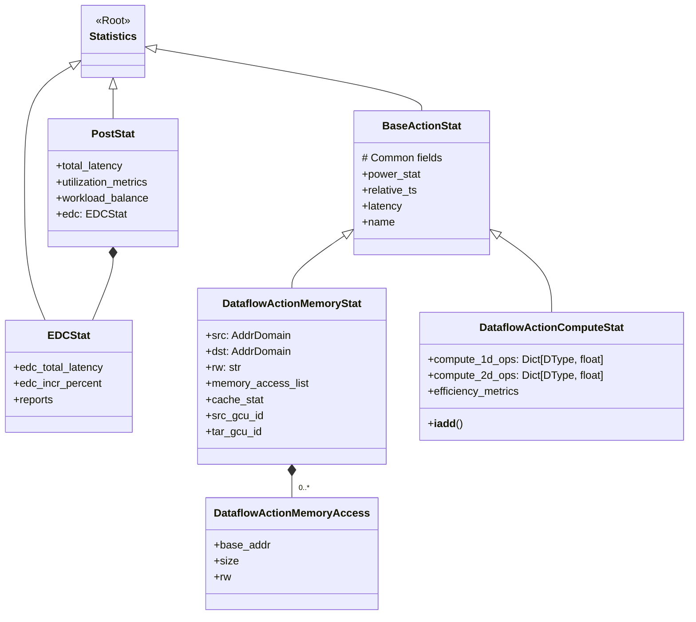
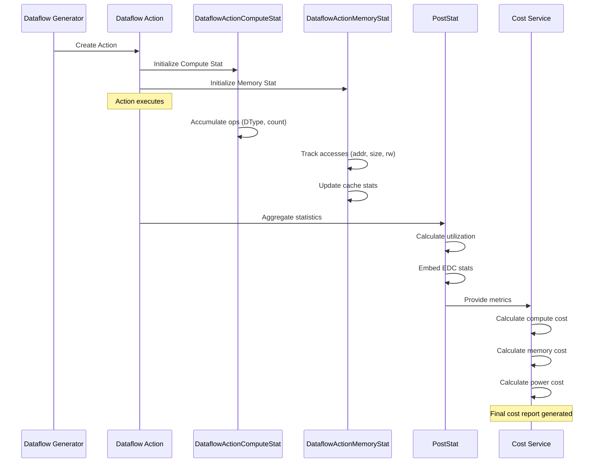
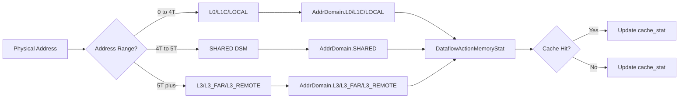
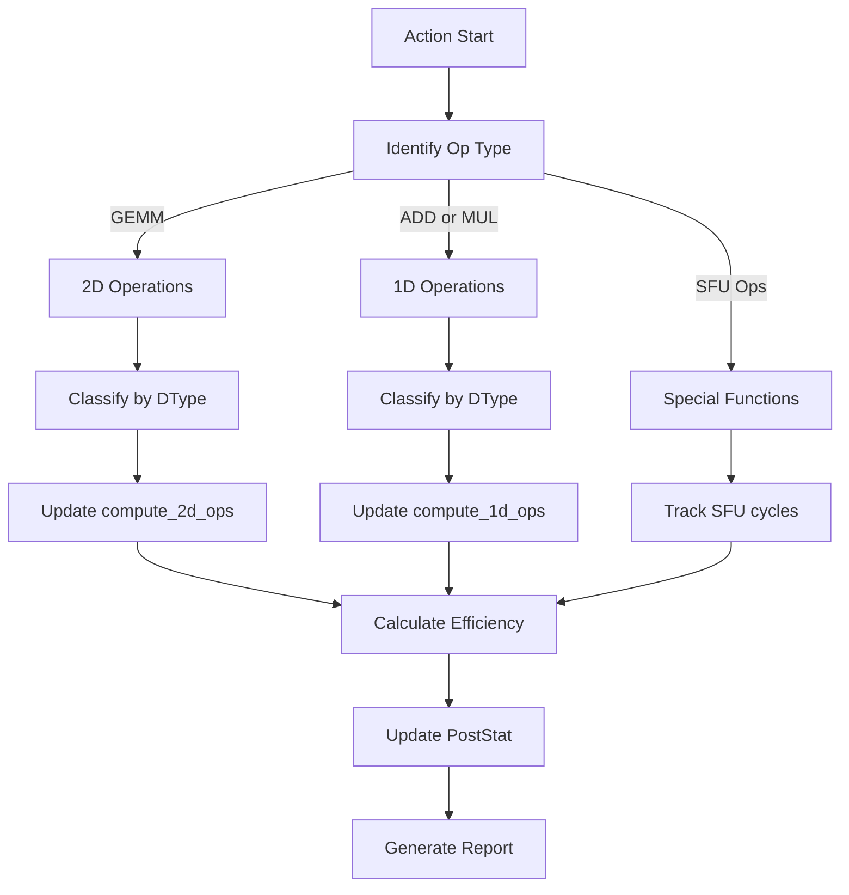

# Base Models Module

## Overview

The `base_models` module serves as the foundational data model layer for the Nova Platform system. It defines core enumerations, data structures, and abstract base classes that are used throughout the platform for representing computational operations, memory domains, statistics, and hardware abstractions.

This module provides the essential building blocks for:
- Data type definitions and their properties
- Memory address domain classification
- Dataflow operation types and actions
- Statistical tracking for compute and memory operations
- ESL (Edge Switch Layer) hardware abstraction

## Architecture

The module is organized around several key conceptual areas:

### 1. **Type System** (`DType`, `TensorFloat`)
Defines data types used in computational operations with their byte-per-element (BPE) characteristics.

### 2. **Memory Domains** (`AddrDomain`)
Classifies memory address spaces across different cache levels and interconnect fabrics.

### 3. **Operation Classification** (`DataflowActionType`, `DataflowOpType`)
Categorizes different types of dataflow operations and computational primitives.

### 4. **Statistical Models** (`BaseActionStat`, `DataflowActionMemoryStat`, `DataflowActionComputeStat`, `PostStat`, `EDCStat`)
Provides data structures for tracking performance metrics, memory access patterns, and compute statistics.

### 5. **Temporal Framework** (`BaseFrame`)
Defines time-based intervals for scheduling and analysis.

### 6. **Hardware Abstraction** (`BaseESLSwitch`)
Abstract interface for ESL switch management and bandwidth resource allocation.

### Module Architecture Diagram



### Module Dependency Flow



### Statistical Model Hierarchy



## Component Details

### Type System

#### `TensorFloat`
```python
class TensorFloat:
    pass
```
Placeholder class for tensor floating-point operations. Used as a type marker in the `DType` enum.

#### `DType` (Enum)
```python
class DType(BaseEnum):
    FP4 = (float, 0.5)
    FP8 = (float, 1)
    FP16 = (float, 2)
    FP32 = (float, 4)
    INT8 = (int, 2)
    INT32 = (int, 4)
    INT64 = (int, 8)
    TF32 = (TensorFloat, 4)
```

**Purpose**: Defines supported data types with their byte-per-element (BPE) values.

**Properties**:
- Each enum value is a tuple of `(python_type, bytes_per_element)`
- `get_bpe()`: Returns the byte-per-element value

**Usage**: Used throughout the platform to specify data precision for compute operations and memory footprint calculations.

### Memory Domains

#### `AddrDomain` (Enum)
```python
class AddrDomain(str, BaseEnum):
    L0 = "L0"
    L1C = "L1C"
    LOCAL = "LOCAL"
    SHARED = "SHARED"
    LLC = "LLC"
    L3 = "L3"
    L3_FAR = "L3_FAR"
    L3_REMOTE = "L3_REMOTE"
    ESL = "ESL"
```

**Purpose**: Classifies memory address spaces across the hardware hierarchy.

**Address Space Mapping**:
- **L0**: Level 0 cache (private)
- **L1C**: Level 1 cache
- **LOCAL**: Local memory (per-GCU)
- **SHARED**: Shared memory [4T, 5T) - DSM region
- **LLC**: Last Level Cache
- **L3**: Level 3 cache [5T, ∞)
- **L3_FAR**: Remote L3 cache
- **L3_REMOTE**: Distributed L3
- **ESL**: Edge Switch Layer memory

**Static Method**: `get_addr_domain(addr)` - Maps physical addresses to domain classification.

### Operation Types

#### `DataflowActionType` (Enum)
```python
class DataflowActionType(str, BaseEnum):
    ODTE = "ODTE"  # Outer DTE
    CDTE = "CDTE"  # Core DTE
    SDTE = "SDTE"  # System DTE
    XPU = "XPU"    # Compute Unit
    ESL = "ESL"    # Edge Switch Layer
```

**Purpose**: Categorizes the origin/owner of dataflow actions in the system.

#### `DataflowOpType` (Enum)
```python
class DataflowOpType(str, BaseEnum):
    GEMM = "GEMM"
    ADD = "ADD"
    MUL = "MUL"
    SOFTMAX = "SOFTMAX"
    GELU = "GELU"
    SIGMOID = "SIGMOID"
    SILU = "SILU"
    RELU = "RELU"
    NOP = "NOP"
    DTE = "DTE"
    LAYERNORM = "LAYERNORM"
    GATHER = "GATHER"
```

**Purpose**: Defines computational primitives supported by the platform.

### Statistical Models

#### `BaseActionStat`
```python
@dataclass
class BaseActionStat:
    power_stat: any = None
    relative_ts: float = 0
    latency: float = 0
    name: str = ""
```

**Purpose**: Base class for action statistics with common timing and identification fields.

**Fields**:
- `power_stat`: Power consumption data
- `relative_ts`: Relative timestamp
- `latency`: Execution latency
- `name`: Action identifier

#### `EDCStat` (Extends `BaseDataclass`)
```python
@dataclass
class EDCStat(BaseDataclass):
    dtu_edc_report: Any = None
    soc_edc_report: Any = None
    edc_total_latency: float = 0
    edc_acc_dict: Dict[float, float] = None
    edc_incr_percent: float = 0
```

**Purpose**: Tracks EDC (Error Detection and Correction) statistics.

**Fields**:
- `dtu_edc_report`: DTU-level EDC data
- `soc_edc_report`: SoC-level EDC data
- `edc_total_latency`: Total EDC latency
- `edc_acc_dict`: Accumulated EDC metrics
- `edc_incr_percent`: EDC overhead percentage

#### `PostStat` (Extends `BaseDataclass`)
```python
@dataclass
class PostStat(BaseDataclass):
    total_latency: float = 0
    action_end_time: float = 0
    core_util: float = 0
    l3_rw_bw_util: float = 0
    sic_io_r_bw_util: float = 0
    sic_io_w_bw_util: float = 0
    sic_io_rw_bw_util: float = 0
    esl_bw_util: float = 0
    workload_balance: float = 0
    service_report_dict: Dict[str, Any] = field(default_factory=dict)
    edc: EDCStat = field(default_factory=EDCStat)
    d2d_tx_rw_bw_util: float = 0
```

**Purpose**: Comprehensive post-simulation statistics covering latency, utilization, and balance metrics.

**Key Metrics**:
- **Latency**: `total_latency`, `action_end_time`
- **Utilization**: `core_util`, `l3_rw_bw_util`, `sic_io_*_bw_util`, `esl_bw_util`, `d2d_tx_rw_bw_util`
- **Balance**: `workload_balance`
- **EDC**: Embedded `EDCStat`
- **Service Reports**: Extensible dictionary for service-specific metrics

#### `DataflowActionMemoryAccess`
```python
@dataclass
class DataflowActionMemoryAccess:
    base_addr: int
    size: int
    rw: str
```

**Purpose**: Represents a single memory access operation.

**Fields**:
- `base_addr`: Starting address
- `size`: Access size in bytes
- `rw`: Read or write operation ("R" or "W")

#### `DataflowActionMemoryStat` (Extends `BaseActionStat`)
```python
@dataclass
class DataflowActionMemoryStat(BaseActionStat):
    cache_stat: Dict[str, any] = None
    total_count: int = 0
    master: DataflowActionType = None
    src: AddrDomain = None
    dst: AddrDomain = None
    rw: str = None
    leading_latency: float = 0
    memory_access_list: List[DataflowActionMemoryAccess] = None
    remote_target_mem_access_list: List[DataflowActionMemoryAccess] = None
    write_through = False
    src_gcu_id: int = None
    tar_gcu_id: int = None
    is_done = False
    bw_factor: bool = 1.0
```

**Purpose**: Tracks memory operation statistics including cache behavior and data movement.

**Key Fields**:
- **Hierarchy**: `src`, `dst` - Source and destination memory domains
- **Ownership**: `master` - Originating action type
- **Access Pattern**: `memory_access_list`, `remote_target_mem_access_list`
- **Performance**: `leading_latency`, `bw_factor`
- **Routing**: `src_gcu_id`, `tar_gcu_id` - Source and target GCU identifiers
- **Cache**: `cache_stat` - Cache hit/miss statistics

#### `DataflowActionComputeStat` (Extends `BaseActionStat`)
```python
@dataclass
class DataflowActionComputeStat(BaseActionStat):
    compute_1d_ops: Dict[DType, float] = field(default_factory=dict)
    compute_2d_ops: Dict[DType, float] = field(default_factory=dict)
    compute_msf_ops: int = 0
    compute_scalar_cycle: int = 0
    compute_nop_cycle: int = 0
    compute_1d_efficiency: float = 1.0
    compute_2d_efficiency: float = 1.0
    compute_sfu_efficiency: float = 1.0
```

**Purpose**: Tracks compute operation statistics by type and efficiency.

**Compute Categories**:
- **1D Operations**: Element-wise operations (per-DType)
- **2D Operations**: Matrix operations (per-DType)
- **MSF Ops**: Multi-source fusion operations
- **Scalar Cycles**: Scalar instruction cycles
- **NOP Cycles**: Idle cycles
- **Efficiency**: 1D, 2D, and SFU (Special Function Unit) efficiency metrics

**Operator Overloading**: `__iadd__` allows combining statistics from multiple operations.

### Temporal Framework

#### `BaseFrame` (Extends `BaseDataclass`)
```python
@dataclass
class BaseFrame(BaseDataclass):
    begin: float = field(default=0)  # second
    end: float = field(default=MAX_TIME)  # second
```

**Purpose**: Represents a time interval for scheduling and analysis.

**Properties**:
- `dur`: Duration (end - begin)
- `incr()`: Abstract method for frame incrementation
- `clone()`: Creates a copy of the frame

**Usage**: Used for temporal partitioning in simulation and scheduling.

### Hardware Abstraction

#### `BaseESLSwitch`
```python
class BaseESLSwitch():
    def __init__(self, config, topo):
        self.gcu_map = {}
        self.port_map = {}
        self.config = config
        self.topo = topo
```

**Purpose**: Abstract base class for ESL (Edge Switch Layer) switch management.

**Responsibilities**:
- GCU (Generic Compute Unit) registration and mapping
- Bandwidth resource management
- Data transfer coordination between GCUs

**Abstract Methods**:
- `build_bw_resource(bw_res_context)`: Build bandwidth resources
- `get_unique_bw_resource(bw_res_context)`: Get unique bandwidth resource
- `get_bw_resource(local_gpu_id, src_gcu_id, tar_gcu_id, rw)`: Retrieve bandwidth resource
- `send(ref, src_gcu_id, tar_gcu_id, rw, data_size, memory_list=None)`: Send data

**Methods**:
- `add_gcu(gcu_id, executor)`: Register a GCU with its executor

## Dependencies

The base_models module depends on:

### Internal Dependencies
- **`nova_platform.utils.base_utils.BaseDataclass`**: Base class for dataclass utilities
- **`nova_platform.utils.config_utils.BaseEnum`**: Base class for enumerated types

### Dependent Modules
This module is foundational and is used by:

- **`cost_service`**: Uses statistical models for cost calculations
- **`dataflow_actions`**: Extends action types and statistics
- **`executor`**: Uses frame and switch abstractions
- **`benchmark`**: Uses data types and operation types

## Design Patterns

### 1. **Dataclass Pattern**
All statistical models use Python dataclasses for:
- Automatic `__init__` generation
- Type hints and validation
- Default value support
- Serialization compatibility

### 2. **Enum Pattern**
All type and domain definitions use enums for:
- Type safety
- Self-documenting code
- Easy serialization
- Extensibility

### 3. **Inheritance Pattern**
- `BaseActionStat` → `DataflowActionMemoryStat`, `DataflowActionComputeStat`
- `BaseDataclass` → `EDCStat`, `PostStat`
- `BaseEnum` → All enums

### 4. **Composition Pattern**
- `PostStat` contains `EDCStat`
- Statistical models contain multiple `DataflowActionMemoryAccess` objects

## Usage Examples

### Defining a Compute Operation
```python
from nova_platform.base_model import DataflowActionComputeStat, DType

# Create compute statistics for a GEMM operation
compute_stat = DataflowActionComputeStat(
    name="GEMM_0",
    latency=10.0,
    relative_ts=0.0
)

# Add FP16 operations
compute_stat.compute_1d_ops[DType.FP16] = 1000000  # 1M operations
compute_stat.compute_2d_ops[DType.FP16] = 500000   # 500K operations

# Combine with another operation
compute_stat += another_compute_stat
```

### Memory Access Tracking
```python
from nova_platform.base_model import (
    DataflowActionMemoryStat, 
    DataflowActionMemoryAccess,
    AddrDomain,
    DataflowActionType
)

# Track L3 to L1C data movement
memory_stat = DataflowActionMemoryStat(
    name="DataLoad_0",
    master=DataflowActionType.XPU,
    src=AddrDomain.L3,
    dst=AddrDomain.L1C,
    rw="R",
    memory_access_list=[
        DataflowActionMemoryAccess(base_addr=0x500000000, size=4096, rw="R"),
        DataflowActionMemoryAccess(base_addr=0x500010000, size=4096, rw="R")
    ]
)
```

### Post-Simulation Analysis
```python
from nova_platform.base_model import PostStat, EDCStat

# Collect comprehensive statistics
post_stat = PostStat(
    total_latency=100.0,
    core_util=0.85,
    l3_rw_bw_util=0.60,
    edc=EDCStat(
        edc_total_latency=5.0,
        edc_incr_percent=5.0
    )
)
```

## Integration Points

### With Cost Service
The statistical models provide input to cost calculation services:
- `DataflowActionComputeStat` → Compute cost models
- `DataflowActionMemoryStat` → Memory cost models
- `PostStat` → Overall system cost

### With Dataflow Actions
Dataflow action implementations inherit from these base models:
- Memory actions use `DataflowActionMemoryStat`
- Compute actions use `DataflowActionComputeStat`

### With Executor
The executor uses:
- `BaseFrame` for scheduling
- `BaseESLSwitch` for inter-GCU communication
- Statistical models for performance tracking

## Process Flow

### Typical Dataflow Operation Lifecycle



### Memory Address Domain Resolution Flow



### Compute Statistics Aggregation Flow



## Best Practices

1. **Use Enums for Type Safety**: Always use `DType`, `AddrDomain`, etc. instead of raw strings
2. **Extend Base Classes**: Create specialized stats by extending `BaseActionStat`
3. **Leverage Dataclasses**: Use dataclass features like `field(default_factory=...)` for mutable defaults
4. **Combine Statistics**: Use `__iadd__` to aggregate compute statistics
5. **Track Hierarchies**: Use `master` field to identify operation ownership

## Future Extensions

Potential areas for extension:
- Additional memory domains for new hardware tiers
- New data types (e.g., FP64, BF16)
- Enhanced ESL switch topologies
- More granular efficiency metrics
- Power domain modeling

## Related Documentation

- [Cost Service Module](cost_service.md) - Uses these models for cost calculations
- [Dataflow Actions Module](dataflow_actions.md) - Extends these models for specific operations
- [Executor Module](executor.md) - Uses frames and switches for execution
