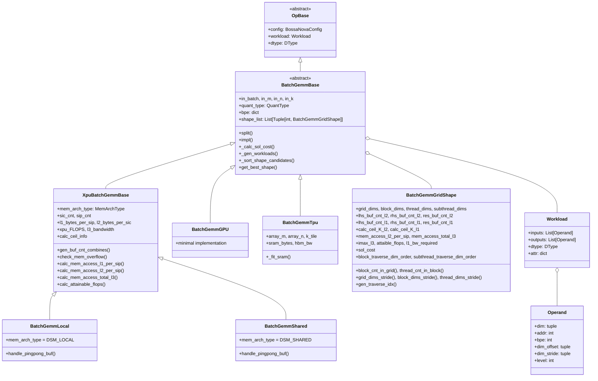
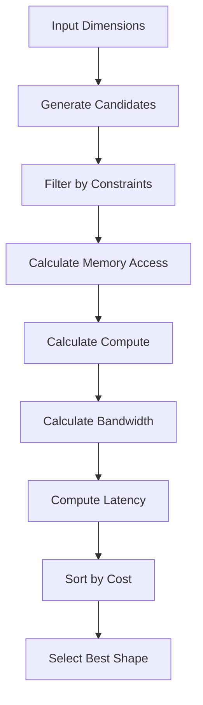

# Batch GEMM Framework

## Overview

The **batch_gemm_framework** module is a comprehensive GEMM (General Matrix Multiplication) tiling and optimization framework designed for heterogeneous computing platforms. It provides backend-agnostic tiling strategies for batched matrix multiplication operations across different hardware architectures including XPU (custom accelerator), GPU, and TPU.

### Key Capabilities

- **Multi-Backend Support**: Unified interface for XPU, GPU, and TPU backends
- **Memory Architecture Optimization**: Supports both DSM_LOCAL and DSM_SHARED memory architectures
- **Quantization-Aware Tiling**: Handles various quantization schemes (FP8, FP4) with optimized memory layout
- **Performance Modeling**: Accurate cost estimation based on compute throughput, memory bandwidth, and latency
- **Automatic Tile Selection**: Intelligent selection of optimal tiling configurations through exhaustive search and cost modeling

## Architecture

The framework follows a layered architecture with clear separation of concerns:



## Core Components

### Base Classes

#### OpBase
The foundational class for all operations in the Nova Platform.

**Key Attributes:**
- `config`: BossaNovaConfig - System configuration
- `workload`: Workload - Operation workload specification
- `dtype`: DType - Data type for computation

#### BatchGemmBase
Abstract base class for all GEMM tiling implementations.

**Key Attributes:**
- `in_batch`, `in_m`, `in_n`, `in_k`: Input dimensions
- `quant_type`: QuantType - Quantization scheme
- `bpe`: dict - Bytes per element for each tensor type
- `compute_dtype`: dict - Computation data types
- `shape_list`: List of candidate tiling configurations

**Abstract Methods:**
- `split()`: Generate all possible tiling configurations
- `impl()`: Implement the tiling strategy
- `_calc_sol_cost()`: Calculate solution cost for a shape
- `_gen_workloads()`: Generate workloads for a shape
- `_sort_shape_candidates()`: Sort tiling candidates
- `get_best_shape()`: Return optimal tiling configuration

**Key Methods:**
- `calc_flops_total()`: Calculate total FLOPs for the operation

### XPU Backend Classes

#### XpuBatchGemmBase
Base class for XPU-specific GEMM implementations with comprehensive memory hierarchy modeling.

**Key Attributes:**
- `mem_arch_type`: Memory architecture type (DSM_LOCAL or DSM_SHARED)
- `sic_cnt`: Number of clusters (System Instance Count)
- `sip_cnt`: Number of cores per cluster (System Instance Per-cluster)
- `l1_bytes_per_sip`, `l2_bytes_per_sic`: Memory sizes
- `xpu_FLOPS`: Total compute throughput
- `l3_bandwidth`: Memory bandwidth
- `calc_ceil_info`: Hardware-specific tiling constraints

**Key Methods:**

##### `gen_buf_cnt_combines()`
Generates buffer count combinations for L1 and L2 caches.

**Parameters:**
- `grid_dims`: Grid dimensions
- `block_dims`: Block dimensions
- `thread_dims`: Thread dimensions
- `subthread_dims`: Subthread dimensions
- `l2K`, `l1K`: K-dimension tile sizes

**Returns:** List of buffer count tuples

**Algorithm:**
1. Calculate strides for different hierarchy levels
2. Determine block loop counts
3. Compute buffer requirements for L1 and L2
4. Generate combinations considering memory constraints
5. Filter based on memory overflow

##### `check_mem_overflow()`
Validates if a tiling configuration fits in available memory.

**Parameters:**
- `shape`: BatchGemmGridShape to validate

**Returns:** Boolean indicating overflow

**Memory Calculation:**
- L1: lhs + rhs + bias bytes per SIP
- L2: lhs + rhs + bias + res bytes per SIC

##### `calc_mem_access_total_l3()`
Calculates total L3 memory access for the entire operation.

**Parameters:**
- `shape`: Tiling configuration

**Returns:** Total bytes transferred from L3

**Algorithm:**
1. Calculate grid stride and block loop counts
2. Determine L2 buffer reuse efficiency
3. Compute memory access with caching effects
4. Account for block traversal order

##### `calc_attainable_flops()`
Computes achievable FLOPs considering compute and memory bottlenecks.

**Parameters:**
- `shape`: Tiling configuration

**Returns:** Achievable FLOPs

**Formula:**
```
I = flops_total / mem_access_total_l3
Imax = xpu_FLOPS * xpu_used / l3_bandwidth
attaible_flops = l3_bandwidth * I if I < Imax else xpu_FLOPS * xpu_used
```

##### `split()`
Main tiling algorithm that enumerates all valid configurations.

**Algorithm:**
1. Generate layout combinations for sic, sip, and ceil dimensions
2. Calculate K-dimension tile candidates
3. Filter invalid shapes based on constraints
4. Generate buffer count combinations
5. Calculate costs for each candidate
6. Sort by performance metrics

**Output:** Populates `self.shape_list` with sorted candidates

#### BatchGemmLocal
XPU implementation for DSM_LOCAL memory architecture.

**Key Features:**
- Local memory optimization
- Ping-pong buffer management
- Per-SIP workload distribution

**Cost Calculation:**
```python
latency = max(
    input_latency + compute_latency + output_latency,
    memory_bandwidth_limited
)
```

**Workload Generation:**
- Splits work across SIC and SIP levels
- Handles k-loop tiling with snake-like traversal
- Manages buffer reuse with deque-based caching

#### BatchGemmShared
XPU implementation for DSM_SHARED memory architecture.

**Key Features:**
- Shared memory optimization
- Collective workload distribution
- L2-level buffer management

**Cost Calculation:**
Similar to Local but with shared memory characteristics

**Workload Generation:**
- Single workload per SIC
- Shared across SIPs
- Buffer management at L2 level

### GPU Backend

#### BatchGemmGPU
Minimal GPU implementation for interface compatibility.

**Characteristics:**
- Single tile configuration
- No optimization search
- Placeholder for future GPU-specific optimizations

**Use Case:** Prototyping and multi-backend validation

### TPU Backend

#### BatchGemmTpu
TPU-specific GEMM tiling with systolic array optimization.

**Key Attributes:**
- `array_m`, `array_n`: Systolic array dimensions
- `k_tile`: K-dimension tile size
- `sram_bytes`: SRAM capacity per core
- `hbm_bw`: HBM bandwidth

**Key Methods:**

##### `_fit_sram()`
Validates if tile fits in SRAM.

**Formula:**
```
lhs_bytes + rhs_bytes + res_bytes <= sram_bytes
```

##### `_calc_sol_cost()`
TPU-specific cost model.

**Formula:**
```
compute_time = (tm * tn * tk * 2) / array_flops
memory_time = (tm * tk * bpe_lhs + tn * tk * bpe_rhs + tm * tn * bpe_res) / hbm_bw
cost = max(compute_time, memory_time) * total_tiles
```

**Workload Generation:**
- Maps to systolic array dimensions
- Handles k-loop tiling
- Generates per-tile workloads

## Data Structures

### BatchGemmGridShape
Extends GridShape with GEMM-specific attributes.

**Core Dimensions:**
- `grid_dims`: [N, M, B, 1] - Grid level
- `block_dims`: [N, M, B, 1] - Block level
- `thread_dims`: [N, M, B, 1] - Thread level
- `subthread_dims`: [N, M, B, 1] - Subthread level

**Buffer Configuration:**
- `lhs_buf_cnt_l2`, `rhs_buf_cnt_l2`, `res_buf_cnt_l2`
- `lhs_buf_cnt_l1`, `rhs_buf_cnt_l1`, `res_buf_cnt_l1`

**Tile Sizes:**
- `calc_ceil_K_l2`, `calc_ceil_K_l1`: K-dimension with alignment

**Performance Metrics:**
- `mem_access_l2_per_sip`: L2 memory access per SIP
- `mem_access_total_l3`: Total L3 memory access
- `imax_l3`: Compute intensity
- `attaible_flops`: Achievable FLOPs
- `l1_bw_required`: Required L1 bandwidth
- `sol_cost`: Solution cost (latency)

**Traversal Order:**
- `block_traverse_dim_order`: Block traversal sequence
- `subthread_traverse_dim_order`: Subthread traversal sequence

**Key Methods:**
- `block_cnt_in_grid()`: Total blocks
- `thread_cnt_in_block()`: Total threads per block
- `grid_dims_stride()`: Strided dimensions
- `gen_traverse_idx()`: Generate traversal indices with snake-like pattern

### Workload
Operation specification with inputs/outputs.

**Attributes:**
- `inputs`: List[Operand] - Input operands
- `outputs`: List[Operand] - Output operands
- `dtype`: DType - Data type
- `attr`: dict - Additional attributes

### Operand
Tensor specification for memory operations.

**Attributes:**
- `dim`: tuple - Logical dimensions
- `addr`: int - Base address
- `bpe`: Bytes per element
- `dim_offset`: tuple - Offset in parent tensor
- `dim_stride`: tuple - Stride for each dimension
- `level`: int - Memory hierarchy level

**Key Methods:**
- `get_phy_addr_by_offset()`: Calculate physical address
- `get_contiguous_mem_accesses()`: Get memory access pattern

## Quantization Support

### QuantType Enum
Defines supported quantization schemes:

- `No_Quant`: Full precision (FP16/FP32)
- `Wf8t_Af8t`: FP8 per-tensor for both weight and activation
- `Wf4g_Af8t`: FP4 per-group for weight, FP8 per-tensor for activation
- `Wf4g_Af8k`: FP4 per-group for weight, FP8 per-token for activation

### BPE Calculation
```python
def bpe_for_quant(dtype, quant_type):
    orig_bpe = dtype.get_bpe()
    if quant_type == QuantType.No_Quant:
        return {"lhs": orig_bpe, "rhs": orig_bpe, "res": orig_bpe, "scaling": orig_bpe, "bias": orig_bpe}
    elif quant_type == QuantType.Wf8t_Af8t:
        return {"lhs": 1, "rhs": 1, "res": orig_bpe, "scaling": 2, "bias": 4}
    elif quant_type == QuantType.Wf4g_Af8t:
        return {"lhs": 1, "rhs": 0.5, "res": orig_bpe, "scaling": 2, "bias": 4}
```

### Compute Type Selection
```python
def compute_dtype_for_quant(dtype, quant_type):
    if quant_type == QuantType.No_Quant:
        return {"1d": dtype, "2d": dtype}
    elif quant_type == QuantType.Wf8t_Af8t:
        return {"1d": DType.FP32, "2d": DType.FP8}
    elif quant_type == QuantType.Wf4g_Af8t:
        return {"1d": DType.FP32, "2d": DType.FP4}
```

## Memory Architecture

### DSM_LOCAL
Distributed Shared Memory - Local mode.

**Characteristics:**
- Each SIP has local L1 buffers
- Minimal data sharing
- Low latency for local access
- Higher bandwidth requirement per SIP

**Buffer Strategy:**
- L1: lhs, rhs, bias buffers
- L2: lhs, rhs buffers (optional)
- Result: Written directly to L3

**Use Case:** Independent computation per SIP

### DSM_SHARED
Distributed Shared Memory - Shared mode.

**Characteristics:**
- Shared L2 buffers across SIPs
- Data reuse across threads
- Lower bandwidth requirement
- Higher latency for sharing

**Buffer Strategy:**
- L2: lhs, rhs, res buffers
- L1: lhs, rhs buffers
- Result: Buffered in L2

**Use Case:** Collaborative computation with data sharing

## Performance Modeling

### Cost Calculation Pipeline



### Latency Components

**Input Latency:**
```
size = sum(input.bpe * product(dim))
latency = size / l3_bandwidth_per_sip + l3_to_l1_latency
```

**Compute Latency:**
```
ops = 2 * b * m * n * k
l1_access = (b * m * k + b * n * k) * bpe
latency = max(ops / xpu_FLOPS, l1_access / l1_bandwidth_per_sip)
```

**Output Latency:**
```
size = sum(output.bpe * product(dim))
latency = size / l3_bandwidth_per_sip
```

### Bottleneck Analysis

**Compute-Bound:**
```
I = flops_total / mem_access_total_l3 > Imax
```
Solution: Increase tile size to improve arithmetic intensity

**Memory-Bound:**
```
I = flops_total / mem_access_total_l3 < Imax
```
Solution: Increase buffer counts to improve reuse

## Usage Examples

### Basic Usage

```python
from nova_platform.benchmark.batch_gemm import BatchGemmLocal
from nova_platform.benchmark.op_base import Workload, Operand
from nova_platform.config import BossaNovaConfig

# Define workload
workload = Workload(
    inputs=[
        Operand(dim=(1, 512, 1024), bpe=2),  # lhs
        Operand(dim=(1, 1024, 256), bpe=2),  # rhs
    ],
    outputs=[
        Operand(dim=(1, 512, 256), bpe=2),   # res
    ],
    attr={"quant_type": "No_Quant", "has_bias": False}
)

# Load config
config = BossaNovaConfig.load("config.yaml")

# Create tiler
tiler = BatchGemmLocal(config, workload)

# Generate optimal tiling
tiler.split()
tiler.impl()

# Get results
best_shape = tiler.get_best_shape()
workloads = tiler.get_tiled_workloads()
```

### With Quantization

```python
workload = Workload(
    inputs=[
        Operand(dim=(1, 512, 1024), bpe=1),  # FP8 weight
        Operand(dim=(1, 1024, 256), bpe=1),  # FP8 activation
        Operand(dim=(1, 32, 256), bpe=2),    # Scaling factors
    ],
    outputs=[Operand(dim=(1, 512, 256), bpe=2)],
    attr={"quant_type": "Wf4g_Af8t", "quant_group_size": 32, "has_bias": False}
)

tiler = BatchGemmLocal(config, workload)
tiler.split()
tiler.impl()
```

### Multi-Backend Selection

```python
from nova_platform.benchmark.batch_gemm import (
    BatchGemmLocal, BatchGemmShared, 
    BatchGemmGPU, BatchGemmTpu
)

def get_tiler(backend, config, workload):
    if backend == "xpu_local":
        return BatchGemmLocal(config, workload)
    elif backend == "xpu_shared":
        return BatchGemmShared(config, workload)
    elif backend == "gpu":
        return BatchGemmGPU(config, workload)
    elif backend == "tpu":
        return BatchGemmTpu(config, workload)
    else:
        raise ValueError(f"Unknown backend: {backend}")

tiler = get_tiler("xpu_local", config, workload)
tiler.split()
tiler.impl()
```

## Integration Points

### Related Modules

- **[base_models](base_models.md)**: Defines DType, data structures
- **[config](config.md)**: Provides BossaNovaConfig with hardware specs
- **[workload_base](workload_base.md)**: Defines Workload and Operand
- **[xpu_local_backend](xpu_local_backend.md)**: XPU local memory implementation
- **[xpu_shared_backend](xpu_shared_backend.md)**: XPU shared memory implementation
- **[gpu_backend](gpu_backend.md)**: GPU backend implementation
- **[tpu_backend](tpu_backend.md)**: TPU backend implementation
- **[eccl_comm](eccl_comm.md)**: Communication primitives (for distributed)
- **[op_trace](op_trace.md)**: Operation tracing and profiling

### Data Flow

```mermaid
flowchart LR
    A[Config] --> B[Workload]
    B --> C[BatchGemmBase]
    C --> D[Split Algorithm]
    D --> E[Cost Model]
    E --> F[Shape Selection]
    F --> G[Workload Generation]
    G --> H[Tiled Workloads]
    
    H --> I[Executor]
    I --> J[Dataflow Generator]
    J --> K[Cost Service]
    K --> L[Performance Report]
```



## Optimization Strategies

### 1. Tile Size Selection
- Balance compute intensity with memory bandwidth
- Consider hardware constraints (array size, cache size)
- Account for quantization overhead

### 2. Buffer Management
- Maximize reuse in L1/L2 caches
- Minimize buffer count while avoiding overflow
- Use ping-pong buffering for overlapping

### 3. Traversal Order
- Row-major vs column-major based on access pattern
- Snake-like traversal for better locality
- Block-first vs thread-first scheduling

### 4. Memory Architecture Selection
- **DSM_LOCAL**: Best for independent workloads
- **DSM_SHARED**: Best for data sharing scenarios

## Performance Tuning

### 1. Hardware Parameters
```yaml
compute:
  thread_2d_throughput:
    FP8: 2048  # ops/cycle
    FP4: 4096
memory:
  l1:
    SIZE_PER_CORE: 65536  # 64KB
  l2:
    SIZE_PER_SIC: 2097152  # 2MB
bw:
  mc:
    l3:
      bw: 64  # GB/s
```

### 2. Algorithm Parameters
- `calc_ceil_info`: Hardware-specific tiling constraints
- Buffer count ranges: [2, max] for reuse
- K-alignment: 64 bytes for optimal memory access

### 3. Cost Model Tuning
- Adjust latency overheads (l3_to_l1_latency)
- Tune bandwidth calculations
- Calibrate with real measurements

## Limitations and Future Work

### Current Limitations
1. **GPU Backend**: Minimal implementation, no optimization
2. **TPU Backend**: Simplified cost model, no systolic optimization
3. **Distributed**: Single-node focus, no multi-node tiling
4. **Bias Handling**: Limited bias support in some backends

### Future Enhancements
1. **Auto-tuning**: Runtime profiling for cost model calibration
2. **ML-based Selection**: Predict optimal shapes
3. **Dynamic Adaptation**: Runtime shape adjustment
4. **Multi-node**: Cross-node tiling and communication
5. **Fusion**: GEMM fusion with other operations

## Testing and Validation

### Unit Tests
- Memory overflow detection
- Cost calculation accuracy
- Workload generation correctness
- Quantization handling

### Integration Tests
- End-to-end tiling pipeline
- Multi-backend consistency
- Large-scale problem sizes

### Performance Validation
- Latency vs theoretical model
- Memory bandwidth utilization
- Compute utilization

## References

- **GEMM Tiling**: Classic matrix multiplication optimization
- **Memory Hierarchy**: Cache-aware optimization techniques
- **Quantization**: FP8/FP4 formats and scaling
- **Cost Modeling**: Roofline model and performance prediction

## Summary

The batch_gemm_framework provides a comprehensive solution for optimizing batched GEMM operations across heterogeneous hardware. Its key strengths are:

1. **Unified Interface**: Consistent API across backends
2. **Memory-Aware**: Detailed memory hierarchy modeling
3. **Quantization-Support**: Handles modern quantization schemes
4. **Performance-Guided**: Cost-based tile selection
5. **Extensible**: Easy to add new backends and optimizations

The framework enables developers to achieve near-optimal performance for GEMM operations without manual tuning, while providing the flexibility to customize for specific hardware and requirements.
