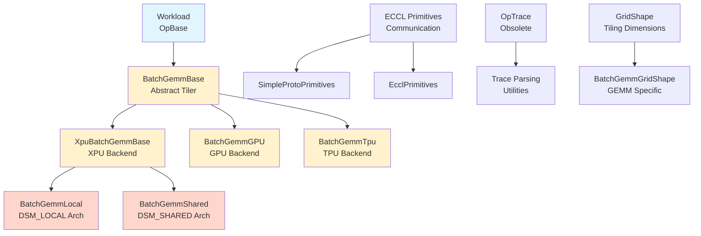

# Benchmark Module

## Overview

The benchmark module provides a comprehensive framework for benchmarking and tiling operations across different hardware backends (XPU, GPU, TPU) and memory architectures. It includes workload representation, GEMM operation tiling, and performance cost modeling for various compute and memory configurations.

## Architecture

The module is designed with a layered architecture that separates concerns between workload representation, tiling strategies, and backend-specific implementations:



## Core Components

### 1. Workload Representation

The module uses a unified workload representation system:

- **`OpBase`**: Abstract base class for all operations
- **`Workload`**: Represents a single operation with inputs, outputs, and attributes
- **`Operand`**: Represents tensor operands with dimensions, strides, and memory layout
- **`GridShape`**: Base class for tiling dimensions across grid, block, thread, and subthread levels

### 2. GEMM Tiling Framework

The GEMM tiling system provides hardware-specific implementations:

#### Base Classes
- **`BatchGemmBase`**: Abstract base for all GEMM tilers
- **`XpuBatchGemmBase`**: XPU-specific base with memory architecture support

#### Backend Implementations
- **`BatchGemmGPU`**: Minimal GPU tiler (placeholder implementation)
- **`BatchGemmTpu`**: TPU tiler with SRAM and HBM optimization
- **`BatchGemmLocal`**: XPU local memory architecture (DSM_LOCAL)
- **`BatchGemmShared`**: XPU shared memory architecture (DSM_SHARED)

### 3. Communication Primitives

ECCL (Efficient Collective Communication Library) primitives for distributed operations:
- **`SimpleProtoPrimitives`**: Basic communication patterns
- **`EcclPrimitives`**: Advanced collective operations

### 4. Legacy Trace Support

- **`OpTraceRecord`**: Legacy trace format parsing and representation

## Module Structure

```
benchmark/
├── batch_gemm.py              # Core GEMM tiling framework
├── batch_gemm_gpu.py          # GPU backend implementation
├── batch_gemm_local.py        # XPU local memory architecture
├── batch_gemm_shared.py       # XPU shared memory architecture
├── batch_gemm_tpu.py          # TPU backend implementation
├── eccl.py                    # Communication primitives
├── op_base.py                 # Workload and operation base classes
└── op_trace_obsolete.py       # Legacy trace format support
```

## Key Features

### 1. Multi-Backend Support
- **XPU**: Advanced tiling with memory hierarchy optimization
- **GPU**: Simple placeholder for GPU workflows
- **TPU**: Array-based tiling with SRAM constraints

### 2. Memory Architecture Optimization
- **DSM_LOCAL**: Local memory buffering with ping-pong strategies
- **DSM_SHARED**: Shared memory with barrier synchronization

### 3. Performance Modeling
- **Cost Calculation**: Latency estimation based on compute and memory bandwidth
- **IMAX Analysis**: Roofline model for compute-bound vs memory-bound scenarios
- **Tiling Selection**: Automated candidate generation and ranking

### 4. Quantization Support
- **No Quant**: Standard FP32/FP16 operations
- **Wf8t_Af8t**: FP8 weight and activation per-tensor quantization
- **Wf4g_Af8t**: FP4 weight per-group + FP8 activation per-tensor
- **Wf4g_Af8k**: FP4 weight per-group + FP8 activation per-token

## Integration Points

The benchmark module integrates with:

- **Config Module**: Hardware configuration (memory sizes, bandwidth, compute throughput)
- **Base Models**: Data types and action statistics
- **Cost Service**: Performance cost calculation
- **Executor**: Dataflow generation and execution
- **Dataflow Actions**: Hardware-specific operation implementations

## Usage Patterns

### Basic GEMM Tiling
```python
# Create workload
workload = Workload(
    inputs=[lhs_operand, rhs_operand],
    outputs=[result_operand],
    dtype=DType.FP16,
    attr={"quant_type": "No_Quant"}
)

# Select backend
tiler = BatchGemmLocal(config, workload)
tiler.split()  # Generate candidates
tiler.impl()   # Select best and generate workloads
workloads = tiler.get_tiled_workloads()
```

### Performance Analysis
```python
# Get best tiling shape
best_shape = tiler.get_best_shape()

# Access performance metrics
print(f"L3 Memory Access: {best_shape.mem_access_total_l3} bytes")
print(f"Attainable FLOPS: {best_shape.attaible_flops}")
print(f"L1 BW Required: {best_shape.l1_bw_required} bytes/cycle")
```

## Related Modules

- **[cost_service](cost_service.md)**: Performance cost calculation services
- **[config](config.md)**: Hardware configuration parameters
- **[dataflow_actions](dataflow_actions.md)**: Hardware operation implementations
- **[executor](executor.md)**: Dataflow generation and execution
