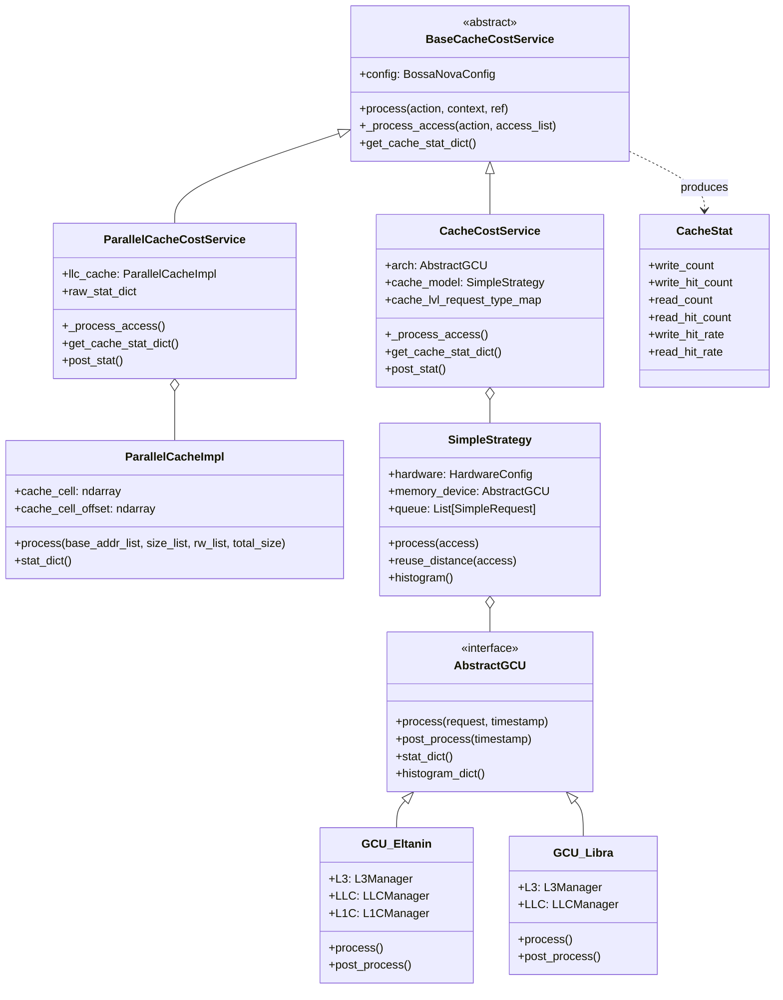
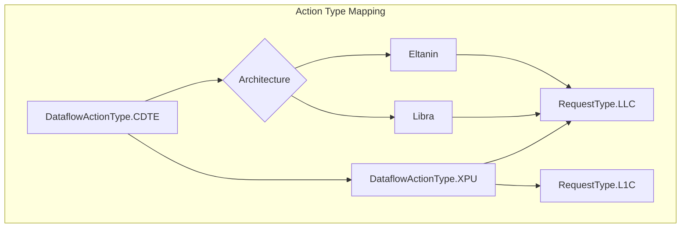
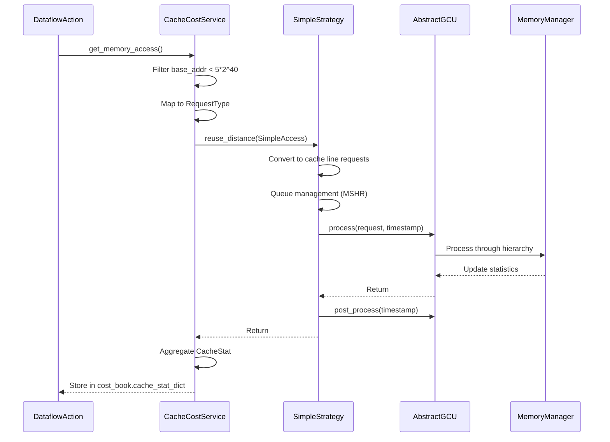
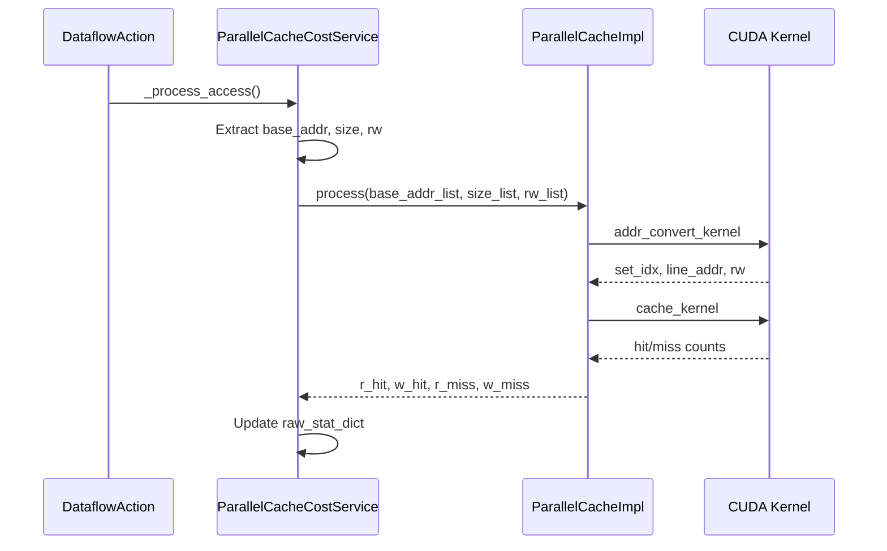

# Cache Cost Service Module

## Overview

The **cache_cost_service** module is a core component of the Nova Platform's cost estimation system, responsible for simulating and analyzing cache behavior across different hardware architectures. It provides detailed cache statistics including hit rates, miss rates, and reuse distance analysis for multi-level cache hierarchies (L1C, LLC, L3).

This module integrates with the broader [cost_service](compute_cost_service.md) framework to provide memory access cost calculations for various compute operations.

## Architecture

The module follows a layered architecture with clear separation of concerns:



## Core Components

### 1. Base Cache Models

#### CacheStat
Represents cache statistics for a specific cache level.

**Properties:**
- `write_count`: Total number of write operations
- `write_hit_count`: Number of write hits
- `read_count`: Total number of read operations
- `read_hit_count`: Number of read hits
- `write_hit_rate`: Computed property for write hit rate
- `read_hit_rate`: Computed property for read hit rate

**Operations:**
- Supports addition (`+`) and subtraction (`-`) operators for aggregating statistics

#### BaseCacheCostService
Abstract base class defining the interface for cache cost services.

**Key Methods:**
- `process(action, context, ref)`: Generator-based processing of memory accesses
- `_process_access(action, access_list)`: Abstract method for processing memory accesses
- `get_cache_stat_dict()`: Abstract method to retrieve current cache statistics

### 2. Architecture-Specific Implementations

#### SimpleStrategy
A strategy pattern implementation that orchestrates cache simulation.

**Components:**
- `hardware`: Hardware configuration
- `memory_device`: AbstractGCU implementation (architecture-specific)
- `queue`: Request queue for handling MSHR (Miss Status Holding Register) limitations

**Key Methods:**
- `process(access)`: Converts memory accesses to cache line requests
- `reuse_distance(access)`: Main entry point for cache simulation with reuse distance tracking
- `finish_queue()`: Processes pending requests in the queue
- `histogram()`: Generates reuse distance histograms

#### AbstractGCU (Generic Cache Unit)
Interface for architecture-specific cache implementations.

**Implementations:**
1. **GCU_Eltanin**: Supports L1C, LLC, and L3 cache levels
   - L1C → LLC → L3 hierarchy
   - Uses cache selectors for SIP-based addressing
   
2. **GCU_Libra**: Supports LLC and L3 cache levels only
   - LLC → L3 hierarchy
   - Uses address conversion for partition-based addressing

### 3. Concrete Cache Cost Services

#### CacheCostService
Main implementation using the cache_model library for simulation.

**Features:**
- Architecture selection (eltanin, libra)
- Automatic request type mapping based on action type
- Integration with [DataflowAction](compute_cost_service.md) types
- Support for L1C, LLC, and L3 configurations

**Workflow:**
1. Convert DataflowActionMemoryAccess to SimpleAccess
2. Map action type to cache level (RequestType)
3. Process through SimpleStrategy
4. Collect and aggregate statistics

#### ParallelCacheCostService
GPU-accelerated cache simulation for high-performance scenarios.

**Features:**
- CUDA-based parallel processing
- Optimized for LLC-only simulation (Libra architecture)
- Significantly faster for large-scale simulations

**Components:**
- `ParallelCacheImpl`: CUDA kernel wrapper
  - Manages GPU memory for cache state
  - Executes cache simulation kernels
  - Provides statistical reporting

### 4. Architecture-Specific Request Types



## Data Flow

### Standard Cache Simulation Flow



### Parallel Cache Simulation Flow



## Configuration

### Hardware Configuration

The module uses `BossaNovaConfig` which includes:

```python
config.memory.llc = {
    CACHE_LINE_SIZE: int,
    CACHE_WAYS: int,
    CACHE_SIZE: int,
    MEM_LATENCY: int,
    NON_MEM_LATENCY: int,
    NUM_MSHR: int | None,
    NUM_OF_PARTITIONS: int,
    NUM_OF_SLICES_PER_PARTITION: int,
}

config.memory.l1c = {  # Optional
    CACHE_LINE_SIZE: int,
    CACHE_WAYS: int,
    CACHE_SIZE: int,
    MEM_LATENCY: int,
    NON_MEM_LATENCY: int,
    NUM_MSHR: int | None,
    NUM_OF_CORE: int,
    CACHE_SIZE_PER_CORE: int,
}

config.inst_num.NUM_OF_DIE: int  # Multiplies partition counts
```

### Architecture Selection

- **Eltanin**: `config.arch_name = "eltanin"`
  - Supports L1C, LLC, L3
  - Used for XPU and CDTE actions
  
- **Libra**: `config.arch_name = "libra"`
  - Supports LLC, L3 only
  - All actions map to LLC

## Integration Points

### Upstream Dependencies

1. **[base_models](base_models.md)**: Provides `DataflowActionMemoryAccess` and `DataflowActionMemoryStat`
2. **[config](config.md)**: Provides `BossaNovaConfig`, `AbstractCacheConfig`
3. **[compute_cost_service](compute_cost_service.md)**: 
   - `BaseCostService` parent class
   - `BossaNovaContext` for context management
   - `DataflowAction` for action processing
   - `CostBook` for storing results

### Downstream Consumers

1. **[executor](executor.md)**: Uses cache statistics for execution planning
2. **[dataflow_actions](dataflow_actions.md)**: Memory access patterns feed into cache service
3. **[simulator](simulator.md)**: Uses cache stats for case analysis

### External Dependencies

- **cache_model**: Core cache simulation library
  - `AbstractGCU`, `HardwareConfig`, `Memory` models
  - `L1CManager`, `LLCManager`, `L3Manager`
  - `Request`, `Access` entities
  
- **pycuda**: GPU acceleration (ParallelCacheCostService only)

## Usage Examples

### Basic Cache Simulation

```python
from nova_platform.config import BossaNovaConfig
from nova_platform.cost_service.cache.cache_cost_service import CacheCostService
from nova_platform.cost_service.compute.base_compute_model import BossaNovaContext, DataflowAction

# 1. Configure
config = BossaNovaConfig(
    arch_name="eltanin",
    memory=MemoryConfig(
        llc=MemoryL2Config(...),
        l1c=MemoryL1Config(...)
    ),
    inst_num=InstNumConfig(NUM_OF_DIE=1)
)

# 2. Create service
cache_service = CacheCostService(config)

# 3. Process action
context = BossaNovaContext()
action = DataflowAction(...)  # From dataflow

# Use as generator
gen = cache_service.process(action, context, ref=1.0)
for mem_stat in action.get_memory_stats():
    gen.send(mem_stat)
gen.close()

# 4. Retrieve results
cost_book = context.get_cost_book(action)
cache_stats = cost_book.cache_stat_dict
# {'LLC': CacheStat(...), 'L1C': CacheStat(...)}
```

### Parallel Cache Simulation

```python
from nova_platform.cost_service.cache.parallel_cache_cost_service import ParallelCacheCostService

# GPU-accelerated (Libra architecture only)
cache_service = ParallelCacheCostService(config, device_id=0)

# Same interface as CacheCostService
gen = cache_service.process(action, context, ref=1.0)
# ... process memory stats

# Get detailed statistics
report = cache_service.post_stat(context, dataflow)
# {'LLC': {'read_hits': ..., 'read_hit_rate': ...}}
```

## Performance Considerations

### CacheCostService
- **Pros**: Full architecture support, detailed simulation
- **Cons**: Sequential processing, slower for large workloads
- **Best for**: Detailed analysis, L1C simulation, debugging

### ParallelCacheCostService
- **Pros**: GPU acceleration, 10-100x faster
- **Cons**: LLC-only, requires CUDA, Libra architecture
- **Best for**: Large-scale simulations, production runs

### Optimization Tips
1. Filter addresses < 5*2^40 early to reduce processing
2. Batch memory accesses when possible
3. Use ParallelCacheCostService for LLC-only analysis
4. Adjust MSHR counts to match hardware behavior

## Error Handling

### Missing Dependencies
```python
try:
    from cache_model import ...
    _CACHE_MODEL_AVAILABLE = True
except ModuleNotFoundError:
    # Falls back to no-op implementation
    # Returns zero statistics
    _CACHE_MODEL_AVAILABLE = False
```

### Fallback Behavior
When cache_model is unavailable:
- `CacheCostService` becomes no-op
- All statistics return zero
- Logs warning message
- Continues execution without crashing

## Testing & Validation

### Expected Statistics
```python
# After processing accesses
stat = cache_service.get_cache_stat_dict()
assert isinstance(stat['LLC'], CacheStat)
assert stat['LLC'].read_hit_rate >= 0.0
assert stat['LLC'].read_hit_rate <= 1.0
```

### Reuse Distance Histogram
```python
histogram = cache_model.histogram()
# Returns: {'LLC': [DistanceCount(...), ...]}
```

## Related Modules

- **[compute_cost_service](compute_cost_service.md)**: Parent module for cost services
- **[base_models](base_models.md)**: Data structures and enums
- **[config](config.md)**: Configuration schemas
- **[dataflow_actions](dataflow_actions.md)**: Memory access patterns
- **[executor](executor.md)**: Integration point for execution

## References

1. Cache Model Library: `cache_model.*`
2. Nova Platform Base: `nova_platform.base_model.*`
3. CUDA Documentation: For ParallelCacheCostService
4. Hardware Specifications: See config module for cache parameters

## Future Enhancements

- [ ] Support for additional architectures
- [ ] Multi-GPU parallel simulation
- [ ] Dynamic cache hierarchy configuration
- [ ] Cache prefetching simulation
- [ ] Write-back/write-through policy selection
- [ ] Cache coherence protocol simulation
