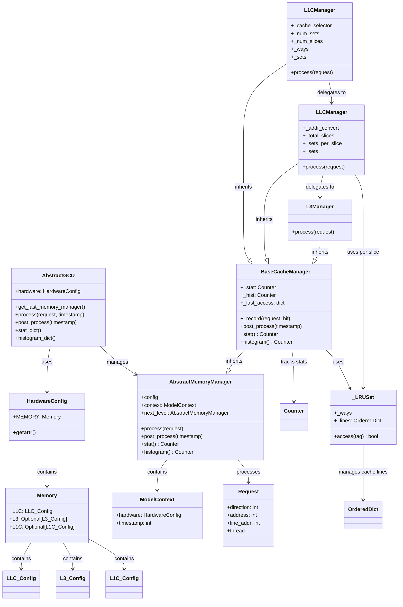

# Cache Model Module

## Overview

The **cache_model** module provides a comprehensive simulation framework for modeling multi-level cache hierarchies in hardware systems. It emulates the behavior of L1, L2/L3, and LLC (Last Level Cache) memory systems with configurable parameters, LRU replacement policies, and detailed statistics tracking.

This module is designed to work within the nova_platform ecosystem, providing cache simulation capabilities that support the broader system architecture modeling and performance analysis framework.

## Architecture

The cache_model module follows a hierarchical architecture with clear separation of concerns:



## Core Components

The cache_model module consists of several key sub-modules that work together to provide complete cache simulation:

### 1. Architecture Layer (`cache_model.arch`)

**Primary Component: `AbstractGCU`**

The `AbstractGCU` class serves as the top-level interface for the cache model, emulating an external cache model API. It coordinates memory management and provides the main entry point for cache operations.

- **Purpose**: Acts as the facade for the cache simulation system
- **Responsibilities**:
  - Manages the memory manager hierarchy
  - Processes requests through the cache hierarchy
  - Coordinates post-processing and statistics collection
  - Provides unified statistics and histogram outputs

**Documentation**: See [arch_layer.md](arch_layer.md) for detailed information.

### 2. Entity Models (`cache_model.entity.model`)

**Core Components**: `Request`, `Access`, `HardwareConfig`, `ModelContext`, `L1C_Config`, `LLC_Config`, `L3_Config`, `Memory`, `No_MSHR`

This sub-module defines the data structures and configuration models used throughout the cache simulation.

- **Purpose**: Provides type-safe data structures for configuration and runtime data
- **Key Classes**:
  - `HardwareConfig`: Central configuration container with memory hierarchy specs
  - `ModelContext`: Runtime context including hardware config and timestamp
  - `Request` & `Access`: Represent cache access operations
  - `L1C_Config`, `LLC_Config`, `L3_Config`: Cache-specific configuration parameters
  - `No_MSHR`: Exception for MSHR (Miss Status Holding Register) exhaustion

**Documentation**: See [entity_models.md](entity_models.md) for detailed information.

### 3. Memory Management (`cache_model.memory`)

**Core Components**: `AbstractMemoryManager`, `_LRUSet`, `_BaseCacheManager`, `LLCManager`, `L1CManager`, `L3Manager`

This sub-module implements the actual cache simulation logic with LRU replacement policy.

- **Purpose**: Simulates multi-level cache hierarchy with configurable behavior
- **Key Classes**:
  - `AbstractMemoryManager`: Base interface for all memory managers
  - `_LRUSet`: Implements LRU replacement policy for a single cache set
  - `_BaseCacheManager`: Common functionality for cache statistics and tracking
  - `L1CManager`: Simulates L1 cache with SIP (Slice) partitioning
  - `LLCManager`: Simulates LLC with address-based slice distribution
  - `L3Manager`: Terminal level memory (always hits)

**Documentation**: See [memory_management.md](memory_management.md) for detailed information.

### 4. Report Models (`cache_model.entity.report`)

**Core Component**: `DistanceCount`

Simple data structure for reporting cache access distance statistics.

- **Purpose**: Provides structured output for histogram data
- **Usage**: Used to track temporal locality patterns in cache accesses

**Documentation**: See [report_models.md](report_models.md) for detailed information.

## Data Flow

The cache model operates through a coordinated flow of requests through the hierarchy:

```mermaid
flowchart TD
    A[External Request] --> B[AbstractGCU.process()]
    B --> C[L1CManager.process()]
    C --> D{L1 Hit?}
    D -->|Yes| E[Record Hit]
    D -->|No| F[LLCManager.process()]
    F --> G{LLC Hit?}
    G -->|Yes| H[Record LLC Hit]
    G -->|No| I[L3Manager.process()]
    I --> J[Record L3 Access]
    J --> K[Propagate back up hierarchy]
    H --> K
    E --> K
    K --> L[Update Statistics]
    L --> M[Post-process at timestamp]
    M --> N[Generate Reports]
```

## Integration with Nova Platform

The cache_model module integrates with the broader nova_platform ecosystem:

- **Cost Service**: Uses cache statistics for power and performance cost calculations
- **Executor**: Cache behavior influences dataflow generation and scheduling
- **Benchmark**: Cache configurations are part of hardware specifications for workload analysis

## Key Features

1. **Configurable Hierarchy**: Support for L1, LLC, and L3 cache levels with independent parameters
2. **LRU Replacement**: True LRU policy implementation using OrderedDict
3. **MSHR Modeling**: Tracks outstanding misses and raises exceptions on exhaustion
4. **Slice-based Partitioning**: Supports distributed cache architectures
5. **Temporal Locality Tracking**: Histograms capture access patterns for analysis
6. **Statistics Collection**: Comprehensive hit/miss tracking per cache level
7. **Address Conversion**: Flexible address mapping for slice distribution

## Usage Example

```python
from cache_model.entity.model import HardwareConfig, Memory, LLC_Config, L3_Config, ModelContext, Request
from cache_model.memory.memory_manger import LLCManager, L3Manager
from cache_model.arch import AbstractGCU

# Configure hardware
llc_config = LLC_Config(
    CACHE_LINE_SIZE=64,
    CACHE_WAYS=16,
    CACHE_SIZE=1024*1024,  # 1MB
    MEM_LATENCY=100,
    NON_MEM_LATENCY=10,
    NUM_MSHR=64,
    NUM_OF_PARTITIONS=2,
    NUM_OF_SLICES_PER_PARTITION=4
)

l3_config = L3_Config(
    START_ADDR=0,
    SIZE_PER_HBM=1024*1024*1024,  # 1GB
    NUM_OF_HBM=4
)

memory = Memory(LLC=llc_config, L3=l3_config)
hardware = HardwareConfig(MEMORY=memory)
context = ModelContext(hardware=hardware)

# Build memory hierarchy
l3_manager = L3Manager(l3_config, context)
llc_manager = LLCManager(llc_config, context, next_level=l3_manager)

# Create GCU facade
class SimpleGCU(AbstractGCU):
    def __init__(self, hardware, llc_manager):
        super().__init__(hardware)
        self.llc_manager = llc_manager
    
    def get_last_memory_manager(self):
        return self.llc_manager
    
    def process(self, request, timestamp):
        self.llc_manager.process(request)
        self.llc_manager.post_process(timestamp)

gcu = SimpleGCU(hardware, llc_manager)

# Process requests
req1 = Request(direction=0, address=0x1000, line_addr=0x1000 // 64)
gcu.process(req1, timestamp=1)

req2 = Request(direction=0, address=0x1008, line_addr=0x1008 // 64)
gcu.process(req2, timestamp=2)

# Get statistics
stats = gcu.stat_dict()
print(stats)  # {'read_hits': 1, 'read_misses': 1, ...}
```

## Configuration Parameters

### LLC Configuration
- `CACHE_LINE_SIZE`: Size of a cache line in bytes
- `CACHE_WAYS`: Number of ways per set
- `CACHE_SIZE`: Total cache size in bytes
- `MEM_LATENCY`: Memory access latency cycles
- `NON_MEM_LATENCY`: Non-memory operation latency cycles
- `NUM_MSHR`: Number of Miss Status Holding Registers
- `NUM_OF_PARTITIONS`: Number of cache partitions
- `NUM_OF_SLICES_PER_PARTITION`: Slices per partition

### L1C Configuration
- All LLC parameters plus:
- `NUM_OF_SIP`: Number of slices/SIPs
- `CACHE_SIZE_PER_SIP`: Cache size per SIP

### L3 Configuration
- `START_ADDR`: Starting address for L3
- `SIZE_PER_HBM`: Size per HBM channel
- `NUM_OF_HBM`: Number of HBM channels

## Statistics Output

The module provides detailed statistics through the `stat()` and `histogram()` methods:

- **Hit/Miss Counts**: Per-operation type (read/write) per cache level
- **Access Distances**: Temporal locality histogram showing time between repeated accesses to same line

## Error Handling

- `No_MSHR`: Raised when cache runs out of MSHR slots during miss processing
- `AttributeError`: Raised when accessing invalid configuration attributes

## Performance Considerations

- LRU sets use OrderedDict for O(1) access and move-to-end operations
- Statistics use Counter for efficient aggregation
- Address conversion allows flexible mapping strategies
- Hierarchical processing minimizes redundant computation

## Future Enhancements

Potential areas for extension:
- Write-back vs write-through policies
- Prefetching strategies
- Cache coherence protocols
- Banked and way-partitioned cache structures
- Power state modeling
- Bandwidth constraints

## Related Modules

- **nova_lite**: Uses cache model for simulation pipeline
- **cost_service**: Consumes cache statistics for cost calculations
- **config**: Provides configuration structures that align with cache model parameters
- **benchmark**: Workloads that exercise cache behavior
