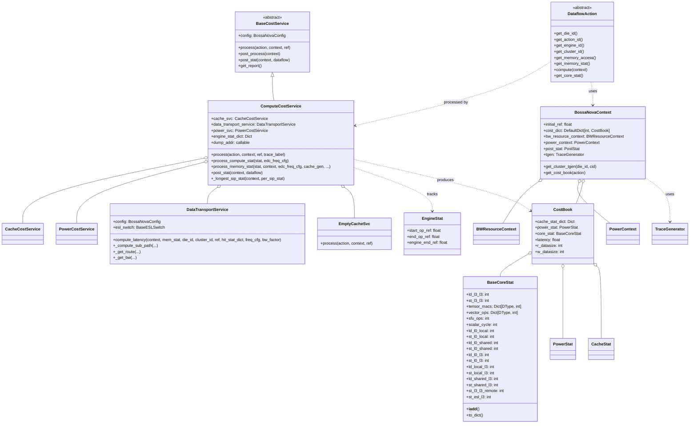
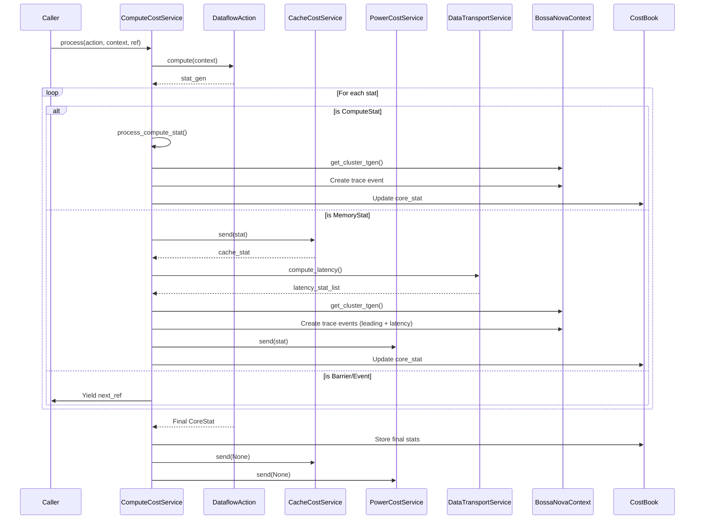
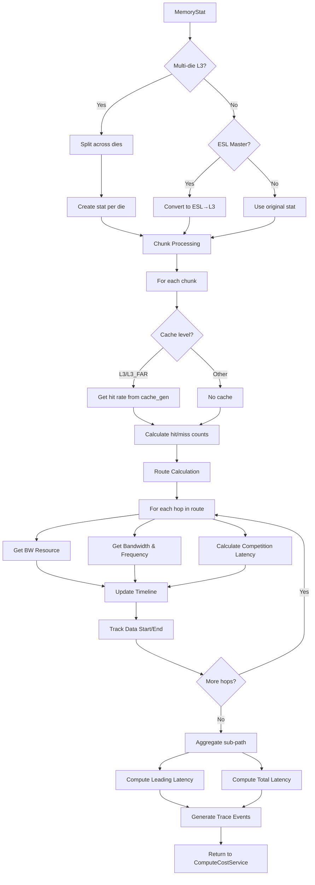
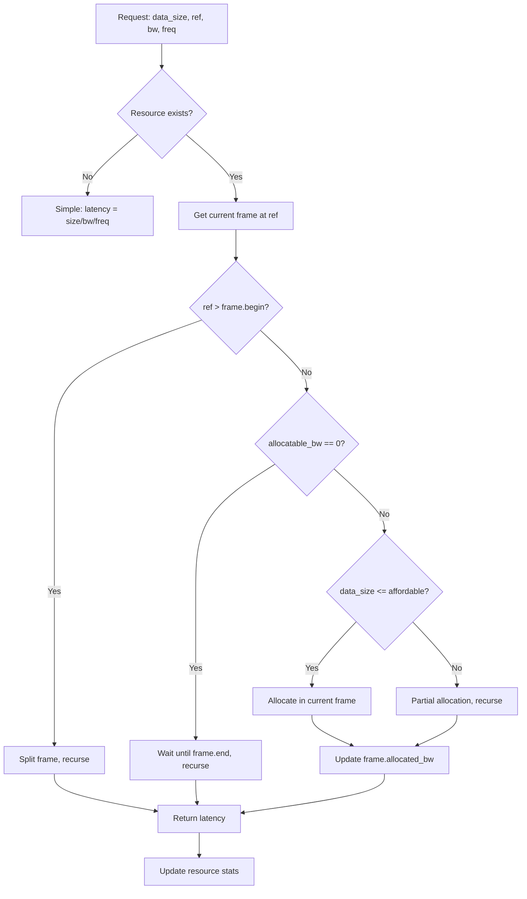

# Compute Cost Service Module

## Overview

The **compute_cost_service** module is the central orchestration engine of the Nova Platform's cost estimation system. It coordinates between cache, power, and data transport services to provide comprehensive computational cost analysis for dataflow operations executed on heterogeneous hardware accelerators.

This module serves as the primary entry point for cost calculation, managing execution context, aggregating statistics, and generating performance reports for complex dataflow graphs.

## Architecture

The compute cost service follows a service-oriented architecture with clear separation between orchestration, computation, and reporting:



## Core Components

### 1. Base Cost Service

#### BaseCostService
Abstract base class defining the interface for all cost services.

**Key Methods:**
- `process(action, context, ref)`: Main entry point for processing an action
- `post_process(context)`: Hook for post-processing after all actions
- `post_stat(context, dataflow)`: Generate statistics report
- `get_report()`: Retrieve final report

**Design Pattern:** Generator-based processing for cooperative multitasking

### 2. Compute Cost Service

#### ComputeCostService
Main orchestration engine that coordinates all cost calculation services.

**Constructor Parameters:**
- `config`: BossaNovaConfig - Hardware configuration
- `power_svc`: PowerCostService - Power modeling service
- `dump_addr`: Callable - Address dumping callback
- `cache_svc`: CacheCostService (optional) - Cache modeling service
- `esl_switch`: BaseESLSwitch (optional) - ESL switch manager

**Key Attributes:**
- `cache_svc`: Cache cost service (or EmptyCacheSvc if None)
- `data_transport_service`: Data transport and latency calculator
- `power_svc`: Power consumption calculator
- `engine_stat_dict`: Dictionary tracking per-engine statistics
- `dump_addr`: Callback for dumping memory access addresses

**Core Methods:**

##### process(action, context, ref, trace_label=None)
Main processing method for a single DataflowAction.

**Workflow:**
1. Extract action metadata (die_id, cluster_id, engine_id, type)
2. Get or create CostBook for the action
3. Initialize generators for cache, power, and compute stats
4. Iterate through stats from action.compute(context)
5. For each compute stat:
   - Calculate latency using process_compute_stat()
   - Track in engine_stat_dict
   - Generate trace events
6. For each memory stat:
   - Process through cache service
   - Calculate latency using process_memory_stat()
   - Dump addresses
   - Update power consumption
7. Aggregate core statistics
8. Update engine timing statistics

**Generator Protocol:**
```python
gen = compute_svc.process(action, context, ref=0)
for next_ref, stat in gen:
    # Handle barriers, events, or continue
    pass
```

##### process_compute_stat(stat, edc_freq_cfg)
Calculates compute latency for DataflowActionComputeStat.

**Calculation:**
```
cyc_1d = max_ops_1d / throughput_1d / efficiency_1d
cyc_2d = max_ops_2d / throughput_2d / (2 * efficiency_2d)
cyc_sfu = msf_ops / throughput_sfu / efficiency_sfu
cyc_scalar = scalar_cycle
cyc_nop = nop_cycle

cycle = max(cyc_1d, cyc_2d, cyc_sfu, cyc_scalar, cyc_nop)
latency = cycle / edc_freq_cfg.CORE / 1e9  # seconds
```

**Supported Operations:**
- 1D vector operations (element-wise)
- 2D tensor operations (MACs)
- Special function unit (SFU) operations
- Scalar operations
- NOP cycles

##### process_memory_stat(stat, context, edc_freq_cfg, cache_gen, die_id, cluster_id, engine_id, action_name, ref)
Processes memory statistics and calculates data transport latency.

**Key Features:**
- **Chunking**: Splits large transfers into manageable chunks
- **Distribution**: Handles multi-die scenarios by distributing across dies
- **ESL Support**: Special handling for ESL (External Shared Memory) operations
- **Write-through/Write-back**: Different handling based on cache policy
- **Latency Tracking**: Separates leading latency from total latency

**Latency Calculation Flow:**
```
1. Split stat into chunks (remainder-first)
2. For each chunk:
   a. Calculate cache hit/miss (via cache_gen)
   b. Determine route: src → dst
   c. For each hop in route:
      - Get bandwidth resource
      - Calculate competition latency
      - Track data start/end times
   d. Aggregate sub-path latencies
3. Compute leading latency (first data available)
4. Compute total latency (all data transferred)
5. Generate trace events
```

**Special Cases:**
- **Multi-die L3**: Distributes across all dies
- **ESL Master Write**: Converts to ESL→L3 read
- **Write-back**: Tracks LLC/LLC_FAR completion
- **Remote Access**: Handles L3_FAR destinations

**Trace Generation:**
Creates two trace segments per memory stat:
- `leading`: Time until first data available
- `latency`: Time until all data transferred

#### EngineStat
Tracks timing statistics per engine (action type + location).

**Fields:**
- `start_op_ref`: First operation start time
- `end_op_ref`: Last operation end time
- `engine_end_ref`: Engine completion time (including pipeline effects)

#### EmptyCacheSvc
Fallback implementation when cache service is not available.

**Behavior:**
- Accepts memory stats but performs no processing
- Returns empty cache statistics
- Allows execution to continue without cache modeling

### 3. BossaNovaContext

Global execution context that maintains state across all actions.

**Fields:**
- `initial_ref`: Starting reference time
- `cost_dict`: Per-action cost books (keyed by action_id)
- `bw_resource_context`: Bandwidth resource manager
- `power_context`: Power consumption timelines
- `post_stat`: Post-execution statistics
- `tgen`: Trace generator for performance visualization

**Key Methods:**
- `get_cluster_tgen(die_id, cid)`: Get trace generator for specific cluster
- `get_cost_book(action)`: Retrieve or create cost book for action

**Cost Book Management:**
```python
# Each action gets its own CostBook
cost_book = context.cost_dict[action.get_action_id()]
cost_book.core_stat = aggregated_core_stats
cost_book.cache_stat_dict = {'LLC': CacheStat(...), ...}
cost_book.power_stat = PowerStat(...)
cost_book.latency = total_latency
```

### 4. BaseCoreStat

Aggregates computational statistics across multiple actions.

**Memory Access Types:**
- `ld_*` / `st_*`: Load/Store operations
- `l0`: Local memory (register file)
- `shared`: Shared memory
- `local`: Local memory (L1)
- `l3`: L3 cache
- `remote`: Cross-die access
- `esl`: External shared memory

**Compute Types:**
- `tensor_macs`: 2D multiply-accumulate (per dtype)
- `vector_ops`: 1D vector operations (per dtype)
- `sfu_ops`: Special function unit operations
- `scalar_cycle`: Scalar operation cycles

**Operations:**
- `__iadd__()`: Accumulate from DataflowActionComputeStat or DataflowActionMemoryStat
- `to_dict()`: Convert to flat dictionary with aggregated metrics

### 5. DataflowAction (Abstract)

Interface that ComputeCostService expects from actions.

**Required Methods:**
- `get_die_id()`, `get_cluster_id()`, `get_engine_id()`: Location info
- `get_action_id()`: Unique identifier
- `get_action_type()`: Type enum (XPU, CDTE, ESL, etc.)
- `compute(context)`: Generator yielding stats
- `get_memory_access()`: Memory access patterns
- `get_memory_stat()`: Memory statistics

**Generator Protocol:**
```python
def compute(self, context):
    # Yield compute stats
    yield DataflowActionComputeStat(...)
    # Yield memory stats
    yield DataflowActionMemoryStat(...)
    # Yield barriers/events if needed
    yield BARRIER(...)
    # Return final core stat
    return BaseCoreStat(...)
```

## Data Flow

### Main Processing Loop



### Memory Stat Processing Flow



### Bandwidth Competition Algorithm



## Key Algorithms

### 1. Compute Latency Calculation

```python
def process_compute_stat(stat, edc_freq_cfg):
    # 1D operations
    cyc_1d = max(
        ops / throughput / efficiency
        for dtype, ops in stat.compute_1d_ops.items()
    ) / stat.compute_1d_efficiency
    
    # 2D operations (MACs)
    cyc_2d = max(
        ops / throughput / (2 * efficiency)
        for dtype, ops in stat.compute_2d_ops.items()
    ) / stat.compute_2d_efficiency
    
    # SFU operations
    cyc_sfu = stat.compute_msf_ops / throughput_sfu / stat.compute_sfu_efficiency
    
    # Scalar operations
    cyc_scalar = stat.compute_scalar_cycle
    
    # NOP cycles
    cyc_nop = stat.compute_nop_cycle
    
    # Take maximum (bottleneck)
    cycle = max(cyc_1d, cyc_2d, cyc_sfu, cyc_scalar, cyc_nop)
    
    # Convert to seconds
    latency = cycle / edc_freq_cfg.CORE / 1e9
    
    return latency
```

### 2. Memory Distribution (Multi-die)

```python
def distribute_memory_stat(stat, num_die, current_die):
    if stat.dst == AddrDomain.L3:
        # Distribute evenly across all dies
        per_die_count = stat.total_count // num_die
        
        for die in range(num_die):
            new_stat = DataflowActionMemoryStat(**stat.__dict__)
            new_stat.total_count = per_die_count
            
            if die != current_die:
                new_stat.dst = AddrDomain.L3_FAR
            
            yield new_stat
```

### 3. Chunking with Remainder-First

```python
def split_array_with_remainder_first(total_count, chunk_size):
    remainder = total_count % chunk_size
    offset = 0
    
    # Yield remainder first
    if remainder > 0:
        yield offset, remainder
        offset += remainder
    
    # Yield full chunks
    for start in range(remainder, total_count, chunk_size):
        yield start, chunk_size
        offset += chunk_size
```

### 4. Timeline Insertion

```python
def insert_timeline(timeline, new_frame):
    # Find frame containing new_frame.begin
    idx, frame = timeline.get_frame(new_frame.begin)
    
    # Split if needed
    if frame.begin < new_frame.begin:
        # Create right half
        rhs = frame.clone()
        rhs.begin = new_frame.begin
        timeline.data.insert(idx + 1, rhs)
        frame.end = new_frame.begin
        idx += 1
        frame = rhs
    
    # Now frame.begin == new_frame.begin
    
    if frame.end > new_frame.end:
        # Split frame
        rhs = frame.clone()
        rhs.begin = new_frame.end
        timeline.data.insert(idx + 1, rhs)
        frame.end = new_frame.end
        frame.incr(new_frame)
    elif frame.end == new_frame.end:
        frame.incr(new_frame)
    else:
        # Frame ends before new_frame
        while frame.end < new_frame.end:
            frame.incr(new_frame)
            idx += 1
            frame = timeline.data[idx]
        
        # Insert remaining
        next_frame = new_frame.clone()
        next_frame.begin = frame.begin
        timeline.insert(next_frame)
```

## Configuration

### BossaNovaConfig Requirements

The ComputeCostService requires the following configuration sections:

```python
config = BossaNovaConfig(
    # Instance configuration
    inst_num=InstNumConfig(
        NUM_OF_DIE=2,
        NUM_OF_CLUSTER=4,
        NUM_OF_CORE_PER_CLUSTER=8
    ),
    
    # Compute throughput (ops/cycle)
    compute=ComputeConfig(
        thread_1d_throughput={
            DType.FLOAT16: 512,
            DType.FLOAT32: 256,
        },
        thread_2d_throughput={
            DType.FLOAT16: 2048,
            DType.FLOAT32: 1024,
        },
        thread_sfu_throughput=128,
    ),
    
    # Frequency configuration (GHz)
    freq=FreqConfig(
        CORE=2.0,
        INTERCONNECT=1.5,
        LLC=1.8,
        MC=1.2,
        L3=1.0,
        NOC=1.5,
    ),
    
    # Bandwidth configuration
    bw=BWConfig(
        sic_io=BWEle(
            noc=BWFile(
                freq_domain=FreqDomain.INTERCONNECT,
                bw=128,  # bytes/cycle
                rw_ratio=2,
                pre_latency=10,
                post_latency=10,
            )
        ),
        mc=BWFile(
            l3=BWEle(
                freq_domain=FreqDomain.MC,
                bw=64,
                rw_ratio=1,
                pre_latency=20,
                post_latency=20,
            )
        ),
        noc=BWFile(
            llc_far=BWEle(
                freq_domain=FreqDomain.NOC,
                bw=256,
                rw_ratio=1,
                pre_latency=50,
                post_latency=50,
            )
        ),
    ),
    
    # DTE configuration (for CDTE actions)
    dte=DTEConfig(
        THREAD_NUMBER=4
    ),
)
```

### EDC (Energy-Delay Product) Frequency Configuration

The service uses EDC frequency scaling for power-aware computation:

```python
# Get current frequency based on time and context
edc_freq_cfg = power_svc.get_edc_freq(ref + stat.relative_ts, context)

# Frequency domains
freq = edc_freq_cfg.CORE  # GHz
```

## Integration Points

### Upstream Dependencies

1. **[base_models](base_models.md)**
   - `DataflowActionComputeStat`: Compute statistics
   - `DataflowActionMemoryStat`: Memory statistics
   - `DataflowActionType`: Action type enums
   - `AddrDomain`: Memory domain enums
   - `DType`: Data type enums

2. **[config](config.md)**
   - `BossaNovaConfig`: Main configuration
   - `ComputeConfig`: Compute parameters
   - `FreqConfig`: Frequency domains
   - `BWConfig`: Bandwidth parameters

3. **[dataflow_actions](dataflow_actions.md)**
   - Concrete action implementations (XPUGemmAction, etc.)
   - Provide `compute()` generators

### Downstream Services

1. **[cache_cost_service](cache_cost_service.md)**
   - Receives memory stats via generator protocol
   - Returns cache hit/miss statistics
   - Integrated via `cache_svc.process()`

2. **[power_cost_service](power_cost_service.md)**
   - Receives memory/compute stats
   - Returns power consumption
   - Provides EDC frequency scaling

3. **[data_transport_service](data_transport_service.md)**
   - Calculates latency for memory transfers
   - Manages bandwidth resource competition
   - Generates detailed latency breakdowns

4. **[executor](executor.md)**
   - Uses ComputeCostService for execution planning
   - Consumes reports for optimization

### External Dependencies

- **[perfetto_protobuf](perfetto_protobuf.md)**: Trace generation
- **[base_models](base_models.md)**: ESL switch interface

## Usage Examples

### Basic Usage

```python
from nova_platform.config import BossaNovaConfig
from nova_platform.cost_service.compute.compute_cost_service import ComputeCostService
from nova_platform.cost_service.cache.cache_cost_service import CacheCostService
from nova_platform.cost_service.power.power_cost_service import PowerCostService
from nova_platform.cost_service.compute.base_compute_model import BossaNovaContext
from nova_platform.executor.nova_platform_switch import DefaultESLSwitch

# 1. Initialize configuration
config = BossaNovaConfig(...)

# 2. Create dependent services
cache_svc = CacheCostService(config)
power_svc = PowerCostService(config)
esl_switch = DefaultESLSwitch(config)

# 3. Create compute cost service
compute_svc = ComputeCostService(
    config=config,
    power_svc=power_svc,
    dump_addr=lambda action, stat, ref: None,  # Optional callback
    cache_svc=cache_svc,
    esl_switch=esl_switch,
)

# 4. Create execution context
context = BossaNovaContext()
context.initial_ref = 0.0
context.bw_resource_context = BWResourceContext(config, esl_switch)
context.power_context = PowerContext()

# 5. Process dataflow
for action in dataflow.actions:
    # Process action with generator
    gen = compute_svc.process(action, context, ref=0)
    for next_ref, stat in gen:
        # Handle barriers or events if yielded
        if isinstance(stat, BARRIER):
            # Wait for barrier
            pass
        elif isinstance(stat, BossaNovaEvent):
            # Handle event
            pass

# 6. Post-process
compute_svc.post_process(context)

# 7. Generate report
report = compute_svc.post_stat(context, dataflow)

# 8. Access results
for action_id, cost_book in context.cost_dict.items():
    print(f"Action {action_id}:")
    print(f"  Latency: {cost_book.latency:.3f}s")
    print(f"  Core Stats: {cost_book.core_stat.to_dict()}")
    print(f"  Cache Stats: {cost_book.cache_stat_dict}")
    print(f"  Power Stats: {cost_book.power_stat}")
```

### Advanced: Custom Action Processing

```python
class CustomDataflowAction:
    def __init__(self, action_id, die_id, cluster_id, engine_id):
        self.action_id = action_id
        self.die_id = die_id
        self.cluster_id = cluster_id
        self.engine_id = engine_id
    
    def compute(self, context):
        # Yield compute stat
        yield DataflowActionComputeStat(
            relative_ts=0,
            compute_1d_ops={DType.FLOAT32: 1000},
            compute_2d_ops={DType.FLOAT32: 500},
            compute_msf_ops=100,
            compute_scalar_cycle=50,
            compute_1d_efficiency=1.0,
            compute_2d_efficiency=1.0,
            compute_sfu_efficiency=1.0,
        )
        
        # Yield memory stat
        yield DataflowActionMemoryStat(
            relative_ts=0.001,  # After compute
            src=AddrDomain.L0,
            dst=AddrDomain.L3,
            rw='r',
            total_count=4096,
            bw_factor=1.0,
            write_through=False,
            master=DataflowActionType.XPU,
        )
        
        # Return final core stat
        return BaseCoreStat()

# Process custom action
action = CustomDataflowAction(action_id=123, die_id=0, cluster_id=2, engine_id=5)
gen = compute_svc.process(action, context, ref=0)
list(gen)  # Consume generator
```

### Multi-Die Simulation

```python
# Configure for 2 dies
config.inst_num.NUM_OF_DIE = 2

# Process actions on both dies
for die_id in range(2):
    for cluster_id in range(4):
        action = create_action(die_id, cluster_id)
        gen = compute_svc.process(action, context, ref=0)
        list(gen)

# Check distributed statistics
for action_id, cost_book in context.cost_dict.items():
    # Memory stats will show L3_FAR for remote accesses
    print(cost_book.core_stat.to_dict())
```

### Trace Generation

```python
# Context automatically creates traces
context.tgen = TraceGenerator()

# Process actions
for action in dataflow.actions:
    compute_svc.process(action, context, ref=0)

# Traces are created for:
# - compute: Compute operations
# - memory:leading: First data available
# - memory:latency: Complete transfer
# - dataflow_detail: Per-hop breakdown

# Export traces
context.tgen.export_perfetto("trace.pb")
```

## Performance Optimization

### 1. Chunk Size Selection

```python
# Automatic chunking based on data size
if stat.total_count > 10 * 2**10:  # >10KB
    chunk_size = (stat.total_count // 10 // 128 + 1) * 128
else:
    chunk_size = stat.total_count
```

**Optimization Tips:**
- Larger chunks = fewer iterations, but less granular timeline
- Smaller chunks = more detail, but more overhead
- Align to cache line (128 bytes) for realistic simulation### 2. Timeline Compaction

The `BWResource.get_frame()` method automatically compacts timelines:

```python
def get_frame(self, ref):
    # ... find frame ...
    if frame.allocated_bw == self.max_bw:
        # Frame is full, compact with next frames
        start_i = i
        end_i = data_len - 1
        for j in range(i+1, data_len):
            if self.timeline.data[j].allocated_bw < self.max_bw:
                end_i = j
                break
        # Merge frames
        self.timeline.data[i].end = self.timeline.data[end_i-1].end
        del self.timeline.data[start_i+1:end_i]
```

**Benefit:** Prevents timeline explosion in long-running simulations

### 3. Parallel Processing

For independent actions, use multi-threading:

```python
from concurrent.futures import ThreadPoolExecutor

def process_action(action):
    context = BossaNovaContext()  # Per-thread context
    gen = compute_svc.process(action, context, ref=0)
    list(gen)
    return context

with ThreadPoolExecutor(max_workers=8) as executor:
    futures = [executor.submit(process_action, a) for a in actions]
    contexts = [f.result() for f in futures]

# Merge contexts
merged_context = BossaNovaContext()
for ctx in contexts:
    merged_context.cost_dict.update(ctx.cost_dict)
```

### 4. Cache Service Optimization

Use `EmptyCacheSvc` when cache simulation is not needed:

```python
# Skip cache simulation
compute_svc = ComputeCostService(
    config=config,
    power_svc=power_svc,
    dump_addr=dump_addr,
    cache_svc=None,  # Uses EmptyCacheSvc
    esl_switch=esl_switch,
)
```

**When to use:**
- Debugging compute logic
- Cache-agnostic analysis
- Performance profiling without cache overhead

## Error Handling

### Missing Cache Service

```python
# If cache_svc is None, EmptyCacheSvc is used
# No error, just returns empty stats
```

### Invalid Memory Stat

```python
# Unknown route
try:
    latency = dts.compute_latency(...)
except ValueError as e:
    logger.error(f"Invalid route: {e}")
    # Fallback to simple latency
    latency = stat.total_count / default_bw / freq
```

### Timeline Overflow

```python
# Timeline too deep (too many splits)
# Automatic compaction prevents this
# But if it occurs:
# - Increase chunk size
# - Reduce action complexity
# - Use ParallelCacheCostService
```

### Frequency Configuration Missing

```python
# EDC frequency fallback
try:
    freq_cfg = power_svc.get_edc_freq(ref, context)
except AttributeError:
    # Use default frequencies
    freq_cfg = config.freq
```

## Testing & Validation

### Expected Output Structure

```python
# After processing
assert isinstance(context.cost_dict, defaultdict)
assert len(context.cost_dict) == num_actions

for action_id, cost_book in context.cost_dict.items():
    assert isinstance(cost_book.core_stat, BaseCoreStat)
    assert cost_book.latency >= 0
    assert isinstance(cost_book.cache_stat_dict, dict)
    
    # Core stat should have non-negative values
    for val in cost_book.core_stat.to_dict().values():
        assert val >= 0
```

### Latency Validation

```python
# Memory latency should be >= leading latency
for action_id, cost_book in context.cost_dict.items():
    action = dataflow._action_map[action_id]
    for mem_stat in action.get_memory_stat():
        assert mem_stat.latency >= mem_stat.leading_latency
```

### Engine Stat Validation

```python
# Engine stats should be monotonic
for key, stat in compute_svc.engine_stat_dict.items():
    assert stat.start_op_ref <= stat.end_op_ref
    assert stat.end_op_ref <= stat.engine_end_ref
```

### Report Validation

```python
report = compute_svc.post_stat(context, dataflow)

# Required keys
required_keys = [
    'tensor_macs', 'vector_ops', 'sfu_ops', 'scalar_cycle',
    'workload_balance', 'longest_sip_stat'
]

for key in required_keys:
    assert key in report

# Workload balance should be reasonable
assert 0 <= report['workload_balance']['tensor_macs_rate'] <= 1.0
```

## Common Patterns

### 1. Generator Chaining

```python
# Services use generator protocol for cooperative multitasking
def process(self, action, context, ref):
    cache_gen = self.cache_svc.process(action, context, ref)
    next(cache_gen)  # Prime generator
    
    power_gen = self.power_svc.process(action, context, ref)
    next(power_gen)
    
    for stat in action.compute(context):
        if isinstance(stat, DataflowMemoryStat):
            cache_gen.send(stat)  # Send to cache
            power_gen.send(stat)  # Send to power
        elif isinstance(stat, DataflowComputeStat):
            power_gen.send(stat)  # Send to power
    
    cache_gen.send(None)  # Close
    power_gen.send(None)
```

### 2. Cost Book Accumulation

```python
# Each action gets its own cost book
cost_book = context.cost_dict[action.get_action_id()]

# Accumulate during processing
cost_book.core_stat += compute_stat
cost_book.core_stat += memory_stat

# Store final results
cost_book.latency = final_latency
cost_book.cache_stat_dict = cache_stats
cost_book.power_stat = power_stats
```

### 3. Trace Event Generation

```python
# Get cluster-specific trace generator
tgen = context.get_cluster_tgen(die_id, cluster_id)

# Compute trace
track = tgen.create_track(f"{label}:{engine_id}:compute", tid=engine_id)
track.duration(ref + stat.relative_ts, stat.latency, stat_name, stat, ["compute"])

# Memory trace (split)
track.duration(
    ref + stat.relative_ts,
    stat.leading_latency,
    f"{stat_name}:leading:{stat.rw}",
    latency_stat_list,
    ["memory", "leading"]
)
track.duration(
    ref + stat.relative_ts + stat.leading_latency,
    stat.latency - stat.leading_latency,
    f"{stat_name}:latency:{stat.rw}",
    stat,
    ["memory", "latency"]
)
```

## Performance Characteristics

### Time Complexity

- **Single action**: O(N × M) where N = number of stats, M = route length
- **Multi-die**: O(N × M × D) where D = number of dies
- **Chunking**: O(N × C) where C = number of chunks (typically 1-10)
- **Timeline operations**: O(log T) where T = number of timeline frames

### Space Complexity

- **CostBook**: O(S) where S = number of unique stats
- **Timeline**: O(F) where F = number of frames (compacted)
- **EngineStat**: O(E) where E = number of unique engines

### Scalability

**Good for:**
- Medium-scale dataflows (100-10000 actions)
- Detailed latency analysis
- Multi-die simulations
- Power-aware scheduling

**Limitations:**
- Very large dataflows (>100k actions) may be slow
- Timeline explosion with many small transfers
- Memory usage grows with timeline complexity

**Mitigations:**
- Use chunking to reduce timeline frames
- Parallelize independent actions
- Use EmptyCacheSvc when possible
- Increase chunk size for large transfers

## Debugging

### Enable Detailed Logging

```python
import logging
logging.basicConfig(level=logging.DEBUG)

# Specific loggers
logging.getLogger('nova_platform.cost_service.compute').setLevel(logging.DEBUG)
logging.getLogger('nova_platform.cost_service.compute.data_transport_service').setLevel(logging.DEBUG)
```

### Common Issues

**Issue: Zero latency**
- Check: EDC frequency configuration
- Check: Compute throughput settings
- Check: Memory stat has non-zero count

**Issue: Timeline explosion**
- Increase chunk size
- Check for many small transfers
- Use timeline compaction

**Issue: Wrong latency**
- Verify route in DataTransportService
- Check bandwidth configuration
- Verify frequency domains

**Issue: Missing traces**
- Ensure context.tgen is set
- Check trace label generation
- Verify cluster IDs are valid

### Debug Mode

```python
# Add debug prints
def debug_process(action, context, ref):
    print(f"Processing action {action.get_action_id()}")
    gen = compute_svc.process(action, context, ref)
    for next_ref, stat in gen:
        if isinstance(stat, DataflowActionMemoryStat):
            print(f"  Memory: {stat.src}→{stat.dst}, {stat.total_count} bytes")
        elif isinstance(stat, DataflowActionComputeStat):
            print(f"  Compute: {stat.lat}s")
    
    cost_book = context.get_cost_book(action)
    print(f"  Result: {cost_book.latency}s")
```

## Related Modules

- **[cache_cost_service](cache_cost_service.md)**: Cache modeling
- **[power_cost_service](power_cost_service.md)**: Power modeling
- **[data_transport_service](data_transport_service.md)**: Latency calculation
- **[base_models](base_models.md)**: Data structures
- **[dataflow_actions](dataflow_actions.md)**: Action implementations
- **[executor](executor.md)**: Integration point

## References

1. Nova Platform Base Models: `nova_platform.base_model.*`
2. Configuration System: `nova_platform.config.*`
3. Trace Generation: `nova_platform.perfetto_protobuf.*`
4. ESL Switch: `nova_platform.executor.nova_platform_switch.*`

## Future Enhancements

- [ ] Adaptive chunk sizing based on transfer patterns
- [ ] GPU-accelerated compute latency calculation
- [ ] Dynamic frequency scaling simulation
- [ ] Cache coherence protocol integration
- [ ] Network-on-chip (NoC) contention modeling
- [ ] Power-gating awareness
- [ ] Thermal throttling simulation
- [ ] Automatic bottleneck detection
- [ ] Cost optimization suggestions
- [ ] Real-time performance prediction
