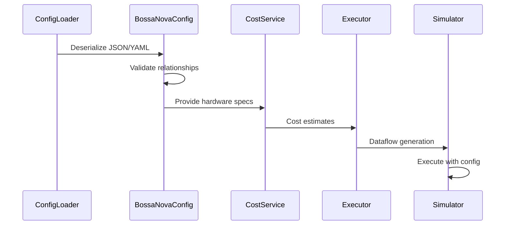

# Config Module

## Overview

The config module serves as the central configuration management system for the Nova Platform architecture. It defines comprehensive dataclass structures that encapsulate hardware specifications, memory hierarchies, compute capabilities, power characteristics, and bandwidth configurations for BossaNova-based systems.

This module provides the foundational configuration schema used throughout the Nova Platform ecosystem, enabling consistent hardware modeling and performance simulation across different components like cost services, executors, and simulators.

## Architecture

The config module is organized into several logical configuration groups:

1. **Cache Configuration** - Defines cache hierarchy parameters
2. **Hardware Instance Configuration** - Specifies compute unit counts and topology
3. **Frequency Configuration** - Manages clock domains
4. **Compute Configuration** - Defines processing capabilities
5. **Dataflow Engine Configuration** - Configures DTE parameters
6. **Bandwidth Configuration** - Models memory bandwidth characteristics
7. **Memory Configuration** - Specifies memory hierarchy and capacities
8. **Power Configuration** - Defines power models and characteristics
9. **System Configuration** - Top-level BossaNova configuration

### Architecture Diagram

```mermaid
graph TB
    BossaNovaConfig --> InstNumConfig
    BossaNovaConfig --> FreqConfig
    BossaNovaConfig --> ComputeConfig
    BossaNovaConfig --> DTEConfig
    BossaNovaConfig --> BWConfig
    BossaNovaConfig --> MemoryConfig
    BossaNovaConfig --> PowerLibConfig
    
    MemoryConfig --> MemoryCommonConfig
    MemoryConfig --> MemoryL3Config
    MemoryConfig --> MemoryL2Config
    MemoryConfig --> MemoryL1Config
    MemoryConfig --> MemoryL0Config
    MemoryConfig --> LLC_Config
    MemoryConfig --> L1C_Config
    
    BWConfig --> BWFile["BWFile (multiple)"]
    BWFile --> BWEle
    
    PowerLibConfig --> PowerSIPLibConfig
    PowerLibConfig --> PowerL1LibConfig
    PowerLibConfig --> PowerSOCLibConfig
    PowerLibConfig --> PowerMemLibConfig
    PowerLibConfig --> PowerESLLibConfig
    PowerLibConfig --> PowerD2DLibConfig
    
    FreqConfig --> FreqDomain
    
    ComputeConfig --> TPUComputeConfig
    
    AbstractCacheConfig --> L1C_Config
    AbstractCacheConfig --> LLC_Config
```



## Component Relationships

The config module integrates with other Nova Platform modules as follows:

- **Cost Service**: Uses configuration data to calculate compute, memory, and power costs
- **Executor**: Leverages hardware specs to generate dataflow actions
- **Simulator**: Uses configurations to model system behavior
- **Data Visual**: Reads configs for post-processing and visualization
- **Nova Lite**: Uses configurations for pipeline simulation

## Core Components

### Cache Configuration Hierarchy

#### AbstractCacheConfig
Base class for all cache configurations with common parameters:
- `CACHE_LINE_SIZE`: Size of a cache line (default: 128 bytes)
- `CACHE_WAYS`: Number of cache ways
- `CACHE_SIZE`: Total cache size
- `MEM_LATENCY`: Memory access latency
- `NON_MEM_LATENCY`: Non-memory operation latency
- `NUM_MSHR`: Number of Miss Status Holding Registers (default: INF)

#### L1C_Config
L1 Cache configuration extending AbstractCacheConfig:
- `NUM_OF_CORE`: Number of cores sharing this cache
- `CACHE_SIZE_PER_CORE`: Cache size allocated per core

#### LLC_Config
Last Level Cache configuration:
- `NUM_OF_PARTITIONS`: Number of cache partitions
- `NUM_OF_SLICES_PER_PARTITION`: Number of slices per partition

### Hardware Instance Configuration

#### InstNumConfig
Defines the hardware topology and instance counts:
- `NUM_OF_CLUSTER`: Number of compute clusters
- `NUM_OF_CORE_PER_CLUSTER`: Cores per cluster
- `NUM_OF_DSM`: Number of Distributed Shared Memory units
- `NUM_OF_DIE`: Number of dies (default: 1)
- `NUM_OF_ESL_PER_DIE`: Number of ESL units per die (default: 1)

### Frequency Configuration

#### FreqConfig
Manages different clock domains in the system:
- `CORE`: Core frequency in GHz
- `INTERCONNECT`: Interconnect frequency
- `NOC`: Network-on-Chip frequency
- `LLC`: Last Level Cache frequency
- `MC`: Memory Controller frequency
- `L3`: L3 cache frequency
- `ESL`: ESL frequency (optional)

**Method**: `get_freq(domain: FreqDomain)` - Returns frequency in Hz for a given domain

#### FreqDomain
Enum defining available frequency domains:
- `CORE`
- `INTERCONNECT`
- `NOC`
- `LLC`
- `MC`
- `L3`
- `ESL`

### Compute Configuration

#### TPUComputeConfig
TPU-specific compute parameters:
- `ARRAY_M`: Matrix dimension M for TPU array
- `ARRAY_N`: Matrix dimension N for TPU array
- `K_TILE`: Tile size for K dimension

#### ComputeConfig
General compute capabilities:
- `thread_2d_throughput`: Dict[DType, float] - 2D operation throughput per dtype
- `thread_1d_throughput`: Dict[DType, float] - 1D operation throughput per dtype
- `thread_sfu_throughput`: Special function unit throughput
- `compute_parallel_capability`: Parallel processing capability
- `tpu`: TPUComputeConfig instance

### Dataflow Engine Configuration

#### DTEConfig
Dataflow Engine configuration:
- `THREAD_NUMBER`: Number of DTE threads
- `BW_PER_DTE_THREAD`: Bandwidth per thread (Bytes/cycle)

### Bandwidth Configuration

#### BWEle
Bandwidth element representing timing and bandwidth characteristics:
- `pre_latency`: Pre-operation latency in cycles
- `post_latency`: Post-operation latency in cycles
- `rw_ratio`: Read-to-write bandwidth ratio
- `bw`: Bandwidth in Bytes/cycle
- `bw_per_second`: Bandwidth in Bytes/second

**Method**: `get_bw(freq)` - Returns effective bandwidth considering frequency

**Deserialization**: Supports multiple input formats:
```python
# Format 1: [[pre, post], bw_byte_cycle, rw_ratio]
BWEle.deserialize([[32, 0], 256, 1])

# Format 2: [[pre, post], 0, rw_ratio, bw_byte_second]
BWEle.deserialize([[355, 0], 0, 1, 8/2*10*2**40])
```

#### BWFile
Bandwidth configuration for a specific frequency domain:
- `freq_domain`: Associated frequency domain
- `otsd`: Off-to-same-die bandwidth
- `shared`: Shared memory bandwidth
- `local`: Local memory bandwidth
- `sic_io`: SIC I/O bandwidth
- `noc`: NoC bandwidth
- `llc`: LLC bandwidth
- `llc_far`: Far LLC bandwidth
- `mc`: Memory controller bandwidth
- `l3`: L3 cache bandwidth

#### BWConfig
System-wide bandwidth configuration:
- `xpu`, `cdte`, `l0`, `local`, `shared`, `sic_io`, `noc`, `llc`, `llc_far`, `mc`, `l3`, `esl`: BWFile instances for different components

### Memory Configuration

#### MemoryCommonConfig
Common memory parameters:
- `DSM_PRIVATE_SHARED_RATIO`: Ratio between private and shared DSM

#### MemoryL3Config
L3 memory configuration:
- `TOTAL_SIZE`: Total L3 memory size

#### MemoryL1Config
L1 memory configuration:
- `SIZE_PER_CORE`: Memory size per core

#### MemoryL2Config
L2 memory configuration:
- `SIZE_PER_SIC`: Memory size per SIC (System Integration Chip)

#### MemoryL0Config
L0 memory configuration:
- `IV_SIZE`: Instruction Vector size
- `SMR_SIZE`: Shared Memory Region size
- `OA_SIZE`: Output Accumulator size

#### MemoryConfig
Comprehensive memory configuration:
- `common`: MemoryCommonConfig
- `l3`: MemoryL3Config
- `l2`: MemoryL2Config
- `l1`: MemoryL1Config
- `l0`: MemoryL0Config
- `llc`: LLC_Config
- `l1c`: L1C_Config (optional)

### Power Configuration

#### PowerSIPLibConfig
SIP (System Integration Package) power characteristics:
- `voltage`, `voltage_scaling`: Voltage parameters
- `idle_power`, `leakage_power`, `plc_power`: Power states
- `xpu_l0_dsm_local_energy`, `xpu_l0_dsm_shared_energy`, `xpu_l0_l3_energy`: Energy costs
- `compute_2d_mac_energy`, `compute_1d_op_energy`, `compute_msf_op_energy`: Compute energy per dtype

#### PowerL1LibConfig
L1-level power configuration:
- `voltage`, `voltage_scaling`: Voltage parameters
- `idle_power`, `leakage_power`: Power states
- `sip_master_energy`, `dte_master_energy`: Master unit energy
- Various energy costs for data movement (xpu/dte between DSM/L3)

#### PowerSOCLibConfig
SoC-level power configuration:
- `voltage`, `voltage_scaling`: Voltage parameters
- `mc_idle_power`, `dataflow_idle_power`, `esl_idle_power`, `d2d_idle_power`: Idle powers
- `leakage_power`, `other_power`: Additional power components
- `cdte_master_energy`: C-DTE master energy
- `llc_hit_data_energy`, `llc_miss_data_energy`: LLC energy costs
- `sic_io`: SIC I/O power

#### PowerMemLibConfig
Memory power configuration:
- `voltage_scaling`: Voltage scaling factor
- `leakage_power`: Leakage power
- `hbm_active_power`, `hbm_idle_power`: HBM power states

#### PowerD2DLibConfig
Die-to-die interconnect power:
- `leakage_power`: Leakage power
- `active_power`: Active power
- `idle_power`: Idle power

#### PowerESLLibConfig
ESL (Edge Side Loader) power:
- `idle_power`: Idle power
- `leakage_power`: Leakage power

#### PowerLibConfig
Complete power library configuration:
- `sip`, `l1`, `soc`, `mem`, `esl`, `d2d`: Component-specific configs
- `dtu_edc`: EDC unit power (default: 1000)
- `board_efficiency`: Board efficiency factor (default: 1)
- `edc_filter_glitch`: EDC glitch filtering (default: 10e-9)
- `edc_current_interval`: EDC current measurement interval (default: 10)

### System Topology

#### TOPO
Enum defining system topologies:
- `STANDALONE`: Single unit (1 node)
- `FULLMESH8`: Full mesh with 8 nodes
- `SUPERNODE4`, `SUPERNODE8`, `SUPERNODE16`, `SUPERNODE32`: Supernode configurations

### Top-Level Configuration

#### BossaNovaConfig
Complete system configuration:
- `name`: System identifier
- `arch_name`: Architecture name
- `arch`: Architecture specification
- `inst_num`: InstNumConfig
- `freq`: FreqConfig
- `compute`: ComputeConfig
- `dte`: DTEConfig
- `bw`: BWConfig
- `memory`: MemoryConfig
- `power`: PowerLibConfig
- `gather_mu`: Gather multiplier (default: 1)
- `gcu_id`: GCU identifier (default: 0)

**Hash**: Implements `__hash__` based on name for dictionary key usage

## Configuration Flow



## Usage Examples

### Basic Configuration Loading

```python
from nova_platform.config import BossaNovaConfig
from nova_platform.utils.config_utils import ConfigLoader

# Load from JSON/YAML
config = ConfigLoader.load("system_config.json", BossaNovaConfig)

# Access configuration
print(f"System: {config.name}")
print(f"Clusters: {config.inst_num.NUM_OF_CLUSTER}")
print(f"Core Frequency: {config.freq.CORE} GHz")
```

### Bandwidth Calculation

```python
# Get bandwidth for a specific domain
bw_config = config.bw.xpu
freq = config.freq.get_freq(FreqDomain.CORE)

# Calculate effective bandwidth
shared_bw = bw_config.shared.get_bw(freq)
print(f"Shared bandwidth: {shared_bw} Bytes/cycle")
```

### Power Model Access

```python
# Access power library configuration
power_sip = config.power.sip
print(f"SIP Voltage: {power_sip.voltage}V")
print(f"2D MAC Energy: {power_sip.compute_2d_mac_energy}")
```

## Integration Points

### With Cost Service
The config module provides hardware specifications to:
- `cost_service.cache`: Cache cost calculations
- `cost_service.compute`: Compute cost estimations
- `cost_service.power`: Power consumption modeling

### With Executor
The executor uses configurations for:
- Dataflow generation (`dataflow_gen` modules)
- Resource allocation
- Event and barrier management

### With Nova Lite
Simulation pipeline uses configs for:
- Hardware modeling
- Performance prediction
- Bottleneck analysis

## Configuration Validation

The module ensures:
1. **Type Safety**: All fields use proper type hints
2. **Default Values**: Sensible defaults for optional parameters
3. **Deserialization**: Custom deserialization for complex types (BWEle)
4. **Consistency**: Related configs reference each other appropriately

## Best Practices

1. **Use ConfigLoader**: Always use `ConfigLoader` for deserialization
2. **Validate Relationships**: Ensure hardware counts match across configs
3. **Frequency Units**: Remember `get_freq()` returns Hz, configs store GHz
4. **BWEle Format**: Use proper deserialization format for bandwidth elements
5. **Topology Matching**: Ensure TOPO matches inst_num configuration

## Related Modules

- **base_model**: Defines DType used in compute configs
- **utils.config_utils**: Provides ConfigLoader and BaseEnum
- **cost_service**: Uses configs for cost calculations
- **executor**: Uses configs for dataflow generation
- **simulator**: Uses configs for system simulation

## Notes

- All bandwidth values in BWEle are per-bank unless specified
- Memory sizes are typically in bytes
- Frequencies are stored in GHz but converted to Hz for calculations
- Power values are typically in mW or µW depending on context
- Energy values are typically in pJ (picojoules)
