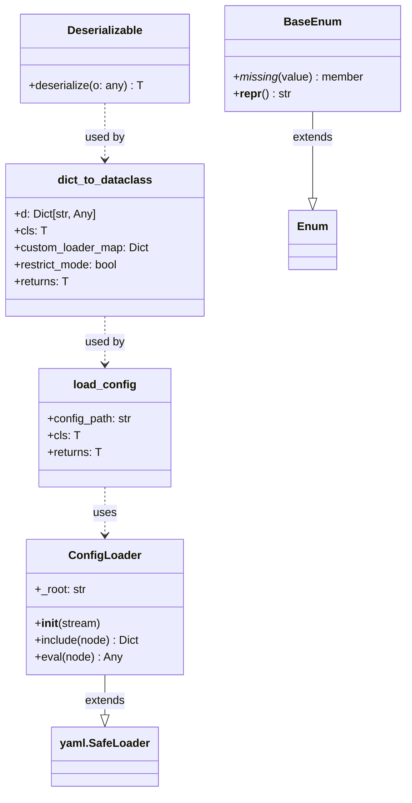
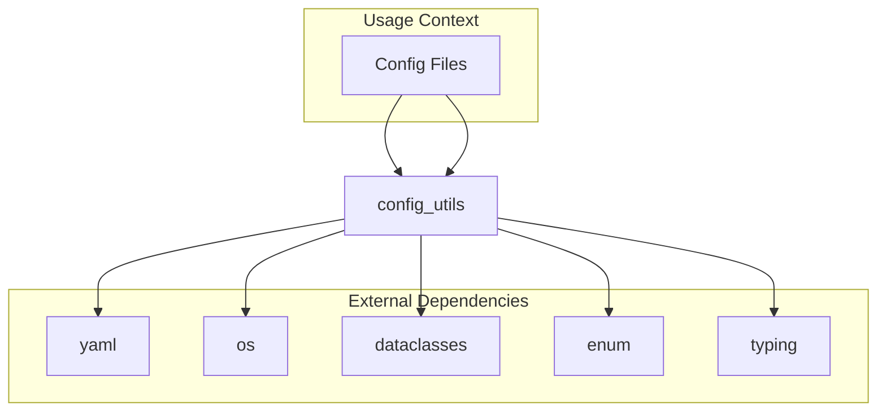
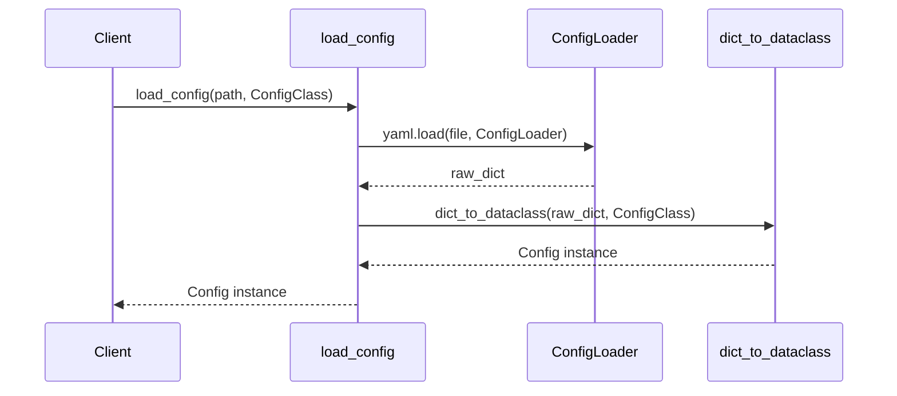
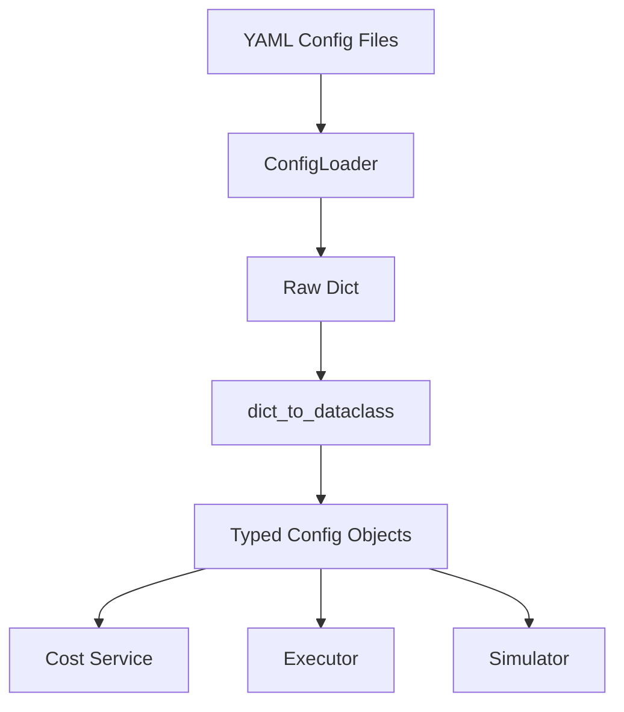

# Config Utils Module

## Overview

The `config_utils` module provides utilities for loading, parsing, and deserializing configuration files in YAML format. It supports advanced YAML features like file inclusion, expression evaluation, and automatic conversion of YAML data to Python dataclasses with type safety.

**Module Path:** `nova-platform.nova_platform.utils.config_utils`

**Core Components:**
- `ConfigLoader` - Custom YAML loader with include and eval directives
- `Deserializable` - Base class for custom deserialization logic
- `BaseEnum` - Enhanced enum with case-insensitive lookup
- `dict_to_dataclass()` - Type-safe conversion from dict to dataclass
- `load_config()` - Main entry point for loading configuration files

## Architecture

### Component Overview



### Module Dependencies



## Core Components

### ConfigLoader

A custom YAML loader that extends `yaml.SafeLoader` to support advanced features:

#### Features

1. **File Inclusion (`!include`)**: Include YAML files within other YAML files
2. **Expression Evaluation (`!eval`)**: Execute Python expressions at load time

#### Usage

```python
# config.yaml
base_config: !include base.yaml
learning_rate: !eval 0.001 * 8  # Evaluates to 0.008
```

```python
from nova_platform.utils.config_utils import ConfigLoader
import yaml

with open("config.yaml") as f:
    config = yaml.load(f, ConfigLoader)
```

#### Implementation Details

- **Root Path Resolution**: Automatically resolves relative paths based on the main config file's location
- **Recursive Loading**: Included files can themselves include other files
- **Safety**: Uses `yaml.SafeLoader` as base for secure parsing

### Deserializable

Abstract base class for objects that require custom deserialization logic.

```python
class Deserializable:
    def deserialize(o: any):
        raise NotImplementedError()
```

#### Purpose

When `dict_to_dataclass()` encounters a class that inherits from `Deserializable`, it delegates the entire deserialization process to that class's `deserialize()` method.

#### Example

```python
from dataclasses import dataclass
from nova_platform.utils.config_utils import Deserializable

@dataclass
class CustomConfig(Deserializable):
    value: int
    
    @classmethod
    def deserialize(cls, d: dict):
        # Custom logic here
        return cls(value=d["val"] * 2)
```

### BaseEnum

Enhanced enumeration class that provides case-insensitive lookup.

```python
class BaseEnum(Enum):
    @classmethod
    def _missing_(cls, value):
        value = value.lower()
        for member in cls:
            if member.name.lower() == value:
                return member
        return None
    
    def __repr__(self):
        return self.name
```

#### Features

1. **Case-Insensitive Matching**: `MyEnum["value"]` works with "VALUE", "Value", "value"
2. **Clean Representation**: `repr()` returns just the name, not the full object representation

#### Example

```python
class Color(BaseEnum):
    RED = 1
    GREEN = 2
    BLUE = 3

# All these work:
Color["red"]
Color["RED"]
Color["Red"]
```

## Core Functions

### dict_to_dataclass()

The main conversion function that transforms dictionaries into type-safe dataclass instances.

#### Signature

```python
def dict_to_dataclass(
    d: Dict[str, Any], 
    cls: T, 
    custom_loader_map={}, 
    *, 
    restrict_mode=True
) -> T:
```

#### Parameters

| Parameter | Type | Description |
|-----------|------|-------------|
| `d` | `Dict[str, Any]` | Input dictionary to convert |
| `cls` | `Type[T]` | Target dataclass type or generic type |
| `custom_loader_map` | `Dict` | Mapping of types to custom loader functions |
| `restrict_mode` | `bool` | If True, missing required fields raise exceptions |

#### Type Support

The function handles multiple type constructs:

1. **Dataclasses**: Standard dataclass conversion with field validation
2. **Lists**: `List[InnerClass]` - recursively converts each element
3. **Tuples**: `Tuple[Type1, Type2, ...]` - converts each element to corresponding type
4. **Dictionaries**: `Dict[KeyType, ValType]` - converts keys and values
5. **Custom Types**: Any type with a constructor that accepts the value

#### Field Processing Logic

For dataclass fields:

1. **Value Present**: Convert value to field's type
2. **Value Missing, Default Exists**: Use default value
3. **Value Missing, Factory Exists**: Call factory function
4. **Value Missing, No Default**: 
   - `restrict_mode=True`: Raise exception
   - `restrict_mode=False`: Set to `None` (with warning)

#### Example

```python
from dataclasses import dataclass
from typing import List, Dict
from nova_platform.utils.config_utils import dict_to_dataclass

@dataclass
class SubConfig:
    value: int

@dataclass
class MainConfig:
    name: str
    sub: SubConfig
    items: List[int]
    mapping: Dict[str, int]

data = {
    "name": "test",
    "sub": {"value": 42},
    "items": [1, 2, 3],
    "mapping": {"a": 1, "b": 2}
}

config = dict_to_dataclass(data, MainConfig)
```

### load_config()

High-level function to load and parse configuration files.

#### Signature

```python
def load_config(config_path: str, cls: T) -> T
```

#### Process Flow



#### Example

```python
from dataclasses import dataclass
from nova_platform.utils.config_utils import load_config

@dataclass
class AppConfig:
    host: str
    port: int
    debug: bool = False

config = load_config("app.yaml", AppConfig)
```

## Integration with Other Modules

The config_utils module serves as a foundational utility used across the nova_platform system:

### Configuration Classes

The module is designed to work with configuration classes defined in the `config` module:

- `BossaNovaConfig` - Main platform configuration
- `MemoryConfig` - Memory hierarchy configuration
- `ComputeConfig` - Compute unit configuration
- `PowerConfig` - Power modeling configuration

### Usage Pattern



### Example: Loading Platform Configuration

```python
from nova_platform.config import BossaNovaConfig
from nova_platform.utils.config_utils import load_config

# Load complete platform configuration
config = load_config("platform.yaml", BossaNovaConfig)

# Access typed configuration
print(config.memory.l1.size)  # Type-safe access
```

## Best Practices

### 1. Use Type Hints

Always use proper type hints in dataclasses for maximum type safety:

```python
@dataclass
class GoodConfig:
    items: List[int]  # Clear type
    mapping: Dict[str, float]  # Explicit types

@dataclass
class BadConfig:
    items: list  # Less clear
    mapping: dict  # No type information
```

### 2. Leverage Defaults

Provide default values for optional fields:

```python
@dataclass
class ServerConfig:
    host: str
    port: int = 8080
    timeout: int = 30
```

### 3. Use Restrict Mode for Production

```python
# Development - more flexible
config = dict_to_dataclass(data, Config, restrict_mode=False)

# Production - strict validation
config = dict_to_dataclass(data, Config, restrict_mode=True)
```

### 4. Organize Config Files

Use `!include` to keep configurations modular:

```yaml
# main.yaml
memory: !include memory.yaml
compute: !include compute.yaml
power: !include power.yaml
```

### 5. Use Custom Loaders for Complex Types

```python
def load_complex_type(d):
    return ComplexType.from_dict(d)

custom_map = {ComplexType: load_complex_type}
config = dict_to_dataclass(data, Config, custom_loader_map=custom_map)
```

## Error Handling

### Common Errors

1. **Missing Required Field**
   ```python
   # Error: required field_name is not provided
   # Solution: Add field to config or provide default
   ```

2. **Type Mismatch**
   ```python
   # Error: Cannot convert 'str' to 'int'
   # Solution: Ensure YAML values match expected types
   ```

3. **File Not Found**
   ```python
   # Error: [Errno 2] No such file: 'missing.yaml'
   # Solution: Check file paths in !include directives
   ```

4. **Invalid YAML Syntax**
   ```python
   # Error: yaml.scanner.ScannerError
   # Solution: Validate YAML syntax
   ```

## Testing

Example test pattern:

```python
import unittest
from dataclasses import dataclass
from nova_platform.utils.config_utils import load_config, dict_to_dataclass

class TestConfigUtils(unittest.TestCase):
    def test_basic_load(self):
        @dataclass
        class TestConfig:
            value: int
        
        config = dict_to_dataclass({"value": 42}, TestConfig)
        self.assertEqual(config.value, 42)
    
    def test_includes(self):
        config = load_config("test_main.yaml", TestConfig)
        # Test that includes work correctly
```

## Performance Considerations

- **Caching**: For frequently loaded configs, consider caching the result
- **Validation**: `restrict_mode=True` adds minimal overhead, always use in production
- **Large Files**: For very large configs, consider streaming or chunking

## Future Enhancements

Potential improvements to consider:

1. **Schema Validation**: Add JSON schema validation support
2. **Environment Variables**: Support `${ENV_VAR}` syntax
3. **Type Checking**: Runtime type verification beyond conversion
4. **Config Merging**: Merge multiple config files with precedence rules
5. **Validation Hooks**: Post-load validation callbacks

## Related Modules

- **base_utils**: Contains `BaseDataclass` and `SingletonMeta` used with configs
- **config**: Defines platform-specific configuration dataclasses
- **cost_service**: Uses configs for cost calculations
- **executor**: Uses configs for platform execution

## References

- [YAML Specification](https://yaml.org/spec/)
- [Python Dataclasses](https://docs.python.org/3/library/dataclasses.html)
- [Python Typing](https://docs.python.org/3/library/typing.html)
