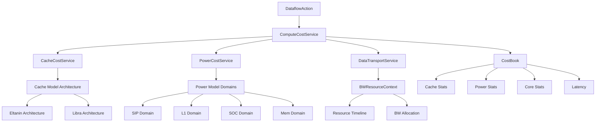
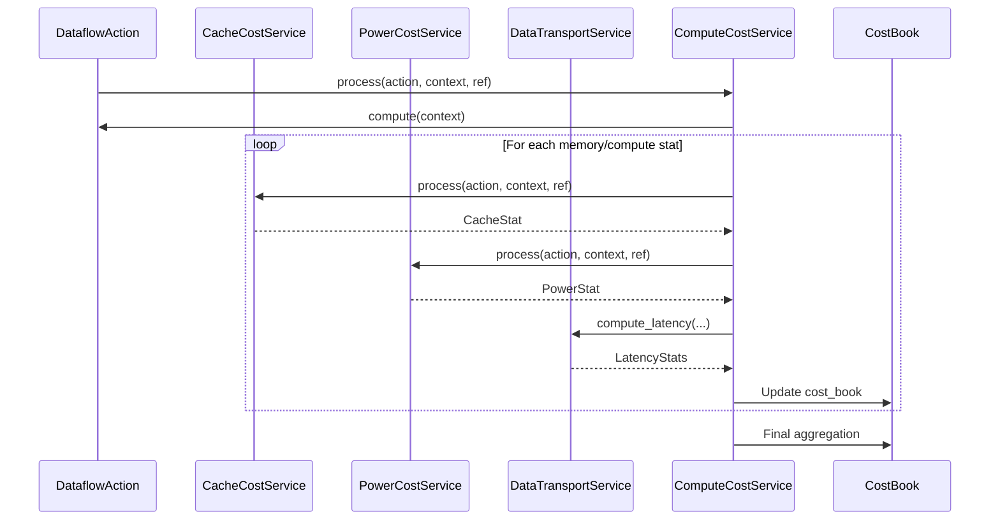

# Cost Service Module

## Overview

The **cost_service** module is a core component of the Nova Platform that provides comprehensive cost modeling and analysis capabilities for hardware accelerators. It calculates computational costs, memory access costs, and power consumption for dataflow operations executed on heterogeneous computing architectures.

The module serves as the primary interface between the dataflow execution engine and the hardware performance models, enabling accurate performance prediction and optimization analysis.

## Architecture

The cost_service module is organized into three main sub-modules:

1. **Cache Cost Service** - Models cache hierarchy behavior and memory access patterns
2. **Compute Cost Service** - Calculates computational costs and orchestrates cost analysis
3. **Power Cost Service** - Models power consumption across different hardware domains



## Core Functionality

The cost_service module provides:

- **Memory Hierarchy Simulation**: Accurate modeling of L1, LLC, and L3 cache behavior
- **Bandwidth Resource Management**: Timeline-based bandwidth allocation and competition modeling
- **Power Consumption Analysis**: Domain-specific power calculation (SIP, L1, SOC, Memory)
- **Latency Calculation**: End-to-end latency including leading and data transfer latency
- **Performance Statistics**: Comprehensive reporting of computational and memory metrics

## Sub-modules

### 1. Cache Cost Service

The cache cost service models memory hierarchy behavior using different architectural implementations.

**Key Components:**
- `CacheCostService` - Main cache cost calculation engine
- `ParallelCacheCostService` - GPU-accelerated cache simulation
- `BaseCacheCostService` - Abstract base class
- `CacheStat` - Cache statistics data structure

**Architecture Implementations:**
- **Eltanin**: Multi-level cache (L1C, LLC, L3) with SIP-aware partitioning
- **Libra**: LLC-focused architecture with address-based partitioning

**Documentation:** [cache_cost_service.md](cache_cost_service.md)

### 2. Compute Cost Service

The compute cost service orchestrates the overall cost analysis process, coordinating between cache, power, and data transport services.

**Key Components:**
- `ComputeCostService` - Main orchestration engine
- `BaseCostService` - Abstract service interface
- `BossaNovaContext` - Global execution context
- `DataflowAction` - Abstract action interface
- `CostBook` - Per-action cost accumulation
- `EngineStat` - Per-engine performance statistics

**Documentation:** [compute_cost_service.md](compute_cost_service.md)

### 3. Power Cost Service

The power cost service models power consumption across different hardware domains using physics-based formulas.

**Key Components:**
- `PowerCostService` - Power calculation engine
- `PowerStat` - Aggregated power statistics
- `PowerSIPDomain` - SIP (System-in-Package) power model
- `PowerL1Domain` - L1 cache power model
- `PowerSOCDomain` - SOC-level power model
- `PowerMemDomain` - Memory power model

**Documentation:** [power_cost_service.md](power_cost_service.md)

### 4. Data Transport Service

The data transport service calculates latency for memory transfers considering bandwidth competition.

**Key Components:**
- `DataTransportService` - Latency calculation engine
- `BWResourceContext` - Bandwidth resource management
- `BWResource` - Individual bandwidth resource
- `Timeline` - Time-based resource allocation
- `BWFrame` - Time frame for bandwidth allocation

**Documentation:** [data_transport_service.md](data_transport_service.md)

## Data Flow



## Key Concepts

### CostBook
A per-action data structure that accumulates all cost metrics:
- `cache_stat_dict`: Cache hit/miss statistics per level
- `power_stat`: Power consumption by domain
- `core_stat`: Computational statistics (MACs, vector ops, etc.)
- `latency`: Total execution latency
- `r_datasize/w_datasize`: Read/write data sizes

### BossaNovaContext
Global execution context that maintains:
- Cost books for all actions
- Bandwidth resource context
- Power context with timelines
- Performance trace generator
- Post-execution statistics

### Timeline
A generic timeline data structure used for:
- Bandwidth resource allocation
- Power consumption tracking
- Event scheduling

## Configuration

The module uses `BossaNovaConfig` which includes:
- Memory configuration (cache sizes, ways, latencies)
- Compute configuration (throughput, frequencies)
- Power configuration (energy per operation, voltage)
- Bandwidth configuration (NOC, MC, ESL)
- Instance configuration (die, cluster, core counts)

## Usage Example

```python
from nova_platform.config import BossaNovaConfig
from nova_platform.cost_service.compute.compute_cost_service import ComputeCostService
from nova_platform.cost_service.cache.cache_cost_service import CacheCostService
from nova_platform.cost_service.power.power_cost_service import PowerCostService

# Initialize configuration
config = BossaNovaConfig(...)

# Create services
cache_svc = CacheCostService(config)
power_svc = PowerCostService(config)
compute_svc = ComputeCostService(config, power_svc, dump_addr, cache_svc, esl_switch)

# Process dataflow
context = BossaNovaContext()
for action in dataflow.actions:
    compute_svc.process(action, context, ref=0)

# Generate report
report = compute_svc.post_stat(context, dataflow)
```

## Cross-Module Dependencies

The cost_service module interacts with:
- **base_models**: Provides base data structures (DataflowActionMemoryStat, etc.)
- **dataflow_actions**: Defines concrete action implementations
- **dataflow_core**: Core dataflow structures
- **executor**: Executes dataflows using cost services
- **config**: Configuration definitions
- **cache_model**: External cache simulation library (optional dependency)

## Error Handling

The module gracefully handles missing dependencies:
- If `cache_model` package is not available, `CacheCostService` operates in no-op mode
- All services provide fallback implementations
- Detailed logging for debugging and analysis

## Performance Considerations

- **ParallelCacheCostService**: Uses CUDA for GPU-accelerated cache simulation
- **Timeline merging**: Optimized for large-scale simulations
- **Caching**: LRU caching for expensive computations
- **Locking**: Thread-safe resource allocation for parallel execution

## See Also

- [cache_cost_service.md](cache_cost_service.md) - Detailed cache modeling
- [compute_cost_service.md](compute_cost_service.md) - Computation orchestration
- [power_cost_service.md](power_cost_service.md) - Power modeling
- [data_transport_service.md](data_transport_service.md) - Bandwidth and latency
