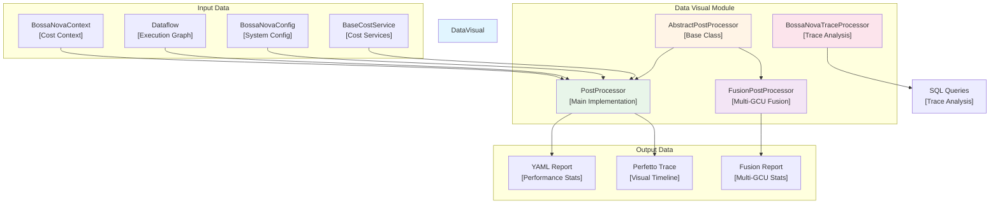
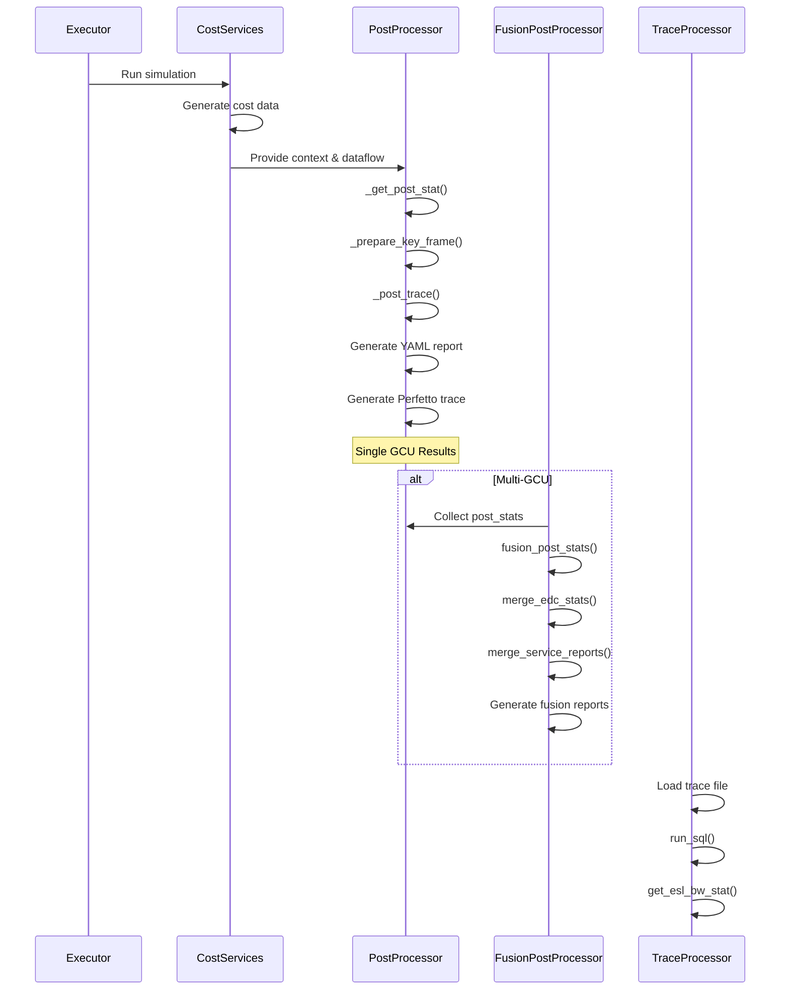
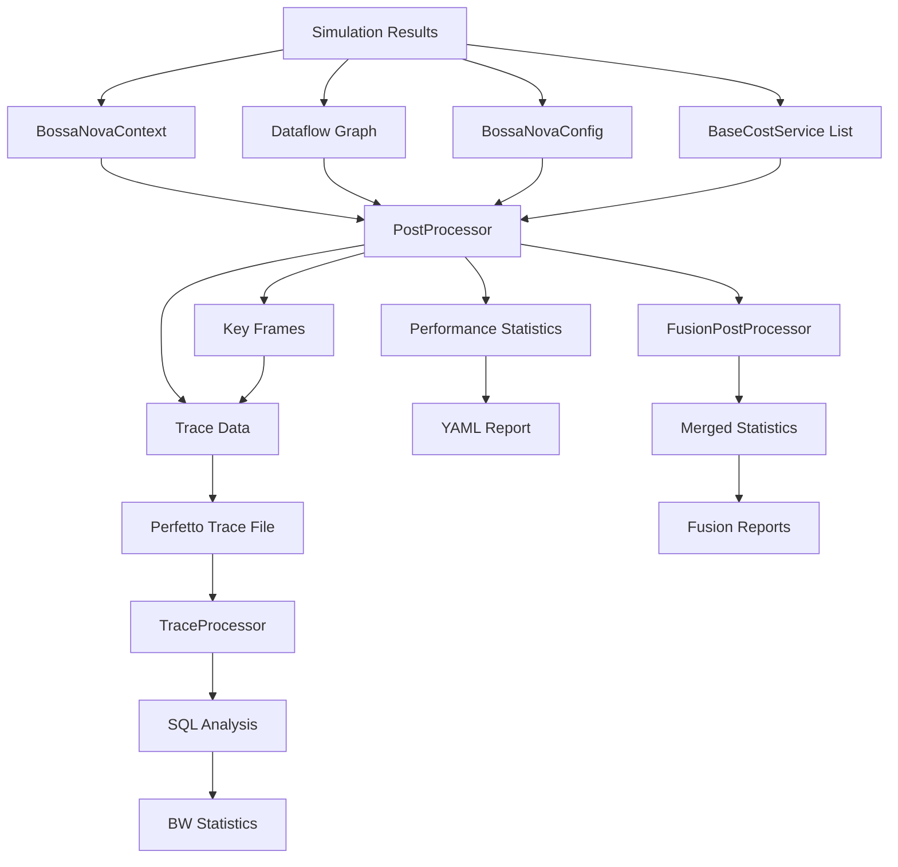

# Data Visualization Module

## Overview

The `data_visual` module is responsible for post-processing simulation results and generating comprehensive reports and visualizations. It provides functionality to transform raw computational data into structured reports and trace files that can be analyzed for performance optimization and debugging purposes.

This module serves as the final stage in the Nova Platform simulation pipeline, processing data generated by cost services and executors to produce human-readable reports and machine-readable trace files compatible with Perfetto.

## Architecture



## Core Components

The data_visual module consists of three main components:

### 1. AbstractPostProcessor
**File**: `nova-platform/nova_platform/data_visual/__init__.py`

The base class that defines the interface for all post-processors. It provides a single method `get_trace_generator()` that must be implemented by concrete implementations.

**Key Responsibilities**:
- Define the contract for post-processor implementations
- Provide access to trace generation capabilities

### 2. PostProcessor
**File**: `nova-platform/nova_platform/data_visual/post_processor.py`

The primary implementation that handles single-GCU post-processing. It performs comprehensive analysis of simulation results and generates detailed reports.

**Key Responsibilities**:
- Calculate performance statistics (latency, utilization, bandwidth)
- Generate Perfetto-compatible trace files
- Prepare key frames for visualization
- Aggregate service-specific reports
- Analyze power consumption and EDC (Energy-Delay Product)

**Core Methods**:
- `generate_report()`: Main entry point for report generation
- `_get_post_stat()`: Calculates overall performance statistics
- `_prepare_key_frame()`: Identifies critical time points for visualization
- `_post_trace()`: Generates Perfetto trace data
- `_get_longest()`: Computes critical path through execution graph

### 3. FusionPostProcessor
**File**: `nova-platform/nova_platform/data_visual/post_processor.py`

Specialized post-processor for multi-GCU scenarios. It merges results from multiple GCUs to provide unified performance metrics.

**Key Responsibilities**:
- Fuse statistics from multiple GCUs
- Merge EDC reports across devices
- Aggregate service reports
- Generate per-GCU fusion reports

**Core Methods**:
- `fusion_post_stats()`: Merges statistics from multiple post-processors
- `fusion_post_stats_list()`: Handles lists of post-stats for different GCUs
- `merge_service_report_dicts()`: Aggregates service-specific metrics
- `merge_edc_stats()`: Combines energy consumption data
- `generate_fus_reports()`: Outputs fused reports per GCU

### 4. BossaNovaTraceProcessor
**File**: `nova-platform/nova_platform/data_visual/trace_post_processor.py`

A trace analysis tool that processes Perfetto trace files using SQL queries to extract specific performance metrics.

**Key Responsibilities**:
- Parse and query Perfetto trace files
- Extract bandwidth statistics
- Analyze ESL (Embedded System Layer) performance

**Core Methods**:
- `run_sql()`: Execute SQL queries on trace data
- `get_esl_bw_stat()`: Extract ESL bandwidth metrics

## Module Workflow



## Data Flow



## Integration with Other Modules

### Dependencies
- **base_models**: Provides `PostStat`, `EDCStat` for result storage
- **cost_service**: Supplies `BossaNovaContext`, `BaseCostService` with cost data
- **dataflow_core**: Provides `Dataflow` execution graph structure
- **perfetto_protobuf**: Supplies `TraceGenerator` for trace file creation

### Usage Context
The data_visual module is typically invoked by the **executor** module after simulation completes. It processes the results from various cost services (compute, cache, power) to produce comprehensive performance reports.

## Key Features

### 1. Performance Metrics Calculation
- **Latency**: Total execution time and critical path analysis
- **Utilization**: Core, memory, and I/O bandwidth utilization
- **Power**: Domain-specific power consumption and EDC metrics

### 2. Visualization Support
- **Perfetto Traces**: Timeline-based visualization compatible with Perfetto UI
- **Key Frame Identification**: Automatic detection of critical execution points
- **Multi-level Tracking**: Per-cluster, per-die, and global views

### 3. Multi-GCU Fusion
- **Statistical Aggregation**: Weighted averaging across GCUs
- **Report Merging**: Intelligent combination of service reports
- **Energy Analysis**: Combined EDC statistics

### 4. Trace Analysis
- **SQL-based Querying**: Flexible trace data extraction
- **Bandwidth Analysis**: ESL and memory bandwidth statistics
- **Performance Profiling**: Detailed execution timeline analysis

## Configuration

The module uses `BossaNovaConfig` for configuration, particularly:
- `power.edc_current_interval`: EDC current measurement granularity
- `power.edc_filter_glitch`: Filter threshold for noise reduction
- `inst_num.NUM_OF_DIE`: Number of dies for multi-device scenarios
- `inst_num.NUM_OF_CLUSTER`: Clusters per die

## Output Formats

### YAML Report
Contains:
- Total latency and action end time
- Utilization metrics (core core, L3, SIC I/O, ESL, D2D)
- Service-specific reports
- EDC statistics with current profiles

### Perfetto Trace
Contains:
- Counter tracks for bandwidth utilization
- Power consumption timelines
- EDC current measurements
- Event markers for key execution points

### Fusion Reports
Per-GCU YAML files with merged statistics from multiple simulation runs.

## Usage Example

```python
from nova_platform.data_visual.post_processor import PostProcessor, FusionPostProcessor
from nova_platform.data_visual import AbstractPostProcessor

# Single GCU processing
processor = PostProcessor(outdir="./results")
report = processor.generate_report(
    context=bossa_context,
    dataflow=dataflow,
    config=config,
    service_list=[compute_svc, cache_svc, power_svc]
)

# Multi-GCU fusion
fusion = FusionPostProcessor(outdir="./fused_results")
fused_report = fusion.fusion_post_stats([post_stat_0, post_stat_1, post_stat_2])
fusion.generate_fus_reports([fused_report])
```

## Performance Considerations

- **Memory**: Key frame dictionaries can grow large; consider filtering for long traces
- **I/O**: Trace generation is I/O intensive; use appropriate output directories
- **Computation**: Longest path calculation uses recursion; may need optimization for very large graphs

## Future Enhancements

1. **Parallel Processing**: Multi-threaded report generation for large GCUs
2. **Custom Metrics**: Plugin system for user-defined performance metrics
3. **Interactive Visualization**: Web-based dashboard generation
4. **Advanced Filtering**: Configurable trace data filtering and compression
