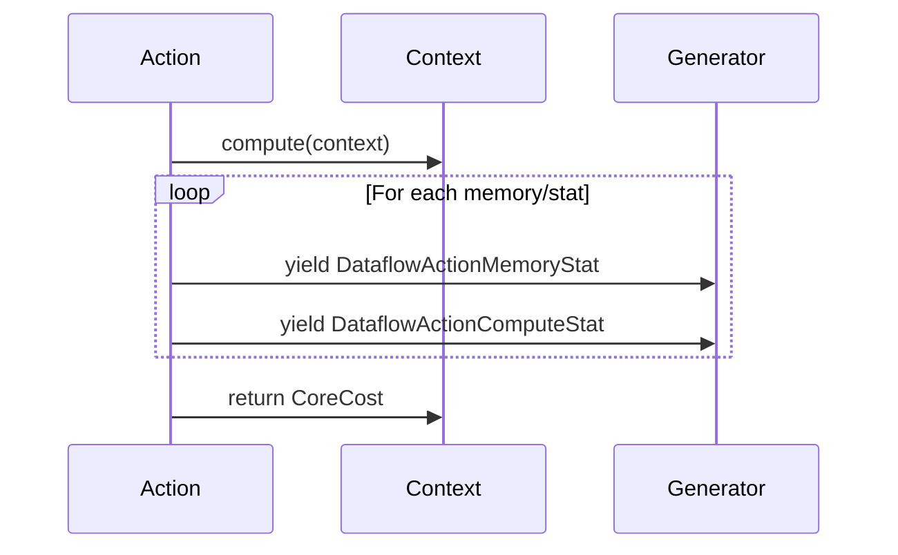

# Dataflow Actions Module

## Overview

The `dataflow_actions` module is a core component of the Nova Platform that defines and implements various computational operations for dataflow graphs. It provides a comprehensive set of action classes that represent different types of operations (GEMM, activation functions, collective operations, etc.) with detailed performance modeling capabilities.

This module is responsible for:
- Defining action classes for various computational operations
- Modeling memory access patterns and compute statistics
- Calculating latency and performance metrics
- Supporting multiple hardware backends (XPU, TPU, DTE)
- Handling distributed operations (AllGather, AllReduce, etc.)

## Architecture

```mermaid
graph TB
    subgraph "Base Classes"
        DDA[DiagDataflowAction]
        XPUA[XPUAction]
        DTEA[DTEAction]
    end
    
    subgraph "XPU Operations"
        XPUAct[XPUActivationAction]
        XPUGemm[XPUGemmAction]
        XPUAllGather[XPUAllGatherAction]
        XPUAllReduce[XPUAllReduceAction]
        XPUElementWise[XPUElementWiseAction]
        XPUGather[XPUGatherAction]
        XPUScatter[XPUScatterAction]
        XPUSoftmax[XPUSoftmaxAction]
        XPULayerNorm[XPULayernormAction]
        XPUSdpa[XPUSdpaAction]
        XPULocalGemm[XPULocalGemmAction]
        XPUNop[XPUNopAction]
    end
    
    subgraph "TPU Operations"
        TPUGemm[TpuGemmAction]
    end
    
    subgraph "DTE Operations"
        DTESlice[CDTESliceAction]
        DTEDeslice[CDTEDesliceAction]
        DTEReshape[CDTEReshapeAction]
    end
    
    subgraph "Activation Functions"
        XPURelu[XPUReluAction]
        XPUSigmoid[XPUSigmoidAction]
        XPUSilu[XPUSiluAction]
        XPUGelu[XPUGeluAction]
    end
    
    subgraph "Supporting Classes"
        DiagTensor[DiagTensor]
        DiagTensorContainer[DiagTensorContainer]
        TileInfo[TileInfo]
        CoreCost[CoreCost]
        InstructionInfo[InstructionInfo]
    end
    
    DDA --> XPUA
    DDA --> DTEA
    XPUA --> XPUAct
    XPUA --> XPUGemm
    XPUA --> XPUAllGather
    XPUA --> XPUAllReduce
    XPUA --> XPUElementWise
    XPUA --> XPUGather
    XPUA --> XPUScatter
    XPUA --> XPUSoftmax
    XPUA --> XPULayerNorm
    XPUA --> XPUSdpa
    XPUA --> XPULocalGemm
    XPUA --> XPUNop
    XPUAct --> XPURelu
    XPUAct --> XPUSigmoid
    XPUAct --> XPUSilu
    XPUAct --> XPUGelu
    DTEA --> DTESlice
    DTEA --> DTEDeslice
    DTEA --> DTEReshape
    XPUA --> CoreCost
    XPUA --> InstructionInfo
    DDA --> DiagTensorContainer
    DDA --> TileInfo
```



## Module Structure

The dataflow_actions module is organized into several sub-modules:

### 1. **Diagnostic Actions** (`diag_action.py`)
Core data structures and base classes for dataflow actions.

**Key Components:**
- `DiagTensor`: Represents tensor metadata (address, dimensions, strides, etc.)
- `DiagTensorContainer`: Groups tensors with their IDs
- `DiagDataflowAction`: Base class for all dataflow actions
- `DiagDataflow`: Complete dataflow graph representation
- `TileInfo`: Contains tiling information for operations

### 2. **DTE Actions** (`dte_action.py`)
Data Transformation Engine operations for data movement and transformation.

**Key Components:**
- `DTEAction`: Base DTE operation
- `CDTESliceAction`: Slice operation (L3 → Shared)
- `CDTEDesliceAction`: Deslice operation (Shared → L3)
- `CDTEReshapeAction`: Reshape operation within L3

### 3. **XPU Actions** (`xpu_action.py`)
Base class for XPU (execution processor unit) operations.

**Key Components:**
- `XPUAction`: Base class for all XPU operations with common functionality

### 4. **XPU Activation Actions** (`xpu_activation_action.py`)
Activation function operations.

**Key Components:**
- `XPUActivationAction`: Base activation action
- `XPUReluAction`: ReLU activation
- `XPUSigmoidAction`: Sigmoid activation
- `XPUSiluAction`: SiLU activation
- `XPUGeluAction`: GELU activation

### 5. **XPU GEMM Actions** (`xpu_gemm_action.py`, `xpu_gemm_action_2.py`)
Matrix multiplication operations.

**Key Components:**
- `XPUGemmAction`: General matrix multiplication
- `TpuGemmAction`: TPU-specific GEMM

### 6. **XPU Collective Actions**
Distributed operations across multiple processors.

**Components:**
- `XPUAllGatherAction`: Gather data from all ranks
- `XPUAllReduceAction`: Reduce data across all ranks
- `XPUAllGatherGemmAction`: Combined AllGather + GEMM
- `XPUGatherAction`: Gather operation
- `XPUScatterAction`: Scatter operation

### 7. **XPU Element-wise Actions** (`xpu_elementwise_action.py`)
Element-wise arithmetic operations.

**Components:**
- `XPUElementWiseAction`: Base element-wise action
- `XPUAddAction`: Addition
- `XPUMulAction`: Multiplication

### 8. **XPU Specialized Operations**
Complex operations with specific implementations.

**Components:**
- `XPULayernormAction`: Layer normalization
- `XPUSoftmaxAction`: Softmax operation
- `XPUSoftmaxBackwardAction`: Softmax backward pass
- `XPUSdpaAction`: Scaled Dot-Product Attention
- `XPULocalGemmAction`: Local GEMM operations
- `XPUNopAction`: No-operation (NOP)

## Core Functionality

### Memory Access Modeling

All actions implement memory access pattern generation through:

```python
def get_memory_access(self) -> Generator[DataflowActionMemoryAccess, None, None]:
    # Yields memory access patterns
```

This generates `DataflowActionMemoryAccess` objects representing:
- Base address
- Access size
- Read/write operation

### Performance Statistics

Actions compute three types of statistics:

1. **Memory Statistics** (`DataflowActionMemoryStat`):
   - Total data transferred
   - Source/destination domains
   - Latency and timing
   - Memory access lists

2. **Compute Statistics** (`DataflowActionComputeStat`):
   - Operation counts (1D, 2D, SFU)
   - Compute latency
   - Relative timing

3. **Core Statistics** (`BaseCoreStat`/`CoreCost`):
   - Overall latency
   - Data sizes
   - Instruction information
   - Tensor operations

### Computation Flow



## Key Patterns

### 1. **Generator-Based Statistics**
All actions use Python generators to yield statistics incrementally, allowing for:
- Memory-efficient processing
- Streaming computation
- Real-time analysis

### 2. **Configuration-Driven Behavior**
Actions use `BossaNovaConfig` to determine:
- Hardware parameters (frequencies, bandwidths)
- Memory hierarchy (L0, L1, L3)
- Compute capabilities
- Topology information

### 3. **Address Domain Awareness**
Operations track memory domains:
- `LOCAL`: Local memory
- `L0`: Level 0 cache
- `L3`: Level 3 cache
- `SHARED`: Shared memory
- `REMOTE`: Remote memory (for distributed ops)

### 4. **Tiling and Parallelism**
Many operations support:
- Multi-dimensional tiling
- Grid/block/thread dimensions
- Sub-thread parallelism
- Unrolling factors

## Usage Example

```python
from nova_platform.dataflow.action.xpu_gemm_action import XPUGemmAction
from nova_platform.config import BossaNovaConfig

# Create action
action = XPUGemmAction(
    config=BossaNovaConfig(...),
    action_id=1,
    action_type=DataflowActionType.XPU,
    engine_id=0,
    inputs=[...],
    outputs=[...],
    code="gemm_fp16",
    data=[...],
    tile_info=TileInfo(...),
    ...
)

# Compute statistics
context = BossaNovaContext(...)
for stat in action.get_memory_stat():
    print(f"Memory stat: {stat}")
    
core_cost = action.compute(context)
print(f"Total latency: {core_cost.latency}")
```

## Integration Points

The dataflow_actions module integrates with:

1. **Cost Service** (`nova_platform.cost_service`): For cost calculation
2. **Base Models** (`nova_platform.base_model`): For data structures
3. **Benchmark** (`nova_platform.benchmark`): For workload definitions
4. **Executor** (`nova_platform.executor`): For dataflow generation
5. **Config** (`nova_platform.config`): For hardware configuration

## Performance Characteristics

### Latency Calculation
Actions compute latency by considering:
- Memory access latency (read/write)
- Compute latency (operations)
- Data transfer latency
- Synchronization overhead
- Parallel execution factors

### Memory Bandwidth Modeling
- Different bandwidths for different memory levels
- Read/write ratio considerations
- Contention modeling
- Remote access penalties

### Compute Throughput
- 1D operation throughput
- 2D (MAC) operation throughput
- SFU (special function unit) throughput
- Scalar operation overhead

## Best Practices

1. **Always provide complete configuration**: Actions require full `BossaNovaConfig` for accurate modeling
2. **Use appropriate tiling**: Tile dimensions significantly impact performance
3. **Consider data domains**: Memory domain transitions add latency
4. **Profile with realistic data**: Use representative tensor shapes and data types
5. **Account for parallelism**: Utilize grid/block/thread dimensions effectively

## See Also

- [Base Models Documentation](base_models.md)
- [Cost Service Documentation](cost_service.md)
- [Executor Documentation](executor.md)
- [Benchmark Documentation](benchmark.md)
