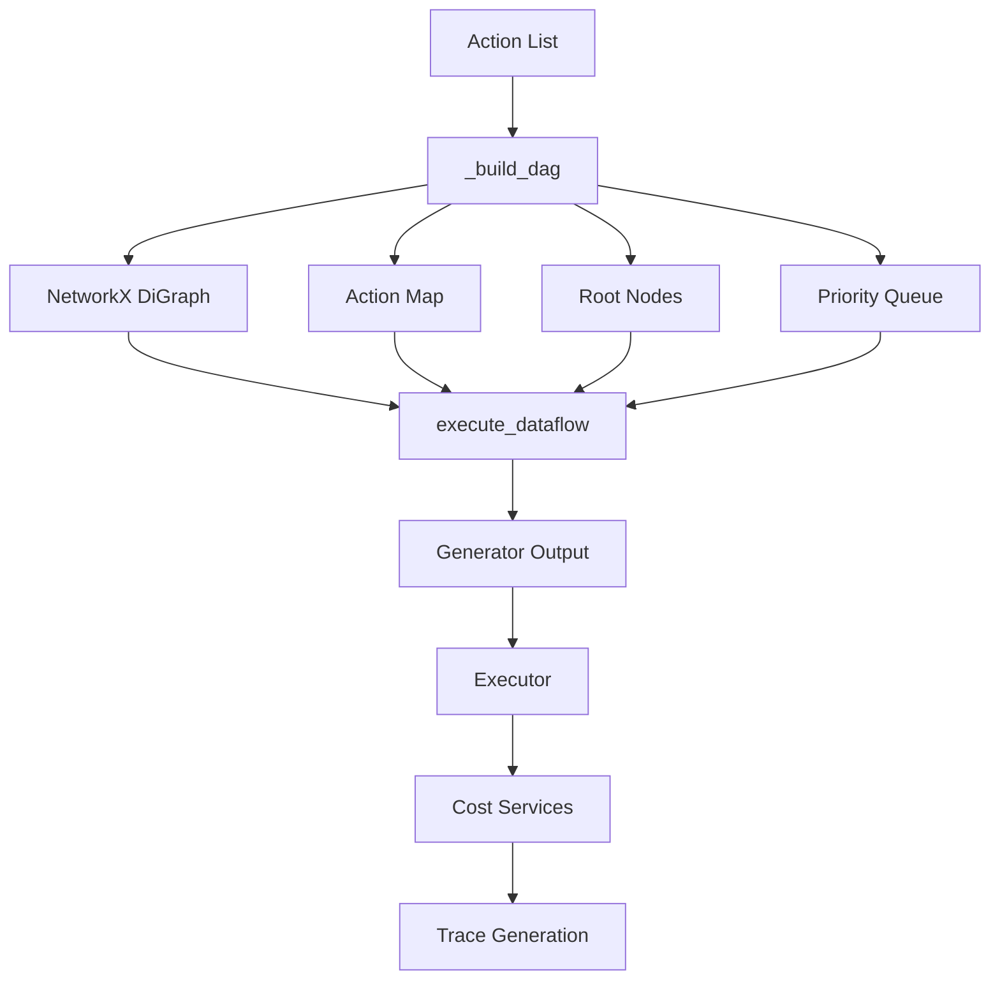
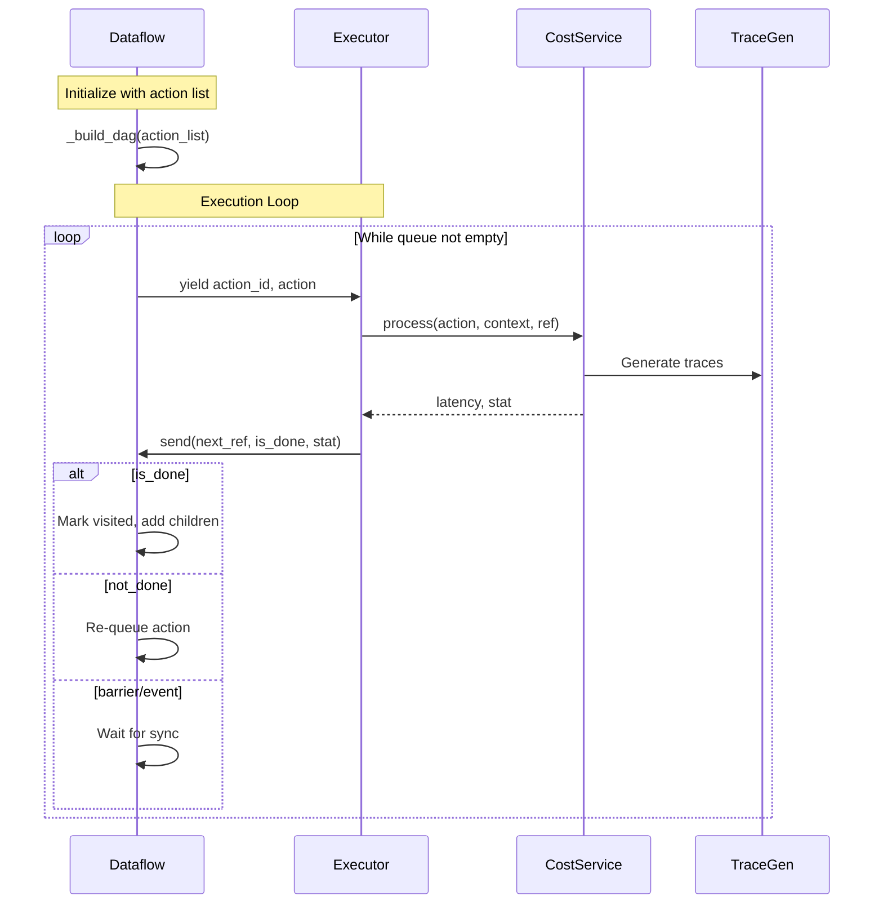
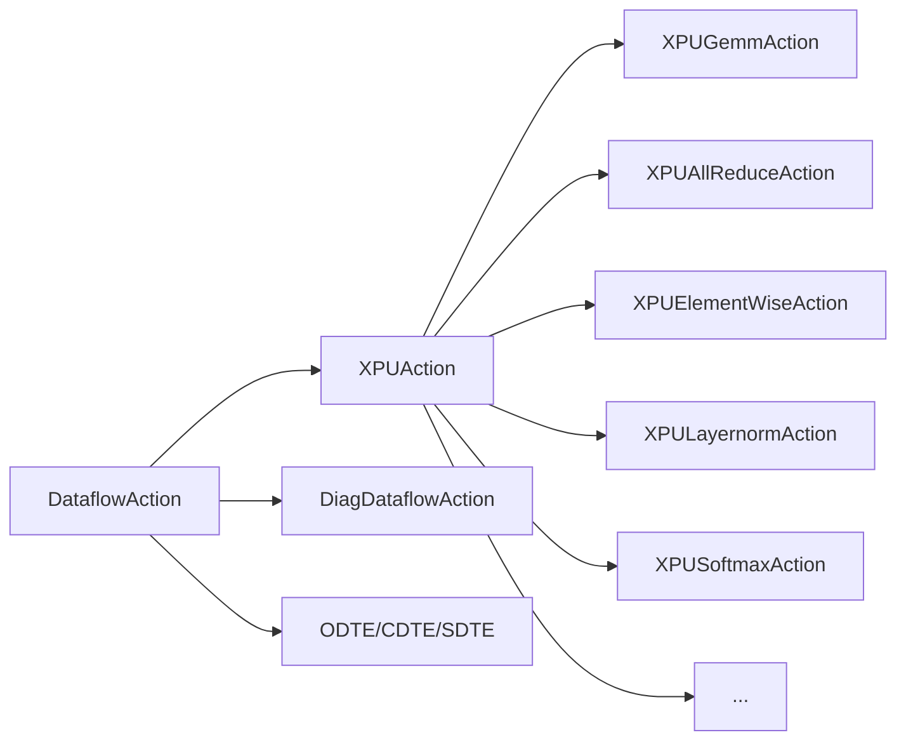
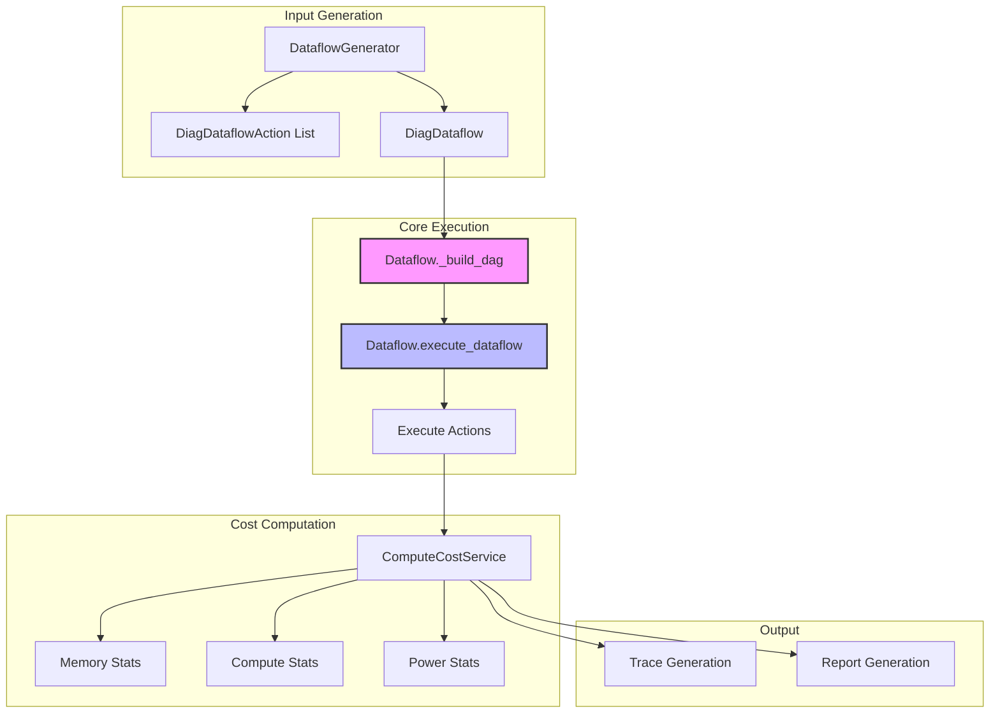

# Dataflow Core Module

## Overview

The **dataflow_core** module is the central orchestration engine that manages the execution of computational workflows in the Nova Platform system. It provides a graph-based execution model that handles dependencies, scheduling, and coordination of dataflow actions across distributed compute resources.

### Module Purpose

The Dataflow class serves as the execution engine that:
- Converts a list of dependent actions into a Directed Acyclic Graph (DAG)
- Manages action execution order based on dependencies
- Coordinates execution through a priority-based queue system
- Handles barriers and events for synchronization
- Provides a generator-based execution model for incremental processing

### Key Components

- **Dataflow**: The main class that orchestrates action execution
- **DataflowAction**: Abstract base class for all computational operations
- **BARRIER**: Synchronization primitive for coordinating multiple actions
- **BossaNovaEvent**: Event-based synchronization mechanism

## Architecture

### Core Data Structure

The Dataflow module uses a graph-based architecture:



### Execution Flow



## Component Details

### Dataflow Class

The `Dataflow` class is the core orchestrator that manages action execution.

#### Key Methods

**`_build_dag(action_list: List[DataflowAction])`**
- Converts a list of actions into a dependency graph
- Creates a NetworkX DiGraph representing action dependencies
- Identifies root nodes (actions with no parents)
- Maps action IDs to action objects
- Initializes a priority queue for execution

**`execute_dataflow() -> Generator`**
- Generator-based execution method
- Yields actions in dependency order
- Handles completion status and re-queuing
- Manages barriers and events
- Ensures all actions are visited

#### Execution Algorithm

```python
def execute_dataflow(self):
    visited = set()
    
    # Initialize queue with root actions
    for action in self._roots:
        self.queue.put((0, action))
    
    while True:
        if not self.queue.empty():
            priority, action_id = self.queue.get()
            
            # Skip if already visited
            if action_id in visited:
                continue
            
            # Check if all predecessors are done
            if not all(p in visited for p in self.dag.predecessors(action_id)):
                continue
            
            # Yield action for execution
            next_ref, is_done, stat = yield action_id, self._action_map[action_id]
        else:
            next_ref, is_done, stat = yield None, None
        
        # Handle execution result
        if isinstance(stat, BARRIER) or isinstance(stat, BossaNovaEvent):
            pass  # Synchronization handled by executor
        elif not is_done:
            self.queue.put((next_ref, action_id))  # Re-queue
        elif is_done:
            visited.add(action_id)
            # Add children to queue
            for child_id in self.dag.successors(action_id):
                self.queue.put((next_ref, child_id))
        elif (next_ref, is_done, stat) == (None, None, None):
            break  # Termination signal
    
    assert len(visited) == len(self.dag.nodes)
```

### DataflowAction

Abstract base class for all computational operations. Key methods include:

- **`get_action_id()`**: Unique identifier
- **`get_parent_ids()`**: Dependencies
- **`get_child_ids()`**: Dependent actions
- **`get_action_type()`**: Type of action (XPU, ESL, etc.)
- **`compute(context)`**: Generator that yields memory/compute statistics
- **`get_memory_stat()`**: Memory access patterns
- **`get_core_stat()`**: Compute statistics

#### Action Types



### Synchronization Primitives

#### BARRIER

Coordinates multiple actions to wait for each other:

```python
class BARRIER:
    def __init__(self, count):
        self.count = count
        self.barrier = [i for i in range(count)]
        self.barrier_map = {b: False for b in self.barrier}
        self.max_t = 0
        self.is_done = False
    
    def wait(self, ref):
        # Wait until all participants reach barrier
        while self.barrier_map:
            yield self
        self.is_done = True
        return self.max_t
```

#### BossaNovaEvent

Event-based synchronization:

```python
class BossaNovaEvent:
    def __init__(self, uuid):
        self.is_done = False
        self.max_t = 0
        self.uuid = uuid
    
    def set(self, ref):
        self.max_t = max(ref, self.max_t)
        self.is_done = True
    
    def wait(self, ref):
        while not self.is_done:
            yield self
        return self.max_t
```

## Integration with Other Modules

### Dependencies

The dataflow_core module integrates with:

1. **[base_models](base_models.md)**: Defines DataflowActionType, DataflowOpType
2. **[dataflow_actions](dataflow_actions.md)**: Provides concrete action implementations
3. **[cost_service](cost_service.md)**: Computes costs for actions
4. **[executor](executor.md)**: Uses Dataflow to execute workflows
5. **[config](config.md)**: Provides configuration for actions

### Data Flow



## Usage Examples

### Basic Usage

```python
from nova_platform.dataflow.dataflow import Dataflow
from nova_platform.cost_service.compute.base_compute_model import DataflowAction

# Create action list with dependencies
actions = [
    action1,  # Root action
    action2,  # Depends on action1
    action3,  # Depends on action1
    action4,  # Depends on action2 and action3
]

# Build dataflow
dataflow = Dataflow()
dataflow._build_dag(actions)

# Execute
action_gen = dataflow.execute_dataflow()
action_id, action = next(action_gen)

while action:
    # Process action
    next_ref, is_done, stat = action_gen.send((ref, True, result))
    action_id, action = action_gen.send((next_ref, is_done, stat))
```

### With Executor

```python
from nova_platform.executor.nova_platform_executor import BossaNovaExecutor

executor = BossaNovaExecutor(
    config=config,
    outdir=output_dir,
    tgen=trace_gen,
    op_shape=[1, 512, 512, 512],
    optype='gemm',
    dtype=DType.FP16,
    input_addr=[],
    output_addr=[],
    dataflow_config={}
)

# Execute returns generator
for ref, status in executor.execute():
    print(f"Progress: {ref}, Status: {status}")

# Generate report
report = executor.generate_report()
```

## Performance Considerations

### Queue Management

- Uses `PriorityQueue` for efficient action scheduling
- Priority based on execution time (next_ref)
- O(log n) insertion and removal

### Graph Operations

- NetworkX DiGraph for dependency tracking
- O(1) node/edge additions
- O(V+E) for successor/predecessor queries

### Memory Efficiency

- Generator-based execution prevents loading all actions in memory
- Lazy evaluation of dependencies
- Action map provides O(1) action lookup

## Testing

Key test scenarios:

1. **Linear Dependencies**: Actions in sequence
2. **Parallel Branches**: Multiple independent paths
3. **Diamond Dependencies**: Common parent, multiple children, common child
4. **Barriers**: Synchronization points
5. **Events**: Conditional execution

## Future Enhancements

1. **Dynamic Reordering**: Adaptive scheduling based on runtime metrics
2. **Resource Awareness**: Consider compute/memory resource constraints
3. **Fault Tolerance**: Recovery from action failures
4. **Parallel Execution**: Multi-threaded action processing
5. **Optimization**: Graph-based optimizations (fusion, reordering)

## Related Documentation

- [Dataflow Actions](dataflow_actions.md) - Concrete action implementations
- [Executor](executor.md) - Execution orchestration
- [Cost Service](cost_service.md) - Cost computation
- [Base Models](base_models.md) - Core data structures
