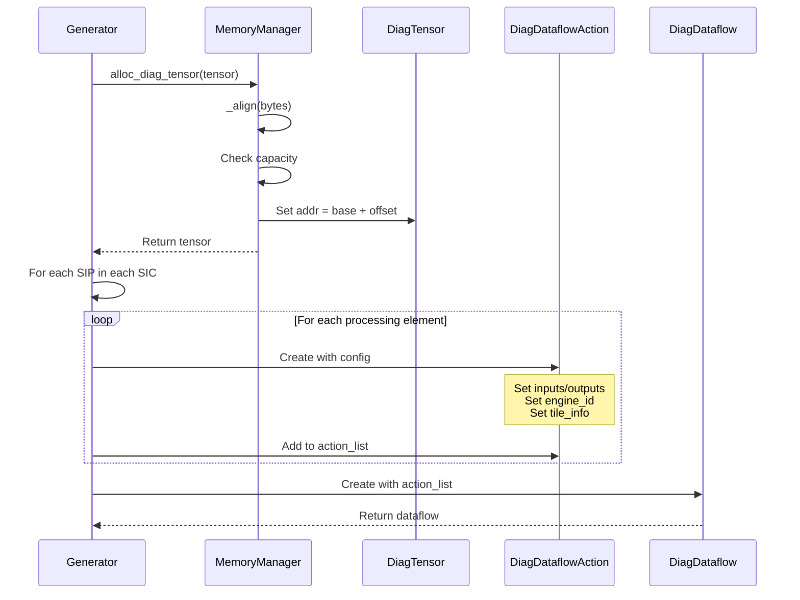
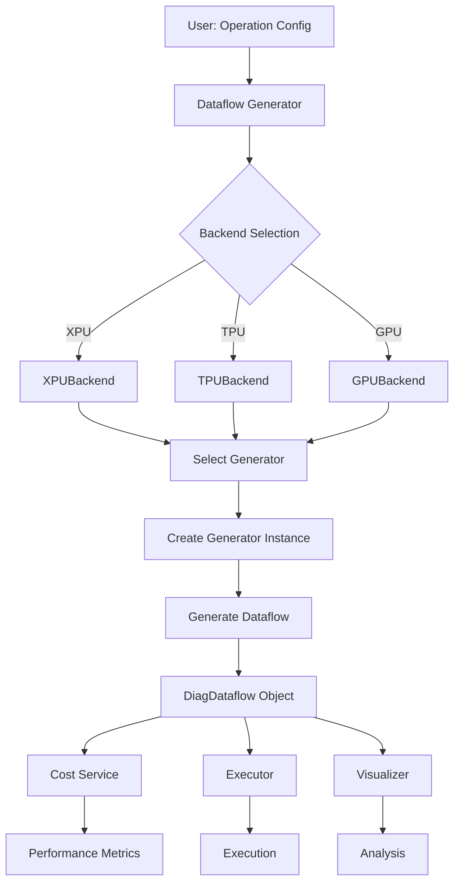

# Dataflow Generation Module (dataflow_gen)

## Overview

The **dataflow_gen** module is a core component of the Nova Platform executor system responsible for generating dataflow graphs for various computational operations. It provides a flexible, backend-agnostic framework that translates high-level operation specifications into executable dataflow representations suitable for different hardware architectures (XPU, TPU, GPU).

### Module Purpose

- **Operation Translation**: Convert operation configurations into structured dataflow graphs
- **Backend Abstraction**: Support multiple hardware backends through a unified interface
- **Memory Management**: Handle tensor allocation and address assignment within the dataflow
- **Action Generation**: Create platform-specific execution actions for each operation

### Key Features

- **Extensible Architecture**: Easy to add new operations and backends
- **Memory-Aware**: Tracks memory usage and allocates addresses for tensors
- **Hardware-Specific Optimizations**: Different generators for different hardware backends
- **Unified Interface**: Consistent API for all operation types

---

## Architecture

### Module Structure

The dataflow_gen module follows a hierarchical architecture with three main layers:

1. **Backend Layer**: Hardware-specific backends (XPU, TPU, GPU)
2. **Generator Layer**: Operation-specific dataflow generators
3. **Core Layer**: Base classes and memory management

```mermaid
classDiagram
    class Backend {
        <<abstract>>
        +get_generator_cls(op_type: str)
        +has_generator(op_type: str) bool
    }
    
    class XPUBackend {
        +_generator_mapping: Dict
        +get_generator_cls(op_type: str)
        +has_generator(op_type: str) bool
    }
    
    class TPUBackend {
        +_generator_mapping: Dict
        +get_generator_cls(op_type: str)
        +has_generator(op_type: str) bool
    }
    
    class GPUBackend {
        +_generator_mapping: Dict
        +get_generator_cls(op_type: str)
        +has_generator(op_type: str) bool
    }
    
    class DataflowGenerator {
        <<abstract>>
        +config: BossaNovaConfig
        +dataflow_config: Dict
        +l3_mm: MemoryManager
        +inputs: List
        +outputs: List
        +add_input_tensor()
        +add_output_tensor()
        +generate_dataflow() DiagDataflow
        +_generate() void
    }
    
    class MemoryManager {
        +total_bytes: int
        +base_addr: int
        +bytes_used: int
        +alloc_mem(bytes: int) int
        +alloc_diag_tensor(tensor: DiagTensor)
        +_align(bytes) int
    }
    
    class GemmSharedDataflowGenerator {
        +_generate()
    }
    
    class GemmLocalDataflowGenerator {
        +_generate()
    }
    
    class TPUGemmDataflowGenerator {
        +_generate()
        +generate_dataflow() DiagDataflow
    }
    
    class ElementwiseDataflowGenerator {
        +_generate()
    }
    
    class LayerNormDataflowGenerator {
        +_generate()
    }
    
    class SoftmaxDataflowGenerator {
        +_generate()
    }
    
    class GatherDataflowGenerator {
        +_generate()
    }
    
    class ScatterDataflowGenerator {
        +_generate()
    }
    
    class TransposeDataflowGenerator {
        +_generate()
    }
    
    class SdpaDataflowGenerator {
        +_generate()
    }
    
    class AllReduceDataflowGenerator {
        +_generate()
    }
    
    class AllGatherDataflowGenerator {
        +_generate()
    }
    
    class AllGatherGemmDataflowGenerator {
        +_generate()
    }
    
    Backend <|-- XPUBackend
    Backend <|-- TPUBackend
    Backend <|-- GPUBackend
    
    DataflowGenerator <|-- GemmSharedDataflowGenerator
    DataflowGenerator <|-- GemmLocalDataflowGenerator
    DataflowGenerator <|-- TPUGemmDataflowGenerator
    DataflowGenerator <|-- ElementwiseDataflowGenerator
    DataflowGenerator <|-- LayerNormDataflowGenerator
    DataflowGenerator <|-- SoftmaxDataflowGenerator
    DataflowGenerator <|-- GatherDataflowGenerator
    DataflowGenerator <|-- ScatterDataflowGenerator
    DataflowGenerator <|-- TransposeDataflowGenerator
    DataflowGenerator <|-- SdpaDataflowGenerator
    DataflowGenerator <|-- AllReduceDataflowGenerator
    DataflowGenerator <|-- AllGatherDataflowGenerator
    DataflowGenerator <|-- AllGatherGemmDataflowGenerator
    
    GemmSharedDataflowGenerator -- MemoryManager : uses
    DataflowGenerator -- MemoryManager : contains
    DataflowGenerator -- DiagDataflow : produces
```



---

## Component Relationships

### Core Components

#### 1. **MemoryManager**
Manages L3 memory allocation for tensors within the dataflow.

**Key Responsibilities:**
- Allocate aligned memory addresses
- Track memory usage
- Assign addresses to DiagTensor objects

**Memory Layout:**
```
Base Address: 0x50000000000
Alignment: 128 bytes
```

#### 2. **DataflowGenerator (Base Class)**
Abstract base class for all operation-specific generators.

**Core Responsibilities:**
- Initialize configuration and dataflow parameters
- Manage input/output tensor containers
- Generate DiagDataflowAction objects for each processing element
- Coordinate with MemoryManager for tensor allocation

**Generation Flow:**
```
1. Initialize with config and dataflow_config
2. Call _generate() to create input/output tensors
3. Generate action list for all processing elements
4. Return DiagDataflow object
```

#### 3. **Backend Classes**
Provide hardware-specific operation-to-generator mappings.

**XPUBackend:**
- Supports: GEMM (shared/local), element-wise ops, layernorm, softmax, gather/scatter, SDPA, collective ops
- Uses XPU-specific action classes

**TPUBackend:**
- Supports: GEMM operations
- Uses TPU-specific action classes
- Different action generation logic (array-based instead of SIP-based)

**GPUBackend:**
- Placeholder for future GPU support

---

## Data Flow

### Operation Generation Flow

```mermaid
flowchart TD
    A[Start: Config + Dataflow Config] --> B{Get Backend}
    B -->|arch='xpu'| C[XPUBackend]
    B -->|arch='tpu'| D[TPUBackend]
    B -->|arch='gpu'| E[GPUBackend]
    
    C --> F{Get Generator Class}
    D --> F
    E --> F
    
    F --> G[Instantiate Generator]
    
    G --> H[MemoryManager Setup]
    H --> I[Call _generate()]
    
    I --> J{Operation Type?}
    J -->|GEMM| K[Add Input/Output Tensors<br/>Configure Tile Info]
    J -->|Element-wise| L[Add Input/Output Tensors]
    J -->|LayerNorm| M[Add Input/Output Tensors]
    J -->|Softmax| N[Add Input/Output Tensors]
    J -->|Gather/Scatter| O[Add Input/Output Tensors]
    J -->|SDPA| P[Add Q/KV Tensors]
    J -->|AllReduce/AllGather| Q[Add Collective Tensors]
    
    K --> R[Generate Action List]
    L --> R
    M --> R
    N --> R
    O --> R
    P --> R
    Q --> R
    
    R --> S[Create DiagDataflow]
    S --> T[Return Dataflow]
```

### Action Generation Flow



---

## Operation-Specific Generators

### GEMM Generators

#### **GemmSharedDataflowGenerator**
Generates dataflow for shared memory GEMM operations.

**Input Tensors:**
- LHS: `[k, m, b]` with quantization-aware BPE
- RHS: `[n, k, b]` with quantization-aware BPE
- Scaling (if quantized): `[n, group_num, b]`
- Output: `[n, m, b]`

**Tile Configuration:**
```python
TileInfo(
    cube_dim=[b, m, n],
    grid_dim=[b, m, n],
    block_dim=[1, 1, 1],
    tile_shape=[1, 1, 1]
)
```

**Quantization Support:**
- `No_Quant`: All tensors use default BPE
- `Wf4g_Af8t`: 4-bit weights, 8-bit activations with scaling
- `Wf8t_Af8t`: 8-bit weights and activations

#### **GemmLocalDataflowGenerator**
Extends GemmSharedDataflowGenerator but uses `XPULocalGemmAction` for local memory semantics.

#### **TPUGemmDataflowGenerator**
Specialized for TPU architecture.

**Key Differences:**
- No SIC/SIP concept
- Generates actions based on `ARRAY_NUM` from config
- Uses `TpuGemmAction` class
- Different action generation loop

### Element-Wise Generators

#### **ElementwiseDataflowGenerator**
Handles binary and unary element-wise operations.

**Supported Operations:**
- Binary: `add`, `mul`
- Unary: `gelu`, `relu`, `silu`, `sigmoid`

**Action Mapping:**
```python
_ACTION_MAP = {
    "add": XPUAddAction,
    "mul": XPUMulAction,
    "gelu": XPUGeluAction,
    "relu": XPUReluAction,
    "silu": XPUSiluAction,
    "sigmoid": XPUSigmoidAction,
}
```

### Specialized Generators

#### **LayerNormDataflowGenerator**
- Input/Output: `bench_layernorm_shape`
- Action: `XPULayernormAction`

#### **SoftmaxDataflowGenerator**
- Input/Output: `bench_softmax_shape_b_c`
- Supports forward and backward (softmaxbackward)
- Actions: `XPUSoftmaxAction` or `XPUSoftmaxBackwardAction`

#### **SdpaDataflowGenerator**
- Q tensor: `bench_sdpa_q_shape`
- KV tensor: `bench_sdpa_kv_shape`
- Output: same as Q shape
- Action: `XPUSdpaAction`

#### **Gather/Scatter Generators**
- `GatherDataflowGenerator`: `XPUGatherAction`
- `ScatterDataflowGenerator`: `XPUScatterAction`

#### **TransposeDataflowGenerator**
- Uses `XPUNopAction` (no operation, just data movement)
- Input/Output: `bench_transpose_tensor_b_h_w_c`

### Collective Operation Generators

#### **AllReduceDataflowGenerator**
- Shape: `bench_all_reduce_shape`
- Action: `XPUAllReduceAction`

#### **AllGatherDataflowGenerator**
- Input: `bench_allgather_in_shape`
- Output: `bench_allgather_out_shape`
- Action: `XPUAllGatherAction`

#### **AllGatherGemmDataflowGenerator**
- Combines all-gather with GEMM
- Input: `[k, m, b]` and `[n, k, b]`
- Output: `[n, m, b]`
- Action: `XPUAllGatherGemmAction`

---

## Integration Points

### Dependencies

```mermaid
graph TD
    A[dataflow_gen] --> B[base_model]
    A --> C[config]
    A --> D[dataflow_actions]
    A --> E[dataflow_core]
    A --> F[benchmark]
    
    B --> B1[DType]
    B --> B2[DataflowActionType]
    
    C --> C1[BossaNovaConfig]
    C --> C2[TOPO]
    
    D --> D1[DiagDataflow]
    D --> D2[DiagDataflowAction]
    D --> D3[DiagTensor]
    D --> D4[DiagTensorContainer]
    D --> D5[TileInfo]
    D --> D6[BufCnt]
    D --> D7[XPUGemmAction]
    D --> D8[XPULocalGemmAction]
    D --> D9[XPUSharedGemmAction]
    D --> D10[TpuGemmAction]
    D --> D11[XPUAddAction]
    D --> D12[XPUMulAction]
    D --> D13[XPUGeluAction]
    D --> D14[XPUReluAction]
    D --> D15[XPUSiluAction]
    D --> D16[XPUSigmoidAction]
    D --> D17[XPULayernormAction]
    D --> D18[XPUSoftmaxAction]
    D --> D19[XPUSoftmaxBackwardAction]
    D --> D20[XPUGatherAction]
    D --> D21[XPUScatterAction]
    D --> D22[XPUSdpaAction]
    D --> D23[XPUAllReduceAction]
    D --> D24[XPUAllGatherAction]
    D --> D25[XPUAllGatherGemmAction]
    D --> D26[XPUNopAction]
    
    E --> E1[Dataflow]
    
    F --> F1[Operand]
```



### Usage Flow



---

## Configuration

### BossaNovaConfig Integration

The module uses `BossaNovaConfig` for:
- **Memory Configuration**: L3 total size
- **Compute Configuration**: Number of clusters, dies, cores
- **Architecture Selection**: XPU/TPU/GPU backend
- **TPU Specific**: ARRAY_NUM for TPU operations

### Dataflow Config Parameters

Common parameters across all generators:

| Parameter | Type | Description | Example |
|-----------|------|-------------|---------|
| `bench_op_type` | str | Operation type | "gemm", "add", "layernorm" |
| `bench_basic_data_type` | str | Data type | "fp16", "bf16", "fp32" |
| `bench_gemm_shape_b_m_k_n` | List[int] | GEMM dimensions | [1, 512, 512, 512] |
| `bench_gemm_quant_type` | str | Quantization type | "No_Quant", "Wf4g_Af8t" |
| `bench_elementwise_shape` | List[int] | Element-wise shape | [1, 512, 512] |
| `bench_layernorm_shape` | List[int] | LayerNorm shape | [1, 512, 512] |
| `bench_softmax_shape_b_c` | List[int] | Softmax shape | [1, 512] |
| `bench_sdpa_q_shape` | List[int] | SDPA Q shape | [1, 8, 512, 64] |
| `bench_sdpa_kv_shape` | List[int] | SDPA KV shape | [1, 8, 512, 64] |
| `bench_all_reduce_shape` | List[int] | AllReduce shape | [1, 512] |
| `bench_allgather_in_shape` | List[int] | AllGather input | [1, 256] |
| `bench_allgather_out_shape` | List[int] | AllGather output | [1, 512] |
| `bench_allgather_gemm_shape_b_m_k_n` | List[int] | AllGatherGEMM shape | [1, 512, 512, 512] |
| `bench_gather_shape` | List[int] | Gather shape | [1, 512] |
| `bench_scatter_shape` | List[int] | Scatter shape | [1, 512] |
| `bench_transpose_tensor_b_h_w_c` | List[int] | Transpose shape | [1, 64, 64, 512] |

---

## Public API

### Main Entry Points

#### `generate_dataflow(config, dataflow_config, topo, case_id)`

**Purpose:** Main entry point for generating dataflow graphs.

**Parameters:**
- `config`: `BossaNovaConfig` - System configuration
- `dataflow_config`: `Dict[str, Any]` - Operation-specific configuration
- `topo`: `TOPO` - Topology information
- `case_id`: `int` - Unique identifier for the case

**Returns:** `DiagDataflow` - Generated dataflow graph

**Example:**
```python
from nova_platform.config import BossaNovaConfig, TOPO
from nova_platform.executor.dataflow_gen import generate_dataflow

config = BossaNovaConfig(...)
dataflow_config = {
    "bench_op_type": "gemm",
    "bench_basic_data_type": "fp16",
    "bench_gemm_shape_b_m_k_n": [1, 512, 512, 512],
    "bench_gemm_quant_type": "No_Quant"
}
topo = TOPO(...)
case_id = 1

dataflow = generate_dataflow(config, dataflow_config, topo, case_id)
```

#### `get_backend(config)`

**Purpose:** Factory function to get appropriate backend.

**Parameters:**
- `config`: `BossaNovaConfig` - Contains `arch` field

**Returns:** `Backend` instance (XPUBackend, TPUBackend, or GPUBackend)

**Example:**
```python
backend = get_backend(config)
generator_cls = backend.get_generator_cls("gemm")
```

### Generator Classes

All generator classes follow this pattern:

```python
generator = GeneratorClass(config, dataflow_config, topo=topo, case_id=case_id)
dataflow = generator.generate_dataflow()
```

**Available Generators:**
- `GemmSharedDataflowGenerator`
- `GemmLocalDataflowGenerator`
- `TPUGemmDataflowGenerator`
- `ElementwiseDataflowGenerator`
- `LayerNormDataflowGenerator`
- `SoftmaxDataflowGenerator`
- `GatherDataflowGenerator`
- `ScatterDataflowGenerator`
- `TransposeDataflowGenerator`
- `SdpaDataflowGenerator`
- `AllReduceDataflowGenerator`
- `AllGatherDataflowGenerator`
- `AllGatherGemmDataflowGenerator`

---

## Extending the Module

### Adding a New Operation

1. **Create Action Class** (in `dataflow_actions`):
   ```python
   class NewOpAction(DiagDataflowAction):
       # Define operation-specific behavior
       pass
   ```

2. **Create Generator Class**:
   ```python
   class NewOpDataflowGenerator(DataflowGenerator):
       def __init__(self, config, dataflow_config, **kwargs):
           super().__init__(config, dataflow_config, **kwargs)
           self.action_cls = NewOpAction
       
       def _generate(self):
           # Parse config and create tensors
           shape = self.dataflow_config.get("bench_newop_shape")
           self.add_input_tensor(shape)
           self.add_output_tensor(shape)
   ```

3. **Register in Backend**:
   ```python
   class XPUBackend(Backend):
       def __init__(self):
           self._generator_mapping = {
               # ... existing ops
               "newop": NewOpDataflowGenerator,
           }
   ```

### Adding a New Backend

1. **Create Backend Class**:
   ```python
   class NewBackend(Backend):
       def __init__(self):
           self._generator_mapping = {
               "gemm": NewBackendGemmGenerator,
               # ... other ops
           }
       
       def get_generator_cls(self, op_type: str):
           return self._generator_mapping.get(op_type)
       
       def has_generator(self, op_type: str) -> bool:
           return op_type in self._generator_mapping
   ```

2. **Update Factory**:
   ```python
   def get_backend(config: BossaNovaConfig) -> Backend:
       arch = getattr(config, "arch", "xpu")
       if arch == 'xpu':
           return XPUBackend()
       elif arch == 'tpu':
           return TPUBackend()
       elif arch == 'gpu':
           return GPUBackend()
       elif arch == 'new_arch':
           return NewBackend()
       else:
           raise RuntimeError(f"Unsupported backend arch: {arch}")
   ```

---

## Performance Considerations

### Memory Alignment
- All allocations are 128-byte aligned
- Prevents cache line issues
- Ensures optimal memory access patterns

### Action Generation
- **XPU**: Generates actions for all SIPs in all SICs
  - Total actions = `NUM_OF_CLUSTER * NUM_OF_DIE * NUM_OF_CORE_PER_CLUSTER`
- **TPU**: Generates actions for all arrays
  - Total actions = `ARRAY_NUM`

### Caching
The module uses `functools.lru_cache` for some operations (imported but not shown in current code), which can be utilized for expensive computations.

---

## Testing and Validation

### Expected Outputs

A valid `DiagDataflow` should contain:
- `dataflow_name`: String identifier
- `dataflow_id`: Integer ID
- `odte_total_bytes`, `cdte_total_bytes`, `sdte_total_bytes`: Memory statistics
- `action_list`: List of `DiagDataflowAction` objects

Each action should have:
- Unique `action_id`
- Correct `engine_id` and `engine_sub_id`
- Proper `inputs` and `outputs` (DiagTensorContainer objects)
- Valid `tile_info`
- Appropriate `action_type`

### Common Issues

1. **Memory Overflow**: Ensure L3 total size is sufficient
2. **Missing Config**: All required bench_* parameters must be provided
3. **Unsupported Operation**: Check backend has generator for op_type
4. **Shape Mismatch**: Verify tensor dimensions match operation requirements

---

## Related Documentation

- [base_models.md](base_models.md) - Core data types and base models
- [config.md](config.md) - Configuration system
- [dataflow_actions.md](dataflow_actions.md) - Action classes and implementations
- [dataflow_core.md](dataflow_core.md) - Core dataflow structures
- [cost_service.md](cost_service.md) - Cost calculation and performance analysis
- [executor.md](executor.md) - Execution framework

---

## Summary

The **dataflow_gen** module is a critical component that bridges high-level operation specifications with low-level hardware execution. Its key strengths are:

1. **Modularity**: Clean separation between backends, operations, and generation logic
2. **Extensibility**: Easy to add new operations and hardware backends
3. **Hardware Abstraction**: Unified interface across different architectures
4. **Memory Awareness**: Proper tracking and allocation of tensor memory
5. **Comprehensive Coverage**: Supports wide range of ML operations from GEMM to collective ops

This module forms the foundation for the Nova Platform's ability to generate optimized dataflows for diverse hardware architectures and computational patterns.
