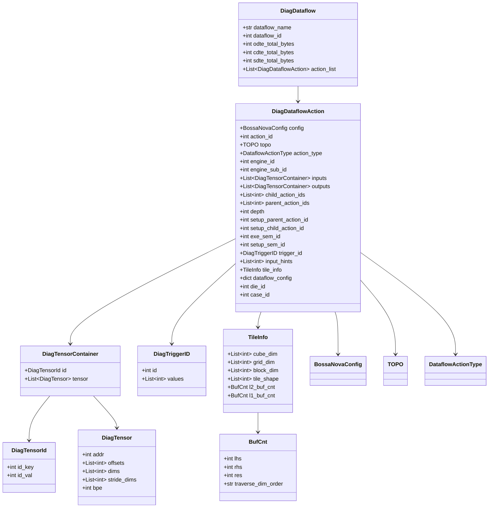
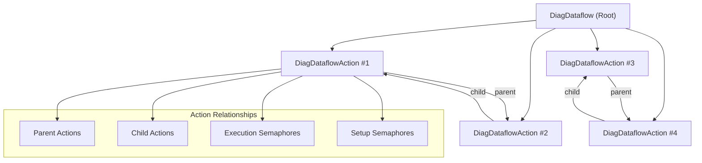
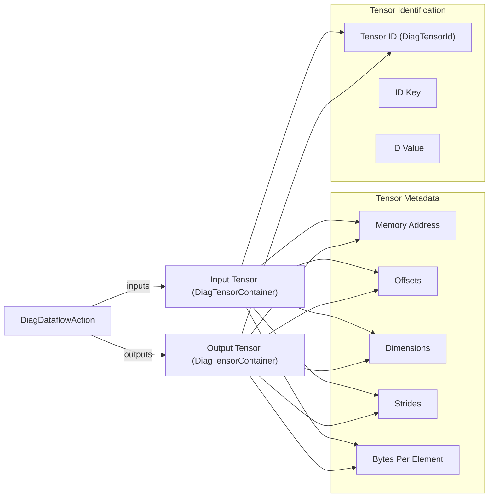
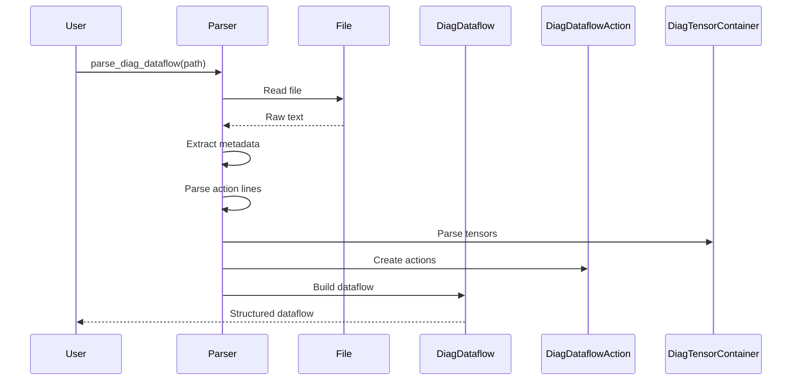
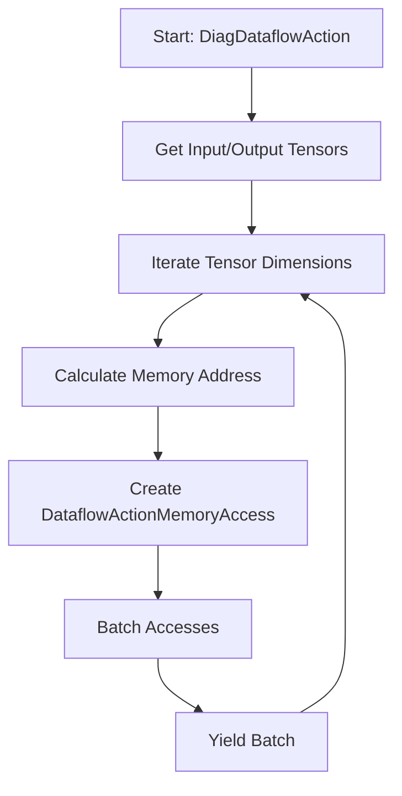

# Diag Action Module

## Overview

The `diag_action` module is a core component of the Nova Platform's dataflow action system, specifically designed for diagnostic and analysis purposes. It provides data structures and parsing utilities for representing and analyzing dataflow actions in the Nova Platform's computational pipeline.

This module serves as the foundation for understanding how computational operations are structured, executed, and traced within the Nova Platform ecosystem, enabling detailed performance analysis and optimization.

## Module Purpose

The diag_action module provides:
- **Dataflow Action Representation**: Structured classes to represent computational actions with full metadata
- **Tensor Management**: Comprehensive tensor description with memory layout and access patterns
- **Dataflow Parsing**: Utilities to parse diagnostic dataflow files into structured objects
- **Tile Information**: Configuration for computational tiles including buffer counts and dimensions
- **Memory Access Analysis**: Tools for analyzing memory access patterns in dataflow operations

## Architecture

### Core Data Structures

The module is built around several interconnected dataclasses that form a complete representation of dataflow operations:



## Component Relationships

### Dataflow Hierarchy

The module implements a hierarchical structure for dataflow operations:



### Tensor Data Flow



## Integration with Nova Platform

### Position in System Architecture

The `diag_action` module sits within the dataflow actions layer of the Nova Platform:

```
Nova Platform
├── base_models (Core data models)
├── config (Configuration management)
├── cost_service (Cost computation)
├── dataflow_actions (Action representations)
│   ├── diag_action ← Current module
│   ├── dte_action
│   ├── xpu_action
│   └── ... (other action types)
├── dataflow_core (Dataflow orchestration)
├── executor (Execution engine)
└── simulator (Simulation framework)
```

### Dependencies

The module depends on several core Nova Platform components:

- **`nova_platform.base_model`**: Provides `DataflowActionMemoryAccess`, `DataflowActionType`
- **`nova_platform.config`**: Provides `TOPO`, `BossaNovaConfig`
- **`nova_platform.cost_service.compute.base_compute_model`**: Provides `BaseCoreStat`, `DataflowAction` (base class)
- **`nova_platform.dataflow.dataflow`**: Provides `Dataflow` (base class)

### Relationship with Other Action Types

The `DiagDataflowAction` extends `DataflowAction` and serves as a diagnostic/action representation that can be used alongside other specialized action types:

- **DTE Actions**: Data Transformation Engine actions (CDTE, ODTE, SDTE)
- **XPU Actions**: Compute unit actions (GEMM, activation, collective operations)
- **Diag Actions**: Diagnostic/tracing actions for analysis

## Key Functionality

### 1. Dataflow Parsing

The module provides comprehensive parsing capabilities:

```python
def parse_diag_dataflow(path: str) -> DiagDataflow:
    """Parse a diagnostic dataflow file into structured objects."""
```

This function:
- Reads dataflow metadata (name, ID, total bytes)
- Parses individual action lines with regex patterns
- Extracts tensor information, relationships, and execution metadata
- Builds a complete dataflow graph

### 2. Tile Information Parsing

```python
def parse_shape_tile_info(path: str) -> TileInfo:
    """Parse tile configuration from file."""
```

Extracts computational tile specifications:
- Cube dimensions
- Grid dimensions
- Block dimensions
- Tile shapes
- Buffer counts (L1 and L2)

### 3. Memory Access Analysis

The `DiagDataflowAction` class provides methods for analyzing memory access patterns:

```python
def _iter_tensor_addr(self, base_addr, tensor: DiagTensor, rw) -> Generator[DataflowActionMemoryAccess, None, None]:
    """Generate memory access patterns for a tensor."""
    
def _iter_access_gen(self, mem_acc_list: List[DataflowActionMemoryAccess]):
    """Batch memory accesses for analysis."""
```

These methods enable:
- Iteration over tensor memory regions
- Batch processing of memory accesses
- Read/write access pattern analysis

## Data Flow Process

### Parsing Pipeline



### Memory Access Generation



## Usage Examples

### Example 1: Parsing a Dataflow File

```python
from nova_platform.dataflow.action.diag_action import parse_diag_dataflow

# Parse diagnostic dataflow
dataflow = parse_diag_dataflow("path/to/dataflow.txt")

# Access metadata
print(f"Dataflow: {dataflow.dataflow_name}")
print(f"Total Actions: {len(dataflow.action_list)}")

# Iterate through actions
for action in dataflow.action_list:
    print(f"Action {action.action_id}: {action.action_type}")
    print(f"  Engine: {action.engine_id}, Sub: {action.engine_sub_id}")
    print(f"  Inputs: {len(action.inputs)}, Outputs: {len(action.outputs)}")
```

### Example 2: Analyzing Memory Access Patterns

```python
from nova_platform.dataflow.action.diag_action import parse_diag_dataflow

dataflow = parse_diag_dataflow("dataflow.txt")

for action in dataflow.action_list:
    # Analyze input tensor accesses
    for container in action.inputs:
        for tensor in container.tensor:
            # Generate memory access pattern
            accesses = list(action._iter_tensor_addr(
                tensor.addr, tensor, "read"
            ))
            print(f"Tensor at {hex(tensor.addr)}: {len(accesses)} accesses")
```

### Example 3: Loading Tile Configuration

```python
from nova_platform.dataflow.action.diag_action import parse_shape_tile_info

tile_info = parse_shape_tile_info("tile_config.txt")

print(f"Cube: {tile_info.cube_dim}")
print(f"Grid: {tile_info.grid_dim}")
print(f"Block: {tile_info.block_dim}")
print(f"L2 Buffer: {tile_info.l2_buf_cnt}")
```

## Key Classes and Their Responsibilities

### DiagTensor
**Purpose**: Represents a tensor with complete memory layout information
- **addr**: Base memory address
- **offsets**: Starting offsets in each dimension
- **dims**: Dimensions of the tensor
- **stride_dims**: Stride information for each dimension
- **bpe**: Bytes per element

### DiagTensorContainer
**Purpose**: Groups tensors with their identification
- **id**: Unique tensor identifier (key-value pair)
- **tensor**: List of tensor instances

### DiagDataflowAction
**Purpose**: Represents a single computational action with full metadata
- **Execution Context**: engine_id, engine_sub_id, die_id
- **Action Metadata**: action_id, action_type, depth
- **Dependencies**: child_action_ids, parent_action_ids
- **Synchronization**: exe_sem_id, setup_sem_id, trigger_id
- **Data Layout**: inputs, outputs, tile_info
- **Configuration**: config, topo, dataflow_config

### DiagDataflow
**Purpose**: Container for a complete dataflow graph
- **Metadata**: name, ID, total bytes per memory tier
- **Actions**: List of all actions in the dataflow
- **DAG Construction**: Automatically builds dependency graph

## Configuration Integration

The module integrates with Nova Platform configuration through:

- **BossaNovaConfig**: Platform-wide configuration
- **TOPO**: Topology configuration
- **InstNumConfig**: Instance numbering for multi-core systems
- **DataflowActionType**: Enum for action classification

These configurations influence:
- Engine ID calculations
- Die/Cluster assignments
- Memory addressing
- Action type handling

## Performance Considerations

### Memory Efficiency
- Uses generators for memory access iteration to avoid large allocations
- Batch processing of memory accesses
- Lazy evaluation of tensor addresses

### Parsing Performance
- Regex-based parsing for structured text
- Efficient line-by-line processing
- Minimal intermediate data structures

## Error Handling

The module includes validation for:
- File existence checks
- Regex pattern matching
- Data type conversions
- Required field presence

## Related Modules

- **[base_models](base_models.md)**: Base action and dataflow models
- **[cost_service](cost_service.md)**: Cost computation for actions
- **[dataflow_core](dataflow_core.md)**: Dataflow orchestration
- **[executor](executor.md)**: Action execution framework

## Future Enhancements

Potential improvements:
1. **Binary Format Support**: Parse binary dataflow formats
2. **Validation Tools**: Verify dataflow consistency
3. **Visualization**: Generate execution graphs
4. **Optimization Analysis**: Identify bottlenecks
5. **Memory Layout Optimization**: Suggest better tensor layouts

## Summary

The `diag_action` module is a critical component for understanding and analyzing computational workflows in the Nova Platform. It provides:

- **Complete Representation**: Full metadata for actions and tensors
- **Parsing Utilities**: Robust file format handling
- **Memory Analysis**: Tools for understanding access patterns
- **Integration**: Seamless connection with other Nova Platform modules

This module enables deep analysis of dataflow execution, making it essential for performance optimization, debugging, and system understanding.
