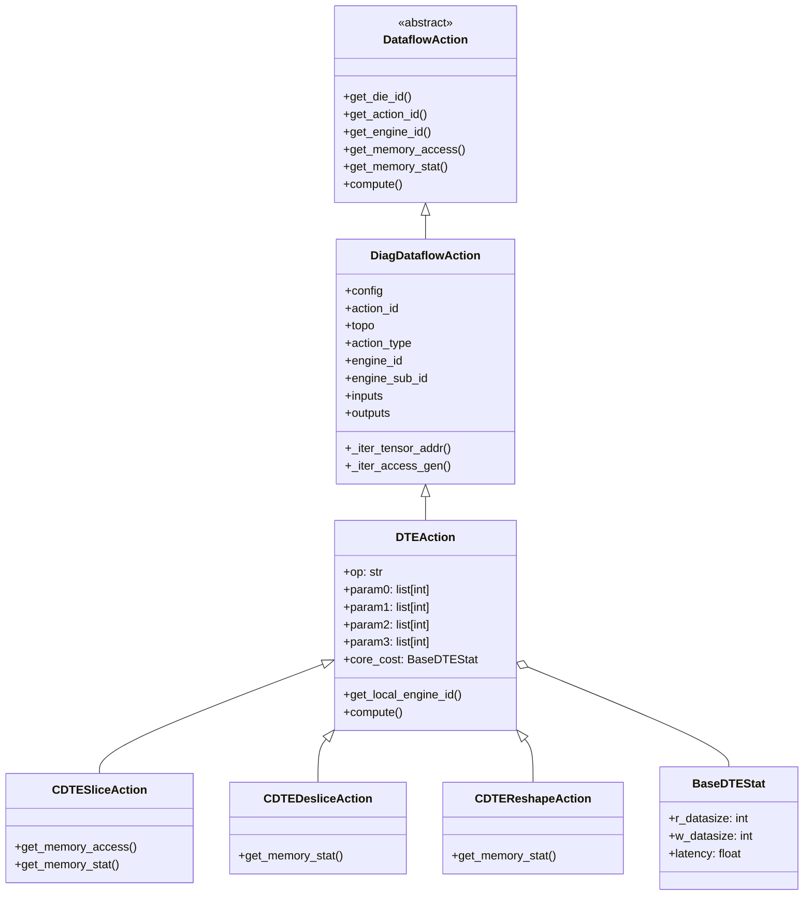
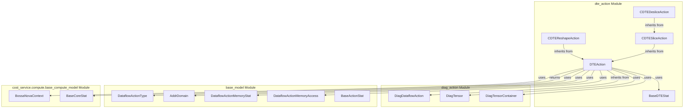
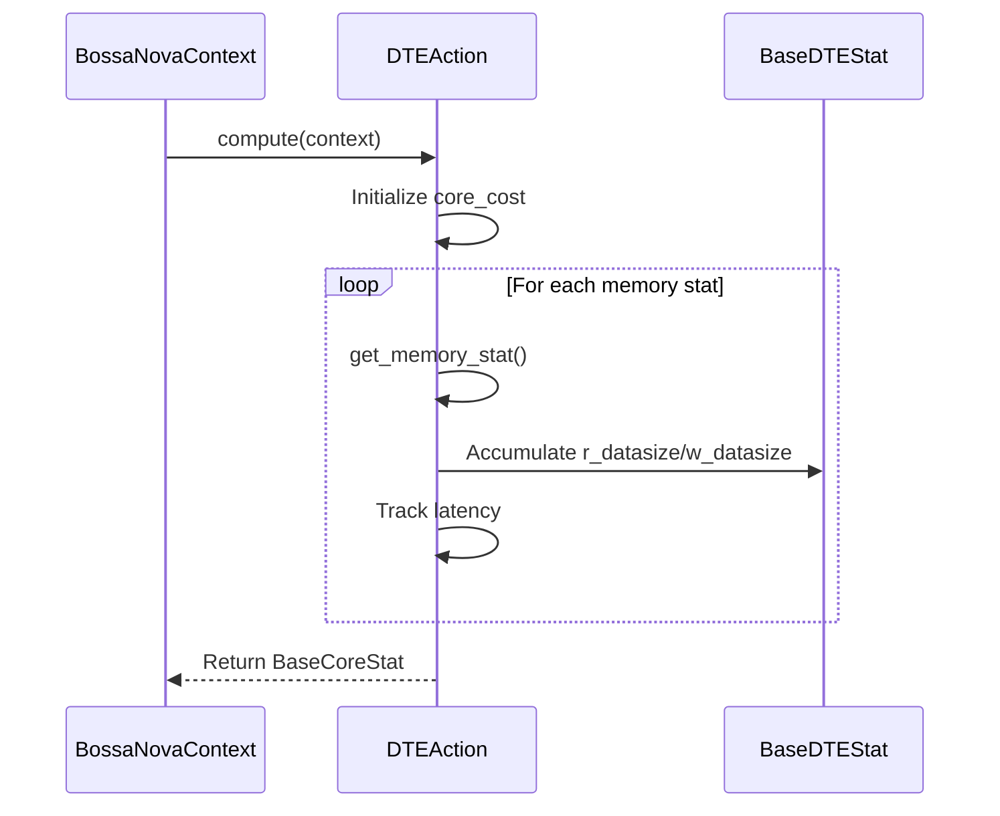
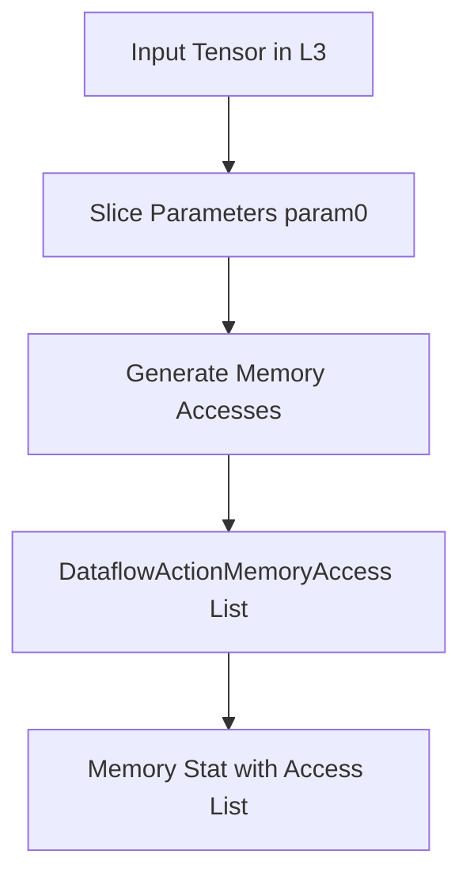
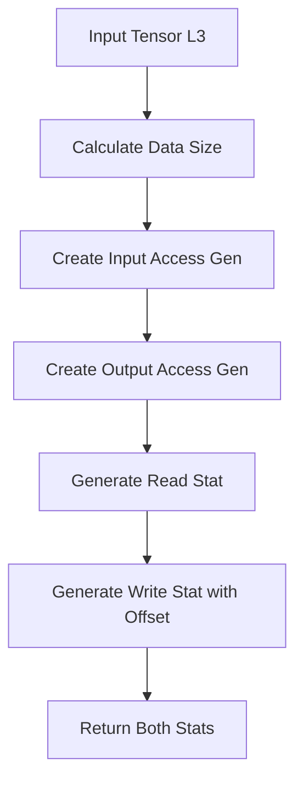
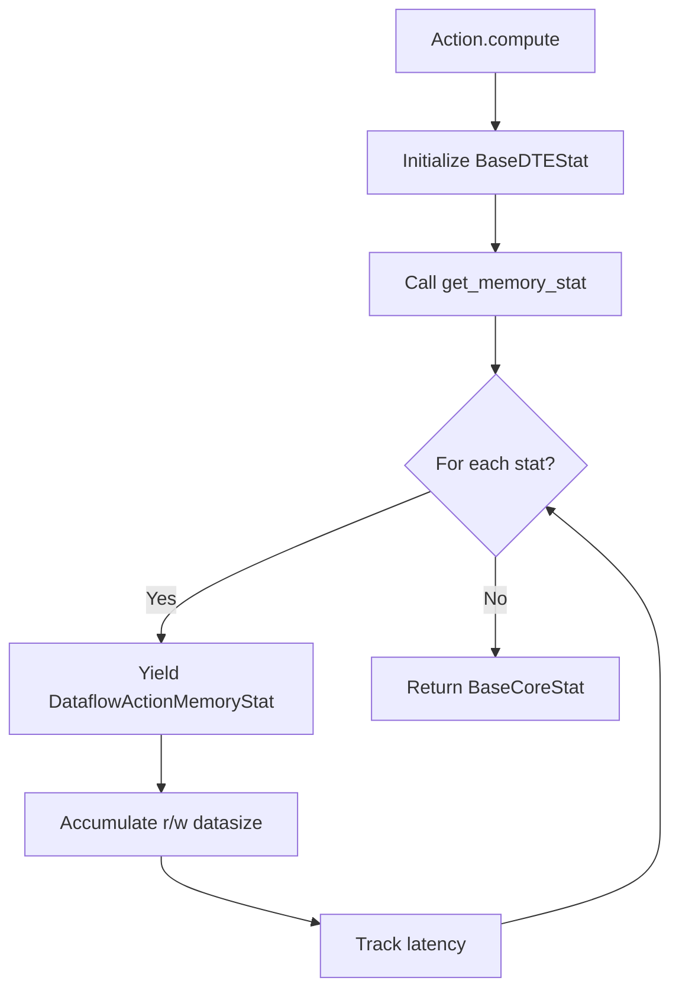

# DTE Action Module

## Overview

The **dte_action** module is a core component of the Nova Platform's dataflow execution system, specifically designed to handle **Data Transfer Engine (DTE)** operations. DTE actions are specialized operations that manage data movement and transformation between different memory domains (L3, SHARED, etc.) within the hardware architecture.

This module is part of the [dataflow_actions](dataflow_actions.md) module hierarchy and provides concrete implementations for slice, deslice, and reshape operations that are fundamental to tensor manipulation in the Nova Platform.

## Module Purpose

The dte_action module serves several key purposes:

1. **Data Movement Management**: Handles efficient data transfer between different memory address domains
2. **Tensor Transformation**: Implements slice, deslice, and reshape operations on tensors
3. **Memory Statistics Collection**: Tracks memory access patterns and data sizes for cost analysis
4. **Cost Computation**: Calculates core statistics including read/write data sizes and latency

## Architecture

### Class Hierarchy



### Component Relationships



## Core Components

### BaseDTEStat

**Purpose**: Stores core statistics for DTE operations.

**Properties**:
- `r_datasize` (int): Total read data size in bytes
- `w_datasize` (int): Total write data size in bytes
- `latency` (float): Operation latency (inherited from BaseActionStat)
- `relative_ts` (float): Relative timestamp (inherited)
- `power_stat` (any): Power statistics (inherited)

**Usage**: Used by DTEAction.compute() to accumulate statistics during execution.

### DTEAction

**Purpose**: Base class for all DTE operations, providing common functionality.

**Key Attributes**:
- `op` (str): Operation identifier
- `param0`, `param1`, `param2`, `param3` (list[int]): Operation parameters
- `core_cost` (BaseDTEStat): Accumulated statistics

**Key Methods**:
- `get_local_engine_id()`: Returns the engine sub-ID
- `compute(context: BossaNovaContext)`: Main computation method that:
  1. Initializes core_cost statistics
  2. Iterates through memory statistics via get_memory_stat()
  3. Accumulates read/write data sizes
  4. Calculates latency
  5. Returns BaseCoreStat

**Data Flow**:


### CDTESliceAction

**Purpose**: Implements CDTE (Compute Data Transfer Engine) slice operation.

**Operation**: Transfers data from L3 to SHARED memory domain with slicing.

**Key Methods**:
- `get_memory_access()`: Generates memory access patterns
  - Handles two scenarios:
    - SHARED → L3: Write operation
    - L3 → SHARED: Read operation
  - Uses param0 for slice dimensions
  - Iterates through tensor addresses using _iter_tensor_addr()

- `get_memory_stat()`: Generates memory statistics
  - Validates address domains (L3 → SHARED)
  - Calculates data size: `dims × bpe`
  - Returns DataflowActionMemoryStat with:
    - `total_count`: Data size
    - `master`: DataflowActionType.CDTE
    - `src`: SHARED
    - `dst`: L3
    - `rw`: 'r' (read)
    - `memory_access_list`: Generated access patterns

**Memory Access Pattern**:


### CDTEDesliceAction

**Purpose**: Implements CDTE deslice operation (inverse of slice).

**Inheritance**: Extends CDTESliceAction, overriding only get_memory_stat().

**Key Differences from Slice**:
- `rw` field is set to 'w' (write) instead of 'r' (read)
- Validates SHARED → L3 direction

**Operation**: Transfers sliced data from SHARED to L3 memory domain.

### CDTEReshapeAction

**Purpose**: Implements CDTE reshape operation (tensor reshaping within L3).

**Key Characteristics**:
- Operates entirely within L3 domain (L3 → L3)
- Handles both read and write operations
- Uses generator pattern for memory access batching

**Key Methods**:
- `get_memory_stat()`: 
  1. Calculates output data size
  2. Creates input access generator
  3. Creates output access generator
  4. Yields read stat first
  5. Yields write stat with relative_ts from read stat

**Data Flow**:


## Data Flow and Execution

### Memory Access Generation

All DTE actions use the inherited `_iter_tensor_addr()` and `_iter_access_gen()` methods from DiagDataflowAction:

```python
_iter_tensor_addr(base_addr, tensor, rw) -> Generator[DataflowActionMemoryAccess]
```

This method:
1. Takes base address and tensor metadata
2. Iterates through tensor dimensions (k, j, i loops)
3. Calculates address for each element
4. Yields DataflowActionMemoryAccess objects

### Cost Computation Flow



## Integration with Nova Platform

### Position in System

The dte_action module integrates with:

1. **Dataflow Generation**: Used by [executor.dataflow_gen](executor.md) to create dataflow graphs
2. **Cost Service**: Provides statistics to [cost_service.compute](cost_service.md) for analysis
3. **Performance Analysis**: Contributes to [perfetto_protobuf](perfetto_protobuf.md) trace generation
4. **Simulation**: Used by [nova_lite.pipeline](nova_lite.md) for execution simulation

### Usage Example

```python
from nova_platform.dataflow.action.dte_action import CDTESliceAction
from nova_platform.cost_service.compute.base_compute_model import BossaNovaContext

# Create action
action = CDTESliceAction(
    op="slice",
    param0=[128, 256, 512, 1024],  # slice dimensions
    param1=[],
    param2=[],
    param3=[],
    core_cost=BaseDTEStat(),
    # ... other required fields
)

# Compute statistics
context = BossaNovaContext()
core_stat = action.compute(context)

print(f"Read data: {core_stat.r_datasize} bytes")
print(f"Write data: {core_stat.w_datasize} bytes")
print(f"Latency: {core_stat.latency} cycles")
```

## Memory Domains

The module operates with the following address domains (from [base_model.AddrDomain](base_models.md)):

- **L3**: Main memory (5T+ address space)
- **SHARED**: Shared memory (4T-5T address space)
- **L3 → SHARED**: Slice operation (read from L3, write to SHARED)
- **SHARED → L3**: Deslice operation (read from SHARED, write to L3)
- **L3 → L3**: Reshape operation (within L3)

## Performance Considerations

1. **Generator Pattern**: Uses generators for memory access to handle large tensors efficiently
2. **Batch Processing**: _iter_access_gen() batches memory accesses for optimal processing
3. **Latency Tracking**: Accounts for both read and write operations with relative timestamps
4. **Data Size Calculation**: Uses reduce() for efficient dimension multiplication

## Related Modules

- [diag_action](diag_action.md): Parent module providing DiagDataflowAction base class
- [dataflow_actions](dataflow_actions.md): Sibling modules for other action types (XPU, TPU, etc.)
- [base_models](base_models.md): Defines DataflowActionType, AddrDomain, and other base types
- [cost_service](cost_service.md): Consumes statistics generated by DTE actions
- [executor](executor.md): Uses DTE actions in dataflow generation

## Testing and Validation

The module includes debug assertions in get_memory_stat() methods:
- Validates address domain transitions
- Ensures correct read/write directions
- Checks tensor metadata consistency

Enable DEBUG logging to see validation output:
```python
import logging
logging.getLogger(__name__).setLevel(logging.DEBUG)
```

## Future Enhancements

Potential improvements:
1. Support for additional memory domains (L0, L1C, LOCAL)
2. Multi-dimensional slicing beyond 4D tensors
3. Optimized memory access patterns for specific hardware configurations
4. Integration with cache model for detailed latency analysis
