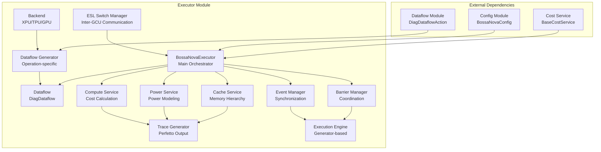
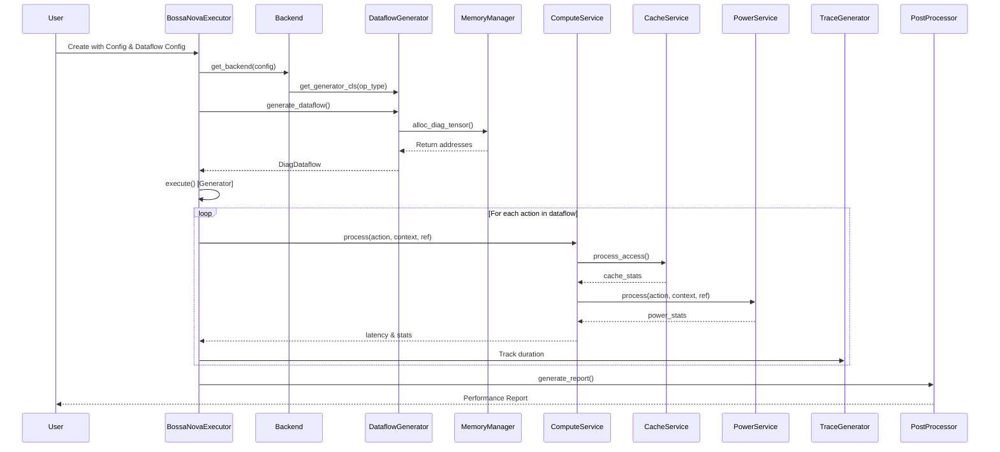

# Executor Module

## Overview

The executor module is the core orchestration engine of the Nova Platform simulation framework. It manages the complete lifecycle of computational workloads, from dataflow generation to execution and performance analysis. The module serves as the bridge between high-level computational specifications and low-level hardware simulation, providing comprehensive support for various compute backends (XPU, TPU, GPU) and complex distributed computing patterns.

## Architecture

The executor module follows a layered architecture with clear separation of concerns:



## Core Components

The executor module consists of several interconnected sub-modules that work together to provide complete simulation capabilities:

### 1. Dataflow Generation Sub-system

**Purpose**: Converts high-level operation specifications into executable dataflow representations.

**Key Components**:
- `DataflowGenerator`: Base class for all operation-specific generators
- `MemoryManager`: Manages L3 memory allocation for tensors
- `Backend` hierarchy: XPU, TPU, GPU backends with operation mappings
- Operation-specific generators (Gemm, Elementwise, LayerNorm, etc.)

**Documentation**: See [executor_dataflow_gen.md](executor_dataflow_gen.md) for detailed information.

### 2. Execution Orchestration

**Purpose**: Coordinates the complete simulation lifecycle, manages service integration, and handles execution flow.

**Key Components**:
- `BossaNovaExecutor`: Main orchestrator class
- `EmptyPowerSvc`: Placeholder for power modeling when disabled
- `_DummyTqdm`: Progress tracking fallback

**Documentation**: See [executor_core.md](executor_core.md) for detailed information.

### 3. Synchronization Primitives

**Purpose**: Provides thread-safe coordination mechanisms for parallel execution simulation.

**Key Components**:
- `BossaNovaEvent`: Event-based synchronization
- `EventManager`: Singleton event registry
- `BARRIER`: Barrier synchronization primitive
- `BarrierManager`: Singleton barrier registry

**Documentation**: See [executor_synchronization.md](executor_synchronization.md) for detailed information.

### 4. ESL Switch Management

**Purpose**: Models inter-GCU (Global Compute Unit) communication through ESL (Elastic Switch Layer) networks.

**Key Components**:
- `ESLSwitchManager`: Factory for switch implementations
- `DefaultESLSwitch`: Base switch functionality
- `FullmeshESLSwitch`: Full mesh topology (8 nodes)
- `SupernodeESLSwitch`: Supernode topology (scalable)
- `StandaloneSwitch`: Single-node configuration

**Documentation**: See [executor_switch.md](executor_switch.md) for detailed information.

## Data Flow

The executor module processes workloads through the following sequence:



## Key Features

### 1. Multi-Backend Support
- **XPU Backend**: Supports GEMM (shared/local), elementwise ops, activation functions, layernorm, softmax, gather/scatter, SDPA, allreduce, allgather
- **TPU Backend**: Specialized GEMM operations for TPU architecture
- **GPU Backend**: Framework for future GPU-specific operations

### 2. Memory Management
- L3 memory allocation with alignment (128-byte boundaries)
- Automatic address assignment for tensors
- Support for multiple tensor inputs/outputs per operation

### 3. Cost Modeling Integration
- **Compute Cost**: Instruction-level throughput modeling
- **Cache Cost**: Multi-level cache hierarchy simulation
- **Power Cost**: Dynamic power consumption modeling
- **Bandwidth Cost**: Resource contention modeling

### 4. Distributed Computing Support
- Multi-die, multi-cluster configurations
- ESL-based inter-GCU communication
- Barrier and event synchronization
- Topology-aware routing (Fullmesh, Supernode, Standalone)

### 5. Trace Generation
- Perfetto-compatible trace output
- Per-action timing visualization
- Resource utilization tracking
- Memory access pattern analysis

## Configuration

The executor module uses `BossaNovaConfig` for hardware specifications:

```python
config = BossaNovaConfig(
    arch="xpu",  # or "tpu", "gpu"
    inst_num=InstNumConfig(
        NUM_OF_CLUSTER=2,
        NUM_OF_DIE=1,
        NUM_OF_CORE_PER_CLUSTER=8
    ),
    memory=MemoryConfig(
        l3=MemoryL3Config(TOTAL_SIZE=8*1024**3),  # 8GB
        l2=MemoryL2Config(SIZE_PER_SIC=64*1024**2),  # 64MB
        l1=MemoryL1Config(SIZE_PER_CORE=512*1024)   # 512KB
    ),
    compute=ComputeConfig(
        thread_2d_throughput={DType.FP16: 128},
        thread_1d_throughput={DType.FP16: 256},
        thread_sfu_throughput=64
    ),
    bw=BWConfig(
        mc=BWEle(bw=100e9),  # 100 GB/s
        l3=BWEle(bw=50e9)
    ),
    freq=FreqConfig(
        MC=1.0,
        ESL=1.0
    )
)
```

## Usage Examples

### Basic GEMM Execution

```python
from nova_platform.config import BossaNovaConfig
from nova_platform.executor.nova_platform_executor import BossaNovaExecutor
from nova_platform.perfetto_protobuf._tgen import TraceGenerator

config = BossaNovaConfig(...)  # Load configuration
tgen = TraceGenerator("output/trace.perfetto-trace", config.gcu_id)

executor = BossaNovaExecutor(
    config=config,
    outdir="output",
    tgen=tgen,
    op_shape=[1, 512, 512, 512],  # [B, M, K, N]
    optype="gemm",
    dtype=DType.FP16,
    input_addr=[],
    output_addr=[],
    dataflow_config={},
    enable_cache=True,
    enable_power_svc=True
)

# Execute and generate report
for ref, status in executor.execute():
    print(f"Progress: {ref}")

report = executor.generate_report()
```

### Distributed AllReduce

```python
executor = BossaNovaExecutor(
    config=config,
    outdir="output",
    tgen=tgen,
    op_shape=[1024],  # Tensor size
    optype="allreduce",
    dtype=DType.FP16,
    input_addr=[],
    output_addr=[],
    dataflow_config={},
    esl_switch=FullmeshESLSwitch(config)
)

# Execute with inter-GCU communication
for ref, status in executor.execute():
    pass
```

## Integration Points

The executor module integrates with:

1. **Config Module**: Hardware specifications and parameters
2. **Dataflow Module**: Action definitions and execution primitives
3. **Cost Service**: Compute, cache, power, and bandwidth modeling
4. **Data Visual**: Post-processing and report generation
5. **Perfetto Protobuf**: Trace output for visualization

## Performance Considerations

- **Generator-based Execution**: Memory-efficient lazy evaluation
- **Singleton Managers**: Thread-safe resource sharing
- **Parallel Cache Service**: GPU-accelerated cache simulation
- **Incremental Trace Generation**: Low-overhead profiling

## Extensibility

The module is designed for extension:

1. **New Operations**: Subclass `DataflowGenerator` and register in `Backend`
2. **New Topologies**: Extend `DefaultESLSwitch` with custom routing
3. **New Backends**: Implement `Backend` interface
4. **Custom Services**: Integrate with `BaseCostService` interface

## Error Handling

- Memory allocation bounds checking
- Operation type validation
- Backend capability verification
- Graceful fallback from external to internal dataflow generation

## Thread Safety

All managers (`EventManager`, `BarrierManager`) use:
- Singleton pattern with locks
- Thread-safe registries
- Protected critical sections

## See Also

- [executor_dataflow_gen.md](executor_dataflow_gen.md) - Dataflow generation details
- [executor_core.md](executor_core.md) - Core execution logic
- [executor_synchronization.md](executor_synchronization.md) - Synchronization primitives
- [executor_switch.md](executor_switch.md) - ESL switch implementations
