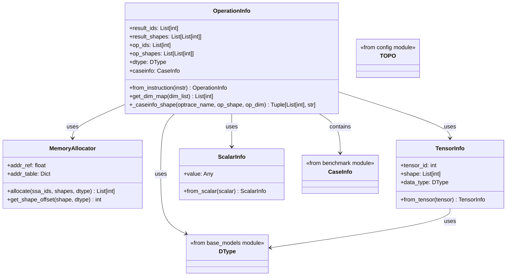
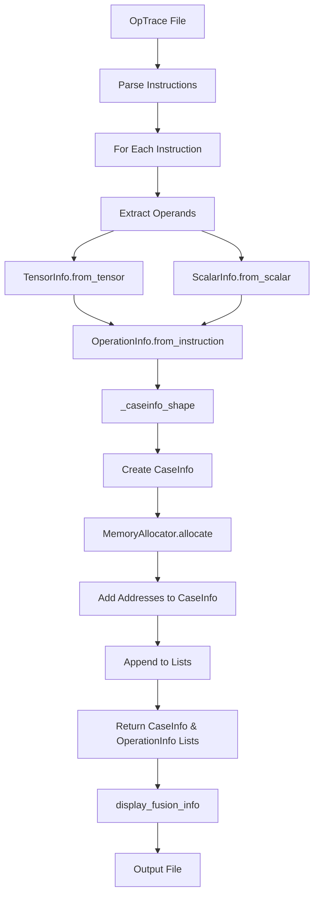
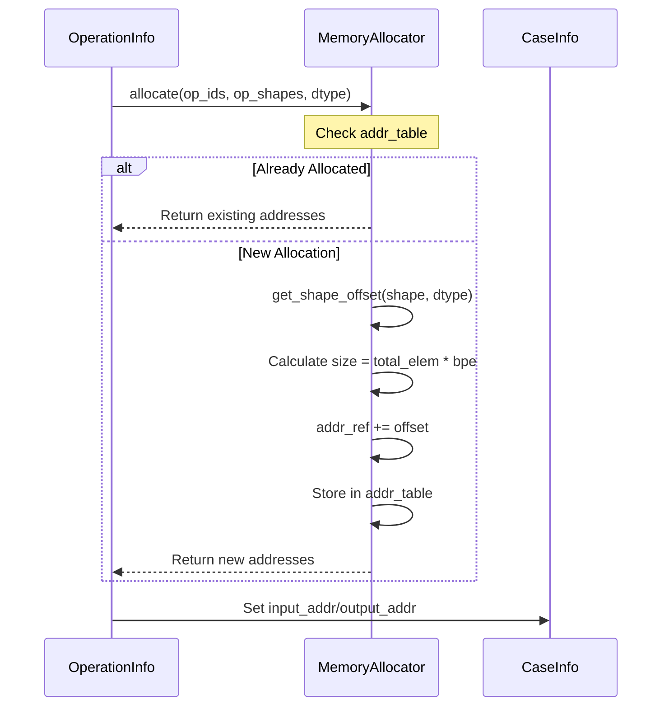
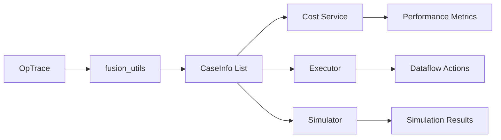

# fusion_utils Module

## Overview

The `fusion_utils` module provides utilities for parsing and processing fused operation traces from the Nova Platform. It serves as a bridge between raw operation trace data and the Nova Platform's simulation and cost analysis infrastructure. The module handles memory allocation, tensor information extraction, and operation metadata conversion.

**Module Path**: `nova-platform.nova_platform.utils.fusion_utils`

**Related Modules**:
- [base_models](base_models.md) - Provides data types and base models
- [benchmark](benchmark.md) - Contains operation definitions and benchmarks
- [config](config.md) - Provides configuration classes like TOPO
- [cost_service](cost_service.md) - Uses CaseInfo for cost calculations
- [executor](executor.md) - Uses CaseInfo for execution planning

## Architecture

The fusion_utils module consists of four core components that work together to transform operation trace data into structured information usable by the Nova Platform:



## Component Details

### MemoryAllocator

**Purpose**: Manages virtual memory address allocation for tensor operands and results during operation trace processing.

**Key Features**:
- Maintains a virtual address space starting at 5TB
- Tracks allocated addresses in a hash table to avoid duplicates
- Calculates memory offsets based on tensor shape and data type

**Memory Layout**:
```
Base Address: 5TB (5 * 2^40 bytes)
Allocation: Sequential allocation based on tensor size
```

**Usage Pattern**:
```python
allocator = MemoryAllocator()
# Allocate addresses for operands
input_addrs = allocator.allocate(op_ids, op_shapes, dtype)
# Allocate addresses for results
output_addrs = allocator.allocate(result_ids, result_shapes, dtype)
```

**Dependencies**:
- Uses `DType.get_bpe()` from [base_models](base_models.md)

### TensorInfo

**Purpose**: Extracts and encapsulates tensor metadata from optrace tensor objects.

**Attributes**:
- `tensor_id`: Unique identifier for the tensor
- `shape`: Dimensions of the tensor (List[int])
- `data_type`: Data type from DType enum

**Construction Methods**:
- `from_tensor(tensor)`: Factory method to create TensorInfo from optrace tensor object

**Data Type Mapping**:
```python
{
    'F8': DType.FP8,
    'F16': DType.FP16,
    'F32': DType.FP32,
}
```

**Dependencies**:
- Uses `DType` enum from [base_models](base_models.md)
- Expects optrace tensor objects with methods: `getTensorID()`, `getDims()`, `getDataType()`

### ScalarInfo

**Purpose**: Extracts scalar values from optrace scalar objects.

**Attributes**:
- `value`: The scalar value

**Construction Methods**:
- `from_scalar(scalar)`: Factory method to create ScalarInfo from optrace scalar object

**Usage**: Primarily used for extracting scalar parameters (like dimensions, indices) from operation traces.

### OperationInfo

**Purpose**: Comprehensive container for operation metadata, bridging optrace instructions to Nova Platform's CaseInfo format.

**Attributes**:
- `result_ids`: List of result tensor IDs
- `result_shapes`: List of result tensor shapes
- `op_ids`: List of operand tensor IDs
- `op_shapes`: List of operand tensor shapes
- `dtype`: Data type of the operation
- `caseinfo`: [CaseInfo](benchmark.md) object containing operation metadata for simulation

**Key Methods**:

#### `from_instruction(instr) -> OperationInfo`
Main factory method that converts an optrace instruction to OperationInfo.

**Processing Flow**:
1. Extract operation name from instruction
2. Parse operands (tensors and scalars)
3. Determine caseinfo shape and operation type
4. Extract result tensors
5. Create CaseInfo object
6. Return complete OperationInfo

#### `_caseinfo_shape(optrace_name, op_shape, op_dim) -> Tuple[List[int], str]`
Maps optrace operation names to Nova Platform operation types and shapes.

**Operation Mapping Table**:

| OpTrace Name | Nova Type | Shape Logic |
|--------------|-----------|-------------|
| `dot` | `gemm` | `op_shape[0] + op_shape[2]` |
| `mbedding`, `embedding` | `gather` | `op_shape[0] + op_shape[1]` |
| `flash_attention_fusion` | `sdpa` | `[op_shape[0], op_shape[1], True]` |
| `layer_norm` | `layernorm` | `op_shape[0][1:]` |
| `add`, `gelu` | Same | `[1, op_shape[0][1], 1, op_shape[0][2]]` |
| `transpose` | Same | `op_shape[0] + dim_map` |
| `allreduce` | Same | `op_shape[0]` |
| `allgather` | Same | `[[op_shape[0][0], op_shape[0][1]*32, ...]] + op_shape[0]` |
| `allgather_gemm` | Same | `op_shape[0] + op_shape[2]` |

#### `get_dim_map(dim_list) -> List[int]`
Generates dimension mapping for transpose operations.

**Example**:
```python
# Input: [0, 1] (transpose first two dimensions)
# Output: [1, 0, 2, 3] (swap positions 0 and 1)
```

## Data Flow

### Trace Processing Pipeline



### Memory Allocation Flow



## Main Functions

### `get_caseinfo_list(op_trace_path, topo, enable_cache)`

**Purpose**: Main entry point for processing optrace files.

**Parameters**:
- `op_trace_path` (str): Path to optrace file
- `topo` (TOPO): Topology configuration (default: TOPO.STANDALONE)
- `enable_cache` (bool): Cache enable flag (default: True)

**Returns**:
- `Tuple[List[CaseInfo], List[OperationInfo]]`: Lists of processed operations

**Processing Steps**:
1. Load optrace file
2. Get module and instruction list
3. Initialize MemoryAllocator
4. For each instruction:
   - Create OperationInfo
   - Set topology and cache flags
   - Allocate memory addresses
   - Add to result lists
5. Return both lists

**Usage Example**:
```python
from nova_platform.utils.fusion_utils import get_caseinfo_list
from nova_platform.config import TOPO

caseinfos, opinfos = get_caseinfo_list(
    "trace.optrace", 
    topo=TOPO.STANDALONE, 
    enable_cache=True
)
```

### `display_fusion_info(outdir, op_info_list)`

**Purpose**: Debug utility to dump operation information to a file.

**Parameters**:
- `outdir` (str): Output directory path
- `op_info_list` (List[OperationInfo]): List of operation info objects

**Output Format**:
```
OperationInfo(
  op_name: gemm,
  dtype: DType.FP16,
  op_ids: [1, 2, 3],
  op_shapes: [[1, 1024, 512], [1, 512, 1024], [1, 1024, 1024]],
  result_ids: [4],
  result_shapes: [[1, 1024, 1024]],
  case_shape: [1, 1024, 512, 1024],
  cache_enable: True,
  topo: TOPO.STANDALONE,
)
mu: 1e-09
Input Address: [10995116277760, 10995116277760, 10995116277760]
Output Address: [10995116277760]
Input Address Hex: ['0x280000000000', '0x280000000000', '0x280000000000']
Output Address Hex: ['0x280000000000']
----------------------------------------
```

**Error Handling**: Catches and logs exceptions for individual operations without stopping the entire dump.

## Integration with Nova Platform

### Downstream Usage

The generated `CaseInfo` objects are used throughout the Nova Platform:

1. **[Benchmark Module](benchmark.md)**: Operation definitions and workload specifications
2. **[Cost Service](cost_service.md)**: Performance and power cost calculations
3. **[Executor](executor.md)**: Dataflow generation and execution planning
4. **[Simulator](simulator.md)**: Case simulation and analysis

### Data Flow to Downstream Modules



## Dependencies

### Internal Dependencies
- `optrace_benchmark`: For parsing optrace files
- `tests.test_base.CaseInfo`: Core operation metadata container
- `nova_platform.base_model.DType`: Data type enumeration
- `nova_platform.config.TOPO`: Topology configuration

### External Dependencies
- `dataclasses`: For OperationInfo data structure
- `pathlib`: For path operations
- `re`: For pattern matching (if needed in extensions)
- `typing`: For type hints

## Usage Examples

### Basic Trace Processing

```python
from nova_platform.utils.fusion_utils import get_caseinfo_list, display_fusion_info
from nova_platform.config import TOPO

# Process optrace file
caseinfos, opinfos = get_caseinfo_list(
    "model_trace.optrace",
    topo=TOPO.STANDALONE,
    enable_cache=True
)

# Display results for debugging
display_fusion_info("./output", opinfos)

# Use CaseInfo with other modules
for case in caseinfos:
    print(f"Operation: {case.optype}, Shape: {case.shape}")
```

### Custom Memory Management

```python
from nova_platform.utils.fusion_utils import MemoryAllocator
from nova_platform.base_model import DType

# Create custom allocator
allocator = MemoryAllocator()

# Allocate memory for tensors
tensor_ids = [1, 2, 3]
tensor_shapes = [[1, 512, 1024], [1, 1024, 512], [1, 512, 512]]
addresses = allocator.allocate(tensor_ids, tensor_shapes, DType.FP16)

print(f"Allocated addresses: {[hex(addr) for addr in addresses]}")
```

### Manual OperationInfo Creation

```python
from nova_platform.utils.fusion_utils import OperationInfo
from nova_platform.base_model import DType
from tests.test_base import CaseInfo

# Create operation info manually
op_info = OperationInfo(
    result_ids=[100],
    result_shapes=[[1, 1024, 1024]],
    op_ids=[1, 2],
    op_shapes=[[1, 1024, 512], [1, 512, 1024]],
    dtype=DType.FP16,
    caseinfo=CaseInfo(
        optype="gemm",
        shape=[1, 1024, 512, 1024],
        expected_res=None,
        fun=None,
        tag=["Custom"],
        dtype=DType.FP16
    )
)

print(op_info)
```

## Extension Points

### Adding New Operation Types

To add support for new optrace operations:

1. Update `_caseinfo_shape()` method in `OperationInfo`:
```python
elif optrace_name in ["new_operation"]:
    optype = "new_op_type"
    caseinfo_shape = [...]  # Define shape mapping
    return caseinfo_shape, optype
```

2. Add data type mapping in `TensorInfo.from_tensor()`:
```python
dtype_map = {
    'F8': DType.FP8,
    'F16': DType.FP16,
    'F32': DType.FP32,
    'BF16': DType.BF16,  # New type
}
```

### Custom Memory Allocation Strategies

Override `MemoryAllocator` for different allocation schemes:

```python
class CustomMemoryAllocator(MemoryAllocator):
    def allocate(self, ssa_ids, shapes, dtype):
        # Custom allocation logic
        pass
    
    def get_shape_offset(self, shape, dtype):
        # Custom offset calculation
        pass
```

## Best Practices

1. **Memory Management**: Always use the same `MemoryAllocator` instance for a complete trace to maintain address consistency
2. **Error Handling**: Wrap `get_caseinfo_list` in try-except for production use
3. **Validation**: Use `display_fusion_info` to verify allocations before passing to cost services
4. **Topology**: Ensure `topo` parameter matches your target hardware configuration
5. **Cache Flags**: Set `enable_cache` based on whether you want to simulate cached or uncached scenarios

## Performance Considerations

- **Address Table**: The `addr_table` in `MemoryAllocator` grows with unique tensors; consider clearing between traces
- **Large Traces**: For traces with thousands of operations, batch processing may be necessary
- **Memory Overhead**: Each `OperationInfo` contains multiple lists; use generators for very large traces

## Troubleshooting

### Common Issues

**Issue**: Address collisions or overlapping allocations
- **Solution**: Ensure `MemoryAllocator` instance is shared across all operations in a trace

**Issue**: Unsupported data type in optrace
- **Solution**: Add mapping to `TensorInfo.from_tensor()` dtype_map

**Issue**: Shape mapping incorrect for new operation
- **Solution**: Update `_caseinfo_shape()` with correct shape logic

**Issue**: Missing CaseInfo fields
- **Solution**: Check that all required fields are set in `CaseInfo` constructor

## Testing

The module should be tested with:
1. Valid optrace files containing various operation types
2. Different data types (FP8, FP16, FP32)
3. Various tensor shapes and dimensions
4. Topology configurations (STANDALONE, MESH, etc.)
5. Cache enabled/disabled scenarios

## Future Enhancements

Potential improvements:
1. Support for more data types (INT8, BF16, etc.)
2. Dynamic memory allocation strategies
3. Parallel processing for large traces
4. Validation and verification of operation sequences
5. Export to additional formats (JSON, CSV)
6. Integration with [perfetto_trace_processor](perfetto_trace_processor.md) for enhanced analysis
