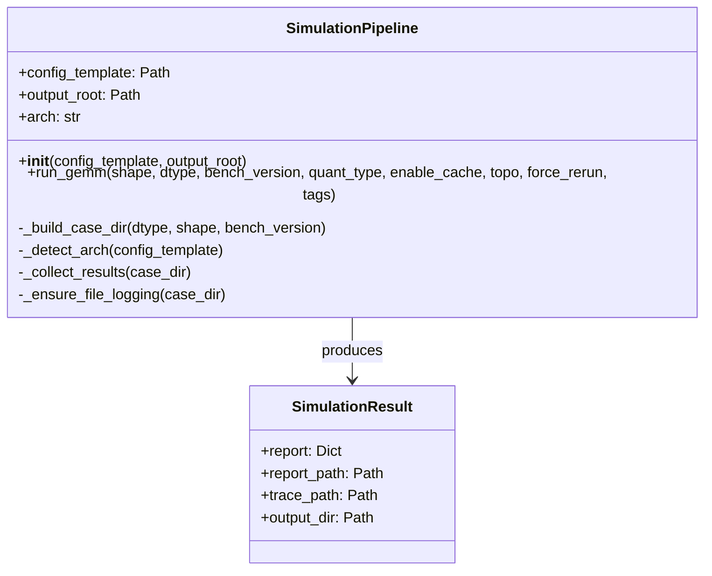
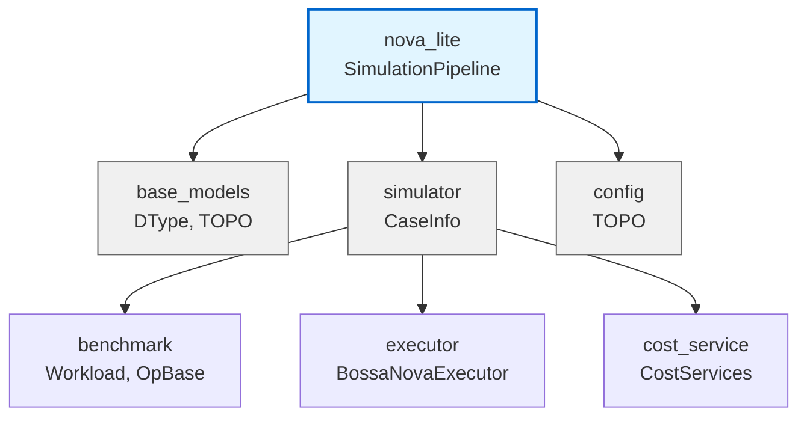

# Nova Lite Module

## Overview

The **nova_lite** module provides a streamlined, Python-only simulation pipeline for GEMM (General Matrix Multiply) operations on the Nova platform. It serves as a high-level orchestrator that abstracts away the complexity of the underlying test harness, enabling developers to quickly run simulations and collect performance metrics without deep integration with the full Nova platform infrastructure.

The module wraps the lower-level `CaseInfo` class from the `simulator` module and provides a clean API for executing GEMM benchmarks end-to-end, including dataflow generation, execution, tracing, and report collection.

## Architecture

The nova_lite module consists of two primary components that work together to provide the simulation pipeline:



### Component Descriptions

#### SimulationPipeline

The `SimulationPipeline` class is the main entry point for running simulations. It orchestrates the entire workflow from configuration to result collection:

- **Configuration Management**: Loads and validates configuration templates
- **Architecture Detection**: Automatically detects the target architecture from config files
- **Case Directory Management**: Organizes simulation outputs in a structured directory hierarchy
- **Logging Setup**: Configures file-based logging for each simulation run
- **Simulation Execution**: Delegates to `CaseInfo` for the actual simulation work
- **Result Collection**: Aggregates and returns all generated artifacts

#### SimulationResult

A dataclass that encapsulates all artifacts produced by a simulation run:

- **report**: The parsed YAML report containing performance metrics
- **report_path**: Filesystem path to the generated report
- **trace_path**: Filesystem path to the Perfetto trace file
- **output_dir**: Root directory containing all simulation artifacts

## Module Dependencies

The nova_lite module integrates with several other modules in the Nova platform ecosystem:



### Key Dependencies

1. **base_models** (`DType`, `TOPO`): Provides data types and topology enumerations
2. **simulator** (`CaseInfo`): Core simulation engine that handles the GEMM → dataflow → execution → trace → report pipeline
3. **config** (`TOPO`): Topology configuration for different hardware setups

## Data Flow

The simulation pipeline follows a structured flow from input configuration to output artifacts:

```mermaid
flowchart LR
    A[User Input<br/>shape, dtype, config] --> B[SimulationPipeline]
    B --> C[Build Case Directory]
    C --> D[Configure Logging]
    D --> E[Create CaseInfo]
    E --> F[Execute Simulation]
    F --> G[Generate Dataflow]
    G --> H[Execute on Hardware Model]
    H --> I[Generate Trace]
    I --> J[Create Report]
    J --> K[Collect Results]
    K --> L[SimulationResult]
    
    style B fill:#e1f5ff,stroke:#0066cc
    style L fill:#e1f5ff,stroke:#0066cc
```



### Detailed Flow

1. **Configuration**: User provides GEMM shape, data type, and configuration template
2. **Case Directory Creation**: Organized output structure based on parameters
3. **Logging Setup**: File-based logging for debugging and audit trails
4. **CaseInfo Instantiation**: Delegates to simulator module for core execution
5. **Simulation Execution**: 
   - Dataflow generation based on GEMM parameters
   - Hardware model execution
   - Performance tracing
   - Report generation
6. **Result Collection**: Aggregates all artifacts into a single result object

## Usage Patterns

### Basic GEMM Simulation

```python
from nova_lite.pipeline import SimulationPipeline
from nova_platform.base_model import DType
from nova_platform.config import TOPO

# Initialize pipeline
pipeline = SimulationPipeline(
    config_template="path/to/config.yaml",
    output_root="./simulation_outputs"
)

# Run GEMM simulation
result = pipeline.run_gemm(
    shape=[1, 512, 512, 512],  # [B, M, K, N]
    dtype=DType.FP16,
    bench_version=5,
    topo=TOPO.STANDALONE,
    force_rerun=True
)

# Access results
print(f"Report: {result.report}")
print(f"Trace: {result.trace_path}")
```

### Advanced Configuration

```python
# With quantization and caching
result = pipeline.run_gemm(
    shape=[8, 1024, 1024, 1024],
    dtype=DType.INT8,
    bench_version=6,  # Different kernel flavor
    quant_type="int8_quant",
    enable_cache=True,
    tags=["experiment-1", "baseline"]
)
```

## Integration Points

### With Benchmark Module

The pipeline leverages benchmark modules for GEMM operations:
- `BatchGemmBase` and variants for different architectures
- Kernel versions control micro-architecture selection
- Quantization support for different precision modes

### With Executor Module

Simulation execution is handled by:
- `BossaNovaExecutor`: Orchestrates the full simulation workflow
- Dataflow generators create optimized computation graphs
- Event and barrier management for synchronization

### With Cost Service Module

Performance metrics are calculated using:
- Cache cost services for memory hierarchy analysis
- Compute cost services for operation timing
- Power cost services for energy estimation

### With Data Visualization

Generated traces can be processed by:
- `PostProcessor` for report analysis
- `BossaNovaTraceProcessor` for Perfetto trace generation

## Output Structure

The pipeline organizes outputs in a hierarchical structure:

```
output_root/
└── gemm_v{version}_{dtype}_{shape}_{arch}/
    ├── gcu{index}/
    │   ├── report.yaml          # Performance metrics
    │   ├── trace.perfetto-trace # Timeline trace
    │   └── ...                  # Other artifacts
    └── nova-lite.log           # Execution log
```

### Report Contents

The `report.yaml` contains:
- **Performance Metrics**: Latency, throughput, utilization
- **Resource Usage**: Memory bandwidth, compute units
- **Configuration**: Input parameters and hardware settings
- **Breakdown**: Per-operation timing and costs

### Trace Format

The `trace.perfetto-trace` file is compatible with:
- Perfetto UI for timeline visualization
- Chrome trace viewer
- Custom analysis tools

## Configuration

### Config Template Format

The configuration template should be a YAML file containing:

```yaml
arch: <architecture_name>  # e.g., "eltanin", "libra"
memory:
  l1: {...}
  l2: {...}
  l3: {...}
compute:
  frequency: {...}
  units: {...}
```

### Architecture Detection

The pipeline automatically extracts the architecture name from the config file by parsing lines starting with `arch:`. This is used to organize outputs and may influence simulation parameters.

## Error Handling

The pipeline handles several error scenarios:

1. **Missing Reports**: Raises `FileNotFoundError` if no `report.yaml` is generated
2. **Invalid Config**: Falls back gracefully if architecture detection fails
3. **Duplicate Logging**: Prevents duplicate file handlers for the same log file
4. **Path Resolution**: Handles both absolute and relative paths for configs and outputs

## Best Practices

1. **Output Organization**: Use descriptive tags to group related experiments
2. **Force Rerun**: Set `force_rerun=False` to leverage cached results when appropriate
3. **Logging**: Monitor the `nova-lite.log` file for detailed execution information
4. **Shape Formatting**: Ensure shapes are in `[B, M, K, N]` order for GEMM
5. **Version Selection**: Use `bench_version=5` for shared memory, `6` for local memory architectures

## Performance Considerations

- **Caching**: Enable `enable_cache=True` to reuse cached computations across runs
- **Parallel Execution**: The underlying `CaseInfo` may support parallel execution
- **Output Management**: Large simulations can generate significant output; consider cleanup strategies

## Future Enhancements

Potential improvements to the module:
- Support for additional operation types beyond GEMM
- Enhanced configuration validation
- Progress callbacks for long-running simulations
- Result caching and comparison utilities
- Integration with experiment management systems

## Related Documentation

- [base_models](base_models.md) - Data types and base classes
- [simulator](simulator.md) - Core simulation infrastructure
- [benchmark](benchmark.md) - GEMM and other workload implementations
- [executor](executor.md) - Execution orchestration
- [cost_service](cost_service.md) - Performance and cost modeling
