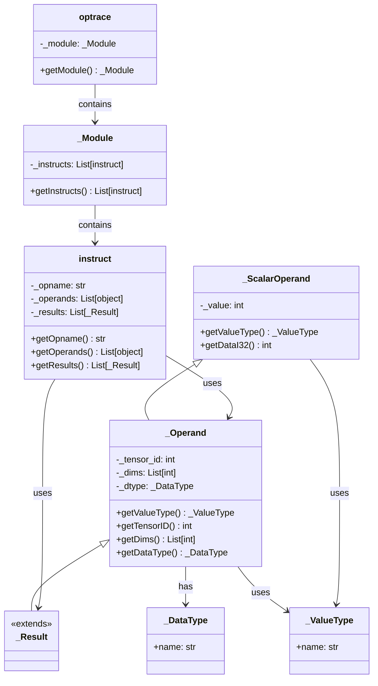
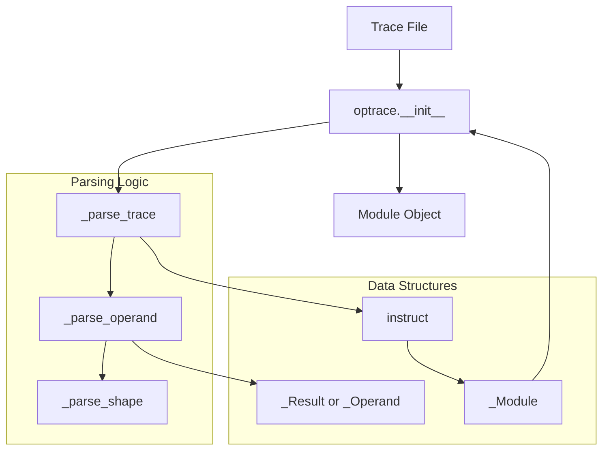
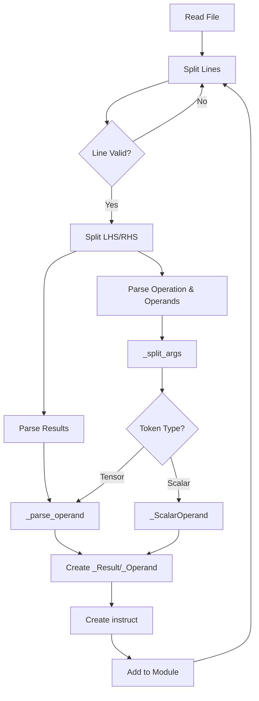
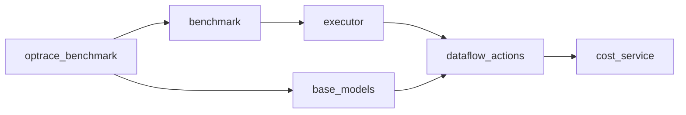

# optrace_benchmark Module

## Overview

The **optrace_benchmark** module provides a lightweight parser for text-based operation trace (optrace) formats used in the Nova Platform benchmarking system. It implements a simplified representation of computational operations, their operands, and results, enabling the parsing and manipulation of trace data for testing and analysis purposes.

This module serves as a foundational component for reading and interpreting operation traces that describe computational workflows, particularly in the context of benchmarking and performance analysis of AI/ML operations.

## Module Purpose

The optrace_benchmark module fulfills several key roles:

1. **Trace Parsing**: Converts text-based operation traces into structured Python objects
2. **Operation Representation**: Provides data structures to represent operations, operands, and results
3. **Type System**: Implements a simple type system for tensors and scalars
4. **Testing Support**: Enables unit tests to work with simplified trace formats

## Architecture

The module follows a simple dataclass-based architecture with clear separation between operands, results, instructions, and modules.

### Core Components



## Component Relationships

### Data Flow



### Operation Trace Format

The module parses text-based traces in the following format:

```
%result_id:shape = operation_name(operand1, operand2, ...)
```

Where:
- `%result_id:shape` defines the result tensor with its ID and shape
- `operation_name` is the name of the operation
- `operand1, operand2, ...` are either tensor references (`%id:shape`) or scalar values

Example:
```
%5:<1x384x12288xf16> = matmul(%3:<1x384x768xf16>, %4:<1x768x12288xf16>)
%6:<1x384x12288xf16> = add(%5:<1x384x12288xf16>, 0)
```

## Component Details

### _ValueType and _DataType

Simple dataclass wrappers for type information:
- `_ValueType`: Distinguishes between `TENSOR` and `SCALAR` types
- `_DataType`: Represents the data type (e.g., F16, F32, I32)

### _Operand

Represents a tensor operand with:
- **tensor_id**: Unique identifier for the tensor
- **dims**: List of dimensions (shape)
- **dtype**: Data type of the tensor

**Methods**:
- `getValueType()`: Returns `_TENSOR`
- `getTensorID()`: Returns the tensor ID
- `getDims()`: Returns the dimension list
- `getDataType()`: Returns the data type

### _ScalarOperand

Represents a scalar value operand:
- **value**: The scalar value (currently supports I32)

**Methods**:
- `getValueType()`: Returns `_SCALAR`
- `getDataI32()`: Returns the integer value

### _Result

A subclass of `_Operand` representing operation results. Inherits all tensor properties.

### instruct

Represents a single operation instruction with:
- **opname**: Name of the operation (e.g., "matmul", "add")
- **operands**: List of input operands (tensors or scalars)
- **results**: List of output results (tensors)

**Methods**:
- `getOpname()`: Returns the operation name
- `getOperands()`: Returns the list of operands
- `getResults()`: Returns the list of results

### _Module

Represents a collection of instructions that form a computational graph:
- **instructs**: List of instructions in execution order

**Methods**:
- `getInstructs()`: Returns the list of instructions

### optrace

The main entry point for parsing trace files:
- **Constructor**: Takes a file path and parses the trace
- **getModule()**: Returns the parsed `_Module` object

**Parsing Process**:
1. Reads the trace file
2. Splits into lines
3. Filters comments and empty lines
4. Parses each instruction
5. Constructs the module object

## Parsing Logic

### Trace Parsing Flow



### Argument Splitting

The `_split_args` function handles nested parentheses to correctly split arguments:
- Tracks depth of parentheses
- Splits on commas only at depth 0
- Preserves nested structures

### Shape Parsing

The `_parse_shape` function extracts dimensions and data type from shape strings:
- Format: `<dim1xdim2x...xdtype>`
- Example: `<1x384x12288xf16>` → dims=[1, 384, 12288], dtype="F16"
- Defaults to "F16" if no shape provided

## Integration with Nova Platform

The optrace_benchmark module integrates with the broader Nova Platform ecosystem:

### Related Modules

- **benchmark**: Uses optrace for workload definitions
- **base_models**: Provides foundational data types that may be referenced
- **dataflow_actions**: Operations defined here may correspond to dataflow actions
- **executor**: May use parsed traces for execution planning

### Usage Context



## Usage Examples

### Basic Trace Parsing

```python
from optrace_benchmark import optrace

# Parse a trace file
trace = optrace("path/to/trace.txt")

# Get the module
module = trace.getModule()

# Iterate through instructions
for instr in module.getInstructs():
    print(f"Operation: {instr.getOpname()}")
    
    # Process operands
    for operand in instr.getOperands():
        if hasattr(operand, 'getTensorID'):
            print(f"  Input Tensor: {operand.getTensorID()}")
        else:
            print(f"  Input Scalar: {operand.getDataI32()}")
    
    # Process results
    for result in instr.getResults():
        print(f"  Output Tensor: {result.getTensorID()}, Shape: {result.getDims()}")
```

### Creating Instructions Programmatically

```python
from optrace_benchmark import instruct, _Operand, _Result, _ScalarOperand

# Create operands
operand1 = _Operand(1, [1, 384, 768], "F16")
operand2 = _Operand(2, [1, 768, 12288], "F16")
scalar = _ScalarOperand(0)

# Create result
result = _Result(3, [1, 384, 12288], "F16")

# Create instruction
instruction = instruct("matmul", [operand1, operand2], [result])
```

## Design Patterns

### Immutable Data Structures

The module uses immutable data structures:
- Dataclasses for simple value objects
- Read-only access patterns via getter methods
- No mutation methods provided

### Factory Pattern

The parsing functions act as factories:
- `_parse_operand` creates operand/result objects
- `_parse_trace` creates instruction objects
- `optrace.__init__` creates module objects

### Type Discrimination

Uses `_ValueType` to distinguish between tensor and scalar operands at runtime, enabling polymorphic handling of different operand types.

## Limitations and Extensions

### Current Limitations

1. **Simplified Format**: Only supports basic text format, not full protobuf
2. **Limited Types**: Primarily supports F16 and I32 types
3. **No Validation**: Minimal error checking on trace format
4. **No Execution**: Only parses, doesn't execute operations

### Potential Extensions

1. **Full Protobuf Support**: Integrate with full optrace protobuf format
2. **Type System Expansion**: Support more data types (F32, INT8, etc.)
3. **Validation**: Add trace format validation
4. **Transformation**: Add methods to transform/modify traces
5. **Serialization**: Add methods to write traces back to file

## Testing

The module is designed for use in unit tests with simplified trace formats. Test traces typically:
- Use minimal operation sets
- Focus on structural correctness
- Avoid complex data dependencies

## Summary

The optrace_benchmark module provides a lightweight, text-based parser for operation traces in the Nova Platform. Its simple architecture and clear separation of concerns make it suitable for testing and prototyping, while its extensible design allows for future enhancement to support more complex trace formats and operations.
