# Nova-Sim Repository Overview

## Purpose

The `nova-sim` repository is a comprehensive simulation and performance modeling framework for the Nova Platform, a heterogeneous hardware accelerator architecture. It provides an end-to-end pipeline for simulating computational workloads (primarily GEMM operations), modeling memory hierarchies, calculating performance costs (compute, memory, power), and generating detailed performance traces for analysis.

The core purpose is to enable performance prediction and bottleneck analysis for AI/ML workloads on the Nova hardware architecture before physical silicon is available. This allows for architectural exploration, workload optimization, and hardware/software co-design.

## End-to-End Architecture

The repository follows a layered, modular architecture that transforms high-level operation specifications into detailed performance reports and visual traces.

### High-Level Data Flow

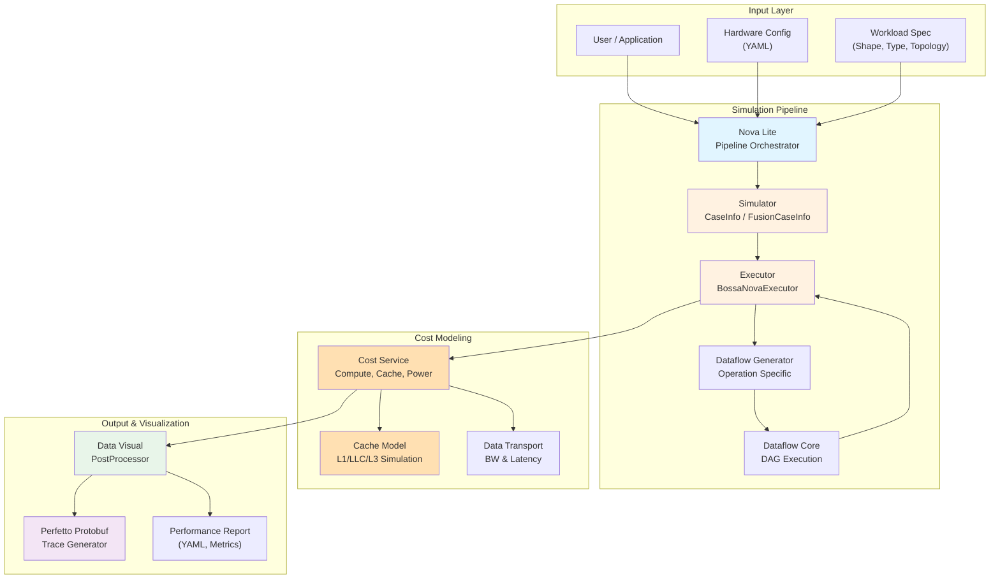

### Detailed Component Architecture

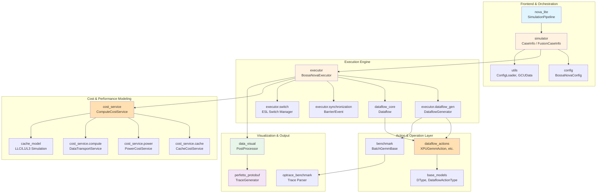

## Core Modules Documentation

### 1. Cache Model (`cache_model`)

**Purpose**: Provides a comprehensive simulation framework for modeling multi-level cache hierarchies (L1, LLC, L3) with configurable parameters, LRU replacement policies, and detailed statistics tracking.

**Key Components**:
- `AbstractGCU`: Top-level interface for cache simulation
- `AbstractMemoryManager`: Base interface for memory managers
- `LLCManager`, `L1CManager`, `L3Manager`: Cache level implementations
- `_LRUSet`: LRU replacement policy implementation
- `HardwareConfig`, `Request`, `Access`: Data models

**Architecture**:
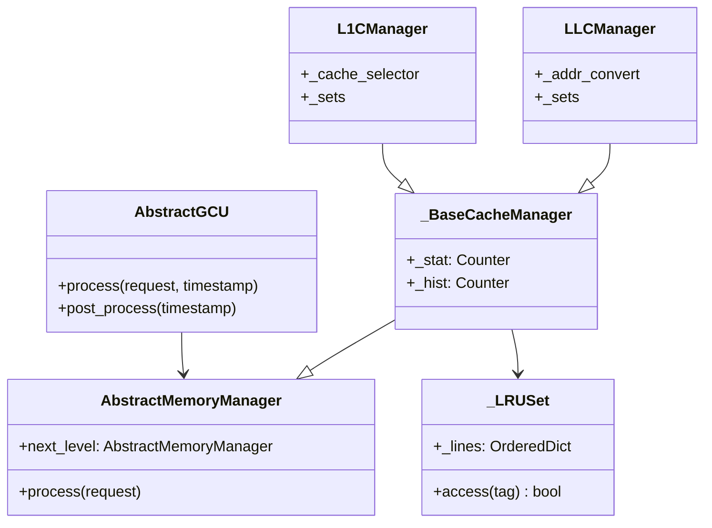

**Data Flow**:
```mermaid
flowchart TD
    A[External Request] --> B[AbstractGCU.process()]
    B --> C[L1CManager.process()]
    C --> D{L1 Hit?}
    D -->|Yes| E[Record Hit]
    D -->|No| F[LLCManager.process()]
    F --> G{LLC Hit?}
    G -->|Yes| H[Record LLC Hit]
    G -->|No| I[L3Manager.process()]
    I --> J[Record L3 Access]
    J --> K[Propagate back]
    H --> K
    E --> K
    K --> L[Update Statistics]
    L --> M[Post-process]
    M --> N[Generate Reports]
```

**Documentation**: See `cache_model` module docs for detailed information.

---

### 2. Nova Lite (`nova_lite`)

**Purpose**: Provides a streamlined, Python-only simulation pipeline for GEMM operations, abstracting away the complexity of the full Nova platform infrastructure.

**Key Components**:
- `SimulationPipeline`: Main orchestrator for running simulations
- `SimulationResult`: Encapsulates all simulation artifacts

**Architecture**:
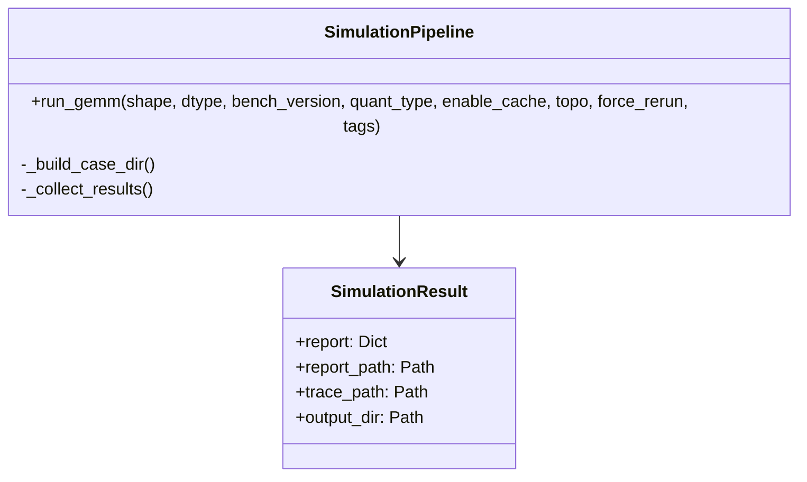

**Integration**:
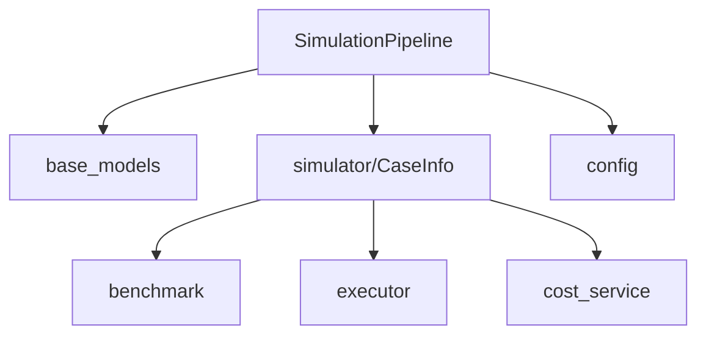

**Documentation**: See `nova_lite` module docs for detailed information.

---

### 3. Base Models (`base_models`)

**Purpose**: Foundational data model layer defining core enumerations, data structures, and abstract base classes for computational operations, memory domains, and statistics.

**Key Components**:
- `DType`: Data type definitions (FP16, FP32, INT8, etc.)
- `AddrDomain`: Memory address space classification
- `DataflowActionType`: Operation categorization (XPU, DTE, ESL)
- `DataflowOpType`: Computational primitives (GEMM, ADD, SOFTMAX, etc.)
- `BaseActionStat`, `DataflowActionMemoryStat`, `DataflowActionComputeStat`: Statistical models
- `PostStat`, `EDCStat`: Post-simulation statistics
- `BaseFrame`: Temporal framework
- `BaseESLSwitch`: Hardware abstraction

**Architecture**:
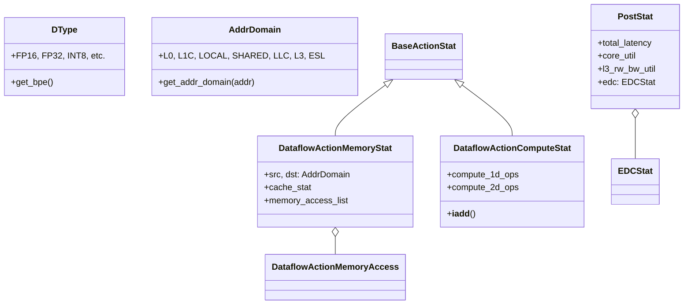

**Documentation**: See `base_models` module docs for detailed information.

---

### 4. Benchmark (`benchmark`)

**Purpose**: Framework for benchmarking and tiling operations across different hardware backends (XPU, GPU, TPU) and memory architectures.

**Key Components**:
- `BatchGemmBase`: Abstract GEMM tiler
- `XpuBatchGemmBase`: XPU-specific base
- `BatchGemmLocal`, `BatchGemmShared`: XPU memory architectures
- `BatchGemmTpu`: TPU backend
- `BatchGemmGPU`: GPU backend
- `Workload`, `OpBase`: Workload representation
- `GridShape`: Tiling dimensions

**Architecture**:
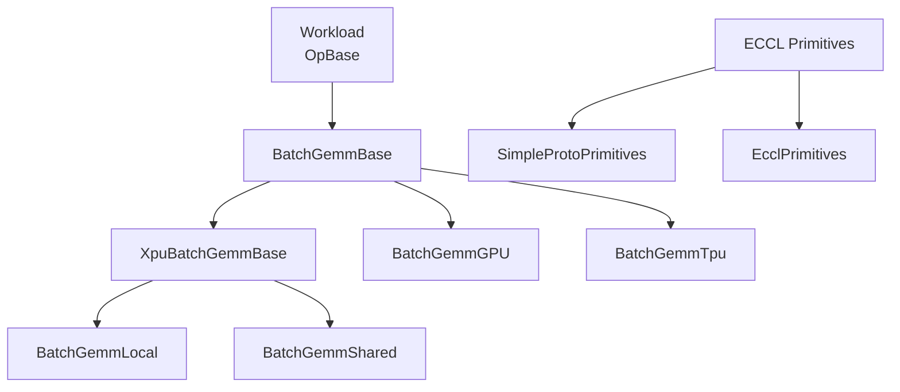

**Documentation**: See `benchmark` module docs for detailed information.

---

### 5. Config (`config`)

**Purpose**: Central configuration management system defining comprehensive dataclass structures for hardware specifications, memory hierarchies, compute capabilities, and power characteristics.

**Key Components**:
- `BossaNovaConfig`: Top-level system configuration
- `InstNumConfig`: Hardware topology
- `FreqConfig`: Clock domains
- `ComputeConfig`: Processing capabilities
- `MemoryConfig`: Memory hierarchy (L0, L1, L2, L3, LLC)
- `BWConfig`: Bandwidth specifications
- `PowerLibConfig`: Power models
- `TOPO`: System topologies (STANDALONE, FULLMESH8, etc.)

**Architecture**:
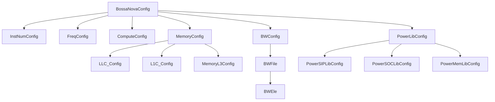

**Documentation**: See `config` module docs for detailed information.

---

### 6. Cost Service (`cost_service`)

**Purpose**: Comprehensive cost modeling for hardware accelerators, calculating computational costs, memory access costs, and power consumption for dataflow operations.

**Key Components**:
- `ComputeCostService`: Main orchestration engine
- `CacheCostService`: Cache hierarchy simulation
- `PowerCostService`: Power consumption modeling
- `DataTransportService`: Bandwidth and latency calculation
- `BossaNovaContext`: Global execution context
- `CostBook`: Per-action cost accumulation

**Architecture**:
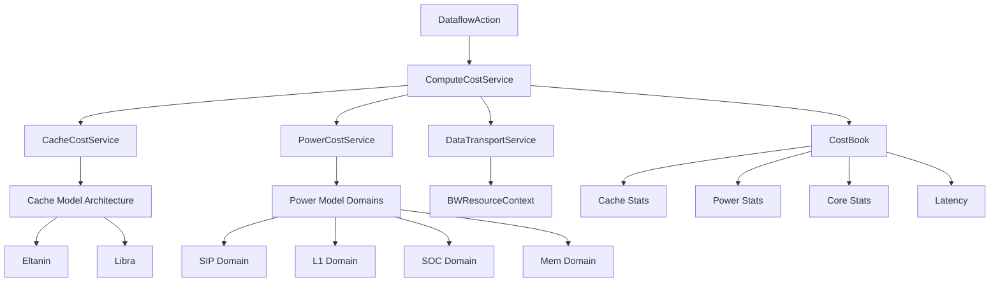

**Documentation**: See `cost_service` module docs for detailed information.

---

### 7. Data Visual (`data_visual`)

**Purpose**: Post-processing simulation results and generating comprehensive reports and visualizations in YAML and Perfetto trace formats.

**Key Components**:
- `PostProcessor`: Single-GCU post-processing
- `FusionPostProcessor`: Multi-GCU result fusion
- `BossaNovaTraceProcessor`: Trace analysis with SQL queries
- `AbstractPostProcessor`: Base interface

**Architecture**:
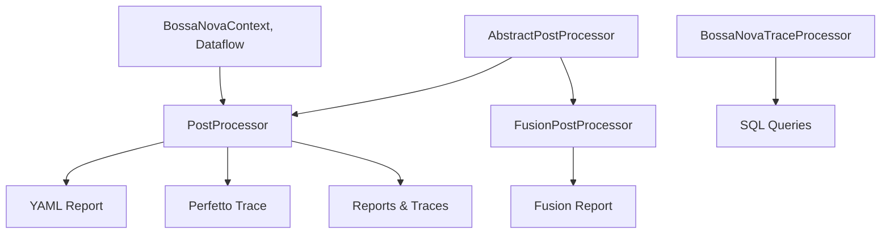

**Documentation**: See `data_visual` module docs for detailed information.

---

### 8. Dataflow Actions (`dataflow_actions`)

**Purpose**: Defines and implements computational operations for dataflow graphs with detailed performance modeling capabilities.

**Key Components**:
- `DiagDataflowAction`: Base class for all actions
- `XPUGemmAction`: Matrix multiplication
- `XPUAllReduceAction`, `XPUAllGatherAction`: Collective operations
- `XPUActivationAction`: Activation functions (ReLU, Sigmoid, GELU, SiLU)
- `XPULayernormAction`, `XPUSoftmaxAction`: Normalization operations
- `XPUSdpaAction`: Scaled Dot-Product Attention
- `CDTESliceAction`, `CDTEDesliceAction`: Data transformation engine

**Architecture**:
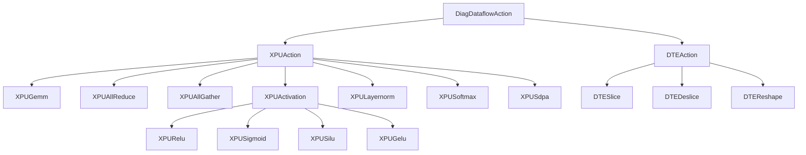

**Documentation**: See `dataflow_actions` module docs for detailed information.

---

### 9. Dataflow Core (`dataflow_core`)

**Purpose**: Central orchestration engine managing execution of computational workflows through graph-based dependency management.

**Key Components**:
- `Dataflow`: Main orchestrator class
- `DataflowAction`: Abstract base for operations
- `BARRIER`: Synchronization primitive
- `BossaNovaEvent`: Event-based synchronization

**Architecture**:
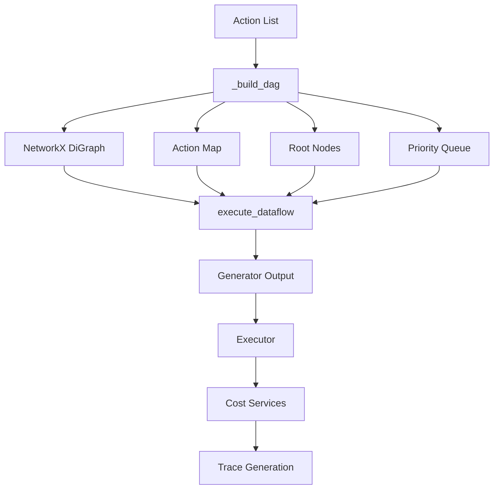

**Documentation**: See `dataflow_core` module docs for detailed information.

---

### 10. Executor (`executor`)

**Purpose**: Core orchestration engine managing complete lifecycle of computational workloads from dataflow generation to execution and performance analysis.

**Key Components**:
- `BossaNovaExecutor`: Main orchestrator
- `DataflowGenerator`: Operation-specific generators
- `MemoryManager`: L3 memory allocation
- `ESLSwitchManager`: Inter-GCU communication
- `EventManager`, `BarrierManager`: Synchronization

**Architecture**:
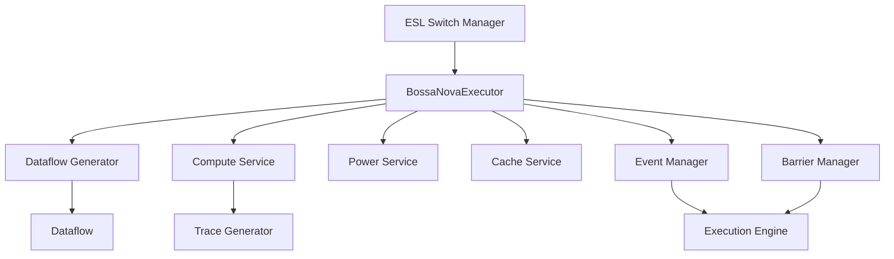

**Documentation**: See `executor` module docs for detailed information.

---

### 11. Perfetto Protobuf (`perfetto_protobuf`)

**Purpose**: Generates Perfetto-compatible performance traces for timeline visualization and analysis.

**Key Components**:
- `TraceGenerator`: High-level trace generation
- `_BaseTraceGenerator`: Core protobuf generation
- `NormalTrack`, `CounterTrack`, `GroupTrack`: Track types
- `trace()`, `instant()`, `count()`: Profile APIs

**Architecture**:
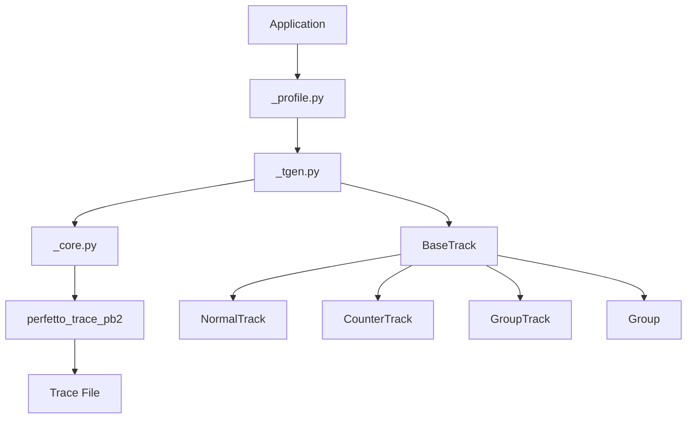

**Documentation**: See `perfetto_protobuf` module docs for detailed information.

---

### 12. Simulator (`simulator`)

**Purpose**: Core orchestration layer managing execution of computational workloads across multiple GCU configurations with trace generation and fusion support.

**Key Components**:
- `CaseInfo`: Single case definition
- `FusionCaseInfo`: Composite case manager
- `GCUData`: Per-GCU state

**Architecture**:
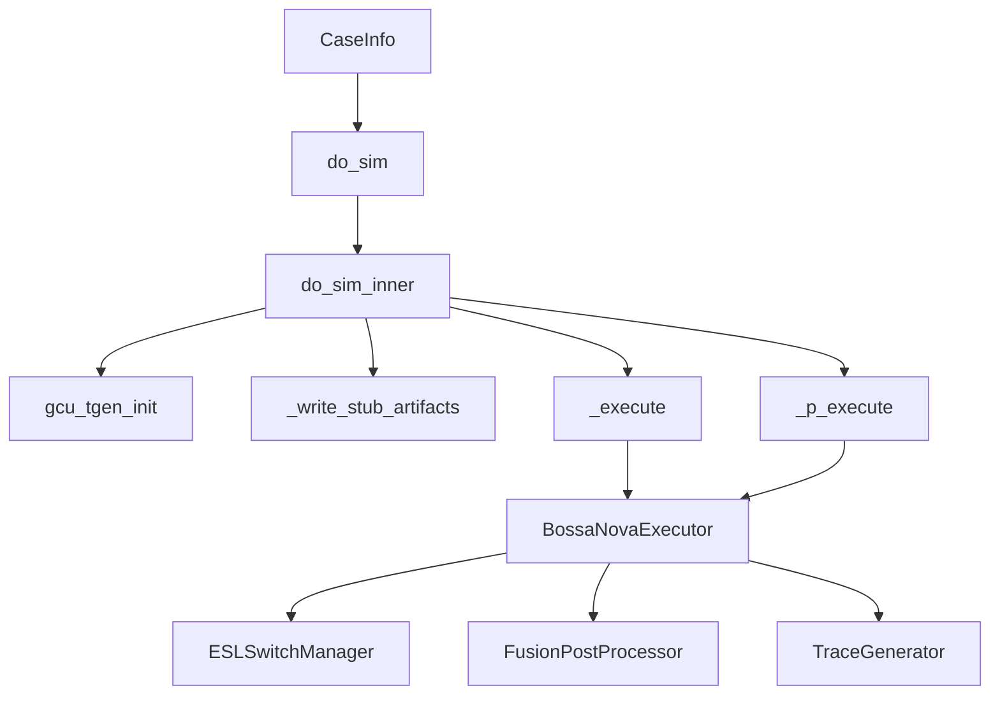

**Documentation**: See `simulator` module docs for detailed information.

---

### 13. Utils (`utils`)

**Purpose**: Foundational utilities including configuration loading, memory allocation, and data structures.

**Key Components**:
- `SingletonMeta`: Singleton pattern metaclass
- `BaseDataclass`: Enhanced dataclass
- `ConfigLoader`: YAML configuration loader
- `MemoryAllocator`: Virtual memory management
- `GCUData`: GCU state container

**Architecture**:
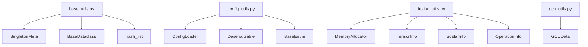

**Documentation**: See `utils` module docs for detailed information.

---

### 14. OpTrace Benchmark (`optrace_benchmark`)

**Purpose**: Lightweight parser for text-based operation trace formats used in benchmarking.

**Key Components**:
- `optrace`: Main parser
- `instruct`: Operation instruction
- `_Operand`, `_ScalarOperand`: Input representations
- `_Result`: Output representation
- `_Module`: Collection of instructions

**Architecture**:
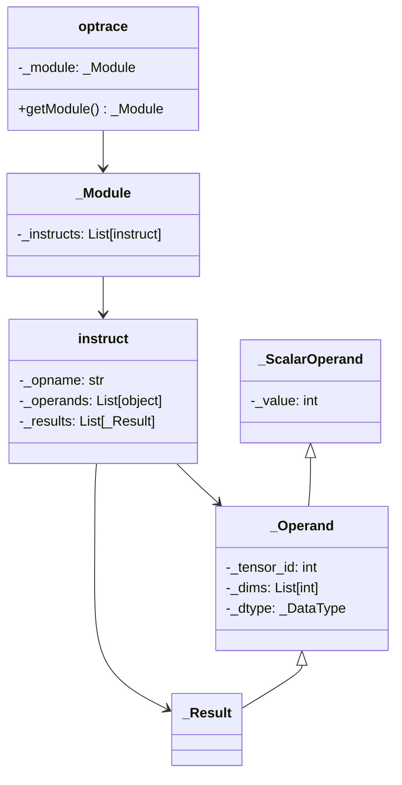

**Documentation**: See `optrace_benchmark` module docs for detailed information.

---

### 15. Perfetto Trace Processor (`perfetto_trace_processor`)

**Purpose**: Provides interface for querying Perfetto trace files using SQL.

**Key Components**:
- `TraceProcessor`: Main processor class
- `TraceProcessorConfig`: Configuration

**Documentation**: Minimal documentation provided.

## Key Features

1. **Multi-Level Cache Simulation**: Accurate modeling of L1, LLC, and L3 caches with LRU replacement
2. **Multi-Backend Support**: XPU, TPU, and GPU operation backends
3. **Distributed Computing**: Multi-GCU, multi-die, multi-cluster configurations
4. **Comprehensive Cost Modeling**: Compute, memory, power, and bandwidth costs
5. **Trace Generation**: Perfetto-compatible traces for timeline visualization
6. **Fusion Support**: Composite workloads from multiple operations
7. **Flexible Configuration**: Hardware specifications via YAML configs
8. **Performance Prediction**: End-to-end latency and utilization metrics

## Integration Flow

The repository provides a complete simulation pipeline:

1. **Configuration**: Define hardware specs via `BossaNovaConfig`
2. **Workload**: Specify operation (GEMM, etc.), shape, data type, topology
3. **Simulation**: Run via `NovaLite` or `Simulator`
4. **Dataflow Generation**: Convert to hardware-specific operations
5. **Execution**: Orchestrate through `Executor` with cost services
6. **Cost Calculation**: Compute, cache, power, and bandwidth modeling
7. **Post-Processing**: Generate reports and traces via `DataVisual`
8. **Analysis**: Visualize traces and analyze performance metrics

This architecture enables comprehensive performance analysis and optimization for Nova Platform workloads.