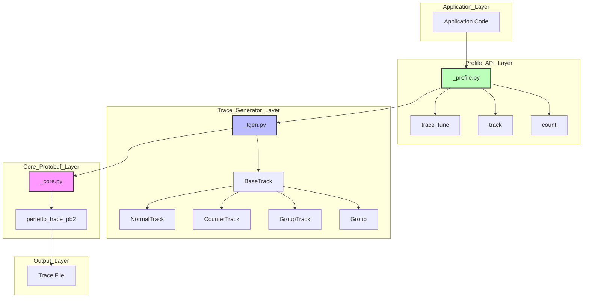
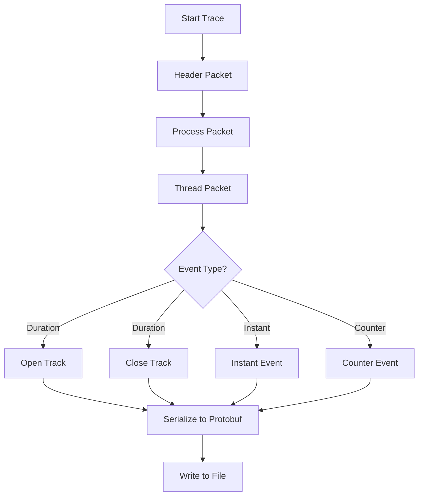
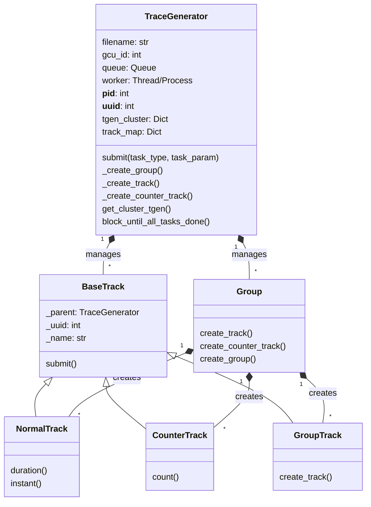
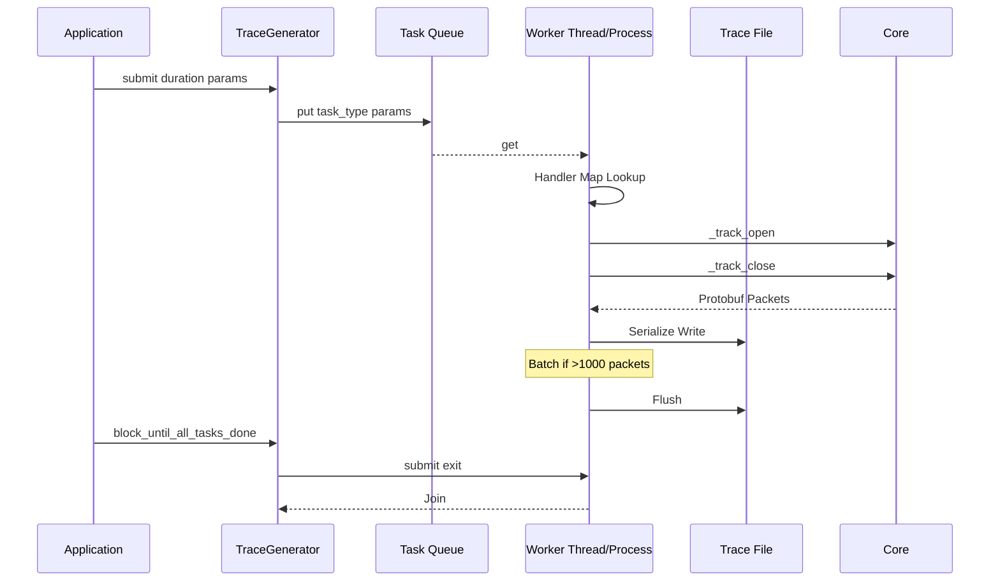
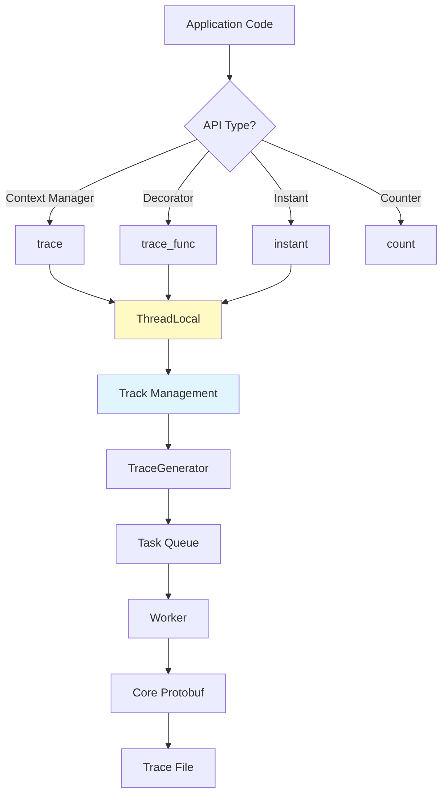

# Perfetto Protobuf Module

## Overview

The `perfetto_protobuf` module provides a comprehensive tracing and profiling framework for the Nova Platform system. It enables developers to generate detailed performance traces in the Perfetto format, which can be visualized using Perfetto UI tools. The module supports multi-threaded and multi-process tracing with hierarchical track organization, counter tracking, and event flow tracking.

### Key Features

- **Hierarchical Track Organization**: Create groups, normal tracks, and counter tracks
- **Event Types**: Support for duration events, instant events, and counter events
- **Flow Tracking**: Track event dependencies and data flow across tracks
- **Multi-threaded/Multi-process Support**: Thread-safe tracing with optional multiprocessing
- **Performance Optimized**: Asynchronous trace generation with configurable batching
- **Debug Annotations**: Rich metadata support for events

## Architecture

The module follows a layered architecture with separation of concerns between core protobuf generation, profile-level APIs, and high-level trace generators.



## Module Components

The perfetto_protobuf module consists of three main sub-modules:

1. **[Core Protobuf Generator](#core-protobuf-generator)** - Low-level protobuf packet generation
2. **[Trace Generator](#trace-generator)** - Multi-threaded trace generation with worker processes
3. **[Profile API](#profile-api)** - High-level decorator and context manager APIs

## Core Protobuf Generator

**File**: `_core.py`  
**Primary Component**: `_BaseTraceGenerator`

The core layer provides fundamental protobuf packet generation capabilities. It handles the creation of all Perfetto trace packets including headers, track descriptors, and event packets.

### Responsibilities

- **Packet Creation**: Generate individual protobuf packets for different event types
- **Header Management**: Create trace initialization packets with clock configurations
- **Track Management**: Define process and thread tracks with hierarchical relationships
- **Event Generation**: Create instant, duration, and counter events
- **Data Interning**: Optimize string storage through interned data structures
- **Debug Annotations**: Serialize complex Python objects into protobuf format

### Key Methods

- `_header_packet()`: Creates initialization packets with clock definitions
- `_pid_packet()`: Creates process-level track descriptors
- `_tid_packet()`: Creates thread-level track descriptors
- `_track_open()`: Begins a duration event (slice)
- `_track_close()`: Ends a duration event
- `_track_instant()`: Records an instant event
- `_track_count()`: Records counter values
- `_add_debug_annotation()`: Serializes metadata into protobuf format

### Architecture Flow



## Trace Generator

**File**: `_tgen.py`  
**Primary Components**: `TraceGenerator`, `BaseTrack`, `NormalTrack`, `CounterTrack`, `GroupTrack`, `Group`

The trace generator layer provides a high-performance, asynchronous interface for trace generation. It uses worker threads or processes to handle protobuf serialization and file I/O without blocking the main application.

### Architecture



### Worker Process Architecture

The trace generator uses a producer-consumer pattern:



### Track Types

1. **NormalTrack**: Records duration and instant events
2. **CounterTrack**: Records time-series numeric values
3. **GroupTrack**: Container for organizing related tracks
4. **Group**: Top-level container representing processes/contexts

### Performance Optimizations

- **Asynchronous Processing**: Non-blocking trace generation
- **Batching**: Accumulates packets before flushing (threshold: 1000)
- **Multiprocessing**: Optional process-based worker for GIL-bound scenarios
- **Thread Safety**: Lock-protected queue operations
- **Lazy Track Creation**: Tracks created on-demand and cached

## Profile API

**File**: `_profile.py`  
**Primary Components**: `trace()`, `instant()`, `track`, `count`, `trace_func`, `trace_func_args`

The profile API provides a developer-friendly interface for instrumenting code with minimal overhead.

### Usage Patterns

#### 1. Context Manager Pattern

```python
from nova_platform.perfetto_protobuf._profile import trace, track

# Create a named track
my_track = track("MyComponent")

# Use as context manager
with my_track.trace("operation_name", arg1, arg2, kwarg1=value):
    # Code to trace
    do_work()
```

#### 2. Decorator Pattern

```python
from nova_platform.perfetto_protobuf._profile import trace_func, trace_func_args

@trace_func
def my_function():
    # Automatically traced
    pass

@trace_func_args
def my_function_with_args(arg1, arg2):
    # Traces with arguments
    pass

# Or with custom track
@trace_func(track("CustomTrack"))
def another_function():
    pass
```

#### 3. Instant Events

```python
from nova_platform.perfetto_protobuf._profile import instant

# Record a point-in-time event
instant("checkpoint", {"data": value})

# With flow tracking
flow_ids = instant("event", num_outgoing_flow_ids=2)
# ... later ...
instant("dependent_event", incoming_flow_ids=flow_ids)
```

#### 4. Counter Tracking

```python
from nova_platform.perfetto_protobuf._profile import count

counter = count("memory_usage")
counter.increment(100)  # Add 100
counter.count(500)      # Set to 500
```

#### 5. File Management

```python
from nova_platform.perfetto_protobuf._profile import open as trace_open

with trace_open("trace.perfetto"):
    # All tracing happens here
    with trace("operation"):
        do_work()
```

### Thread-Local Storage

The profile API uses thread-local storage (`_tls`) to maintain separate default tracks per thread, ensuring thread-safe tracing without explicit track management.

### Architecture Flow



## Integration with Other Modules

The perfetto_protobuf module integrates with several other Nova Platform components:

### Executor Integration

The [executor module](executor.md) uses perfetto_protobuf to trace:
- Dataflow generation operations
- Layer execution timelines
- Memory access patterns
- Compute operations

### Cost Service Integration

The [cost_service module](cost_service.md) can use traces to:
- Profile cache operations
- Track memory bandwidth usage
- Analyze power consumption patterns
- Validate cost models

### Benchmark Integration

The [benchmark module](benchmark.md) instruments operations using:
- Operation-level tracing
- Performance counter tracking
- Timeline analysis

## Configuration

### Environment Variables

- `BOSSANOVA_PROTOBUF_MP`: Controls multiprocessing mode ('1' for enabled, '0' for disabled)
  - Default: '1' (enabled)
  - When disabled, falls back to thread-based worker

### Performance Tuning

- **Batch Size**: 1000 packets (hardcoded in worker)
- **Queue Size**: Unlimited (system-dependent)
- **List Max Size**: 256 items (for debug annotations)
- **Flush Threshold**: 10000 (in core, though not actively used in async mode)

## Best Practices

### 1. Use Context Managers for Scoped Tracing

```python
# Good
with trace("operation"):
    do_work()

# Avoid manual open/close
trace_obj = track("op").trace("operation")
trace_obj.__enter__()
do_work()
trace_obj.__exit__(None, None, None)
```

### 2. Use Descriptive Names

```python
# Good
with trace("matrix_multiply", {"size": (1024, 1024)}):
    pass

# Avoid
with trace("op1"):
    pass
```

### 3. Use Flow IDs for Dependencies

```python
# Producer
flow_ids = instant("data_ready", num_outgoing_flow_ids=1)

# Consumer
instant("process_data", incoming_flow_ids=flow_ids)
```

### 4. Use Counters for Metrics

```python
# Track memory usage over time
mem_counter = count("memory_usage")
mem_counter.count(current_memory)
```

### 5. Clean Up Resources

```python
# Always use context manager for file opening
with trace_open("trace.perfetto"):
    # work
    pass
# File automatically closed
```

## Limitations and Constraints

1. **Nested Traces**: The old `_profile.open()` doesn't support nested calls (raises AssertionError)
2. **Flow ID Management**: Flow IDs are globally managed and may overflow in very long traces
3. **String Interning**: Interned data is not shared across worker processes
4. **UUID Management**: UUIDs are managed per TraceGenerator instance
5. **Performance**: Very high-frequency events (>100k/sec) may cause queue overflow

## Example: Complete Usage

```python
from nova_platform.perfetto_protobuf._profile import (
    trace_open, trace, track, count, instant, trace_func
)

# 1. Open trace file
with trace_open("my_trace.perfetto"):
    
    # 2. Create custom track
    compute_track = track("Compute")
    
    # 3. Use context manager
    with compute_trace.trace("matrix_ops", size=1024):
        
        # 4. Use decorator
        @trace_func
        def multiply(a, b):
            return a * b
        
        result = multiply(10, 20)
        
        # 5. Record instant events
        instant("checkpoint", {"result": result})
        
        # 6. Track counters
        counter = count("operations")
        counter.increment(1)
        
        # 7. Flow tracking
        flow = instant("data_ready", num_outgoing_flow_ids=1)
        instant("process", incoming_flow_ids=flow)
```

## Testing and Debugging

### Enable Debug Mode

```python
# In _core.py, set:
print_proto = True  # Prints protobuf to stdout
```

### Verify Trace Output

Use Perfetto UI (https://ui.perfetto.dev/) to visualize generated traces.

### Common Issues

1. **Empty Trace**: Ensure `trace_open()` context is active
2. **Missing Events**: Check queue is being processed (call `block_until_all_tasks_done()`)
3. **Thread Safety**: Use locks when sharing tracks across threads

## Future Enhancements

Potential improvements for the module:
- Dynamic batch size configuration
- Compression support for trace files
- Streaming trace output
- Integration with remote tracing services
- Custom event types
- Hierarchical counter support

## Related Documentation

- [Executor Module](executor.md) - How traces are used in execution
- [Cost Service Module](cost_service.md) - Performance profiling integration
- [Dataflow Actions](dataflow_actions.md) - Operation-level tracing
