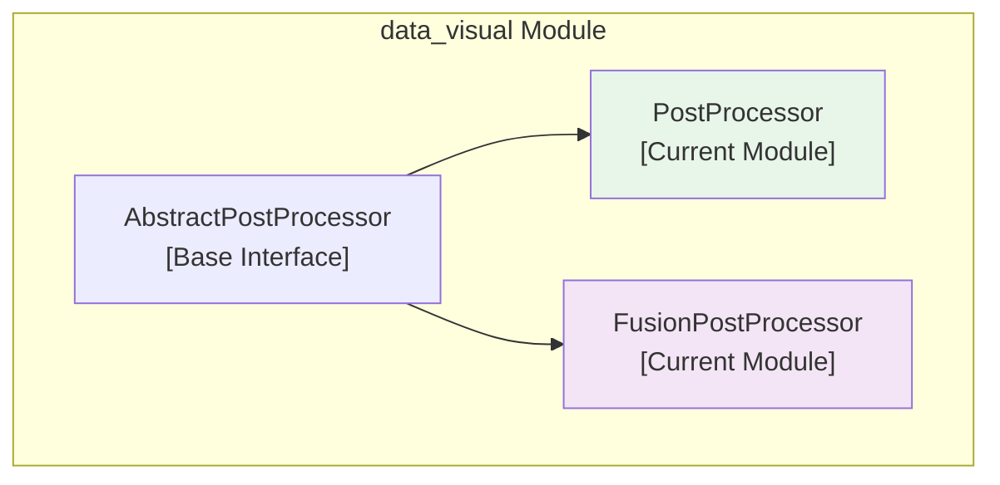
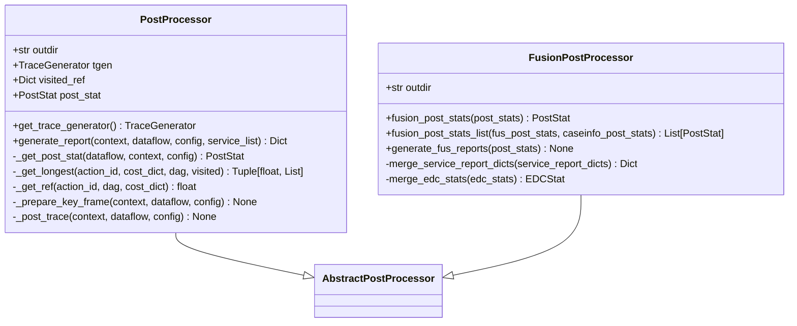
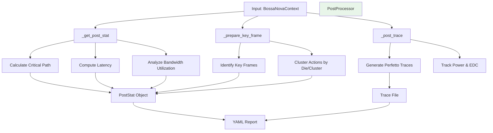
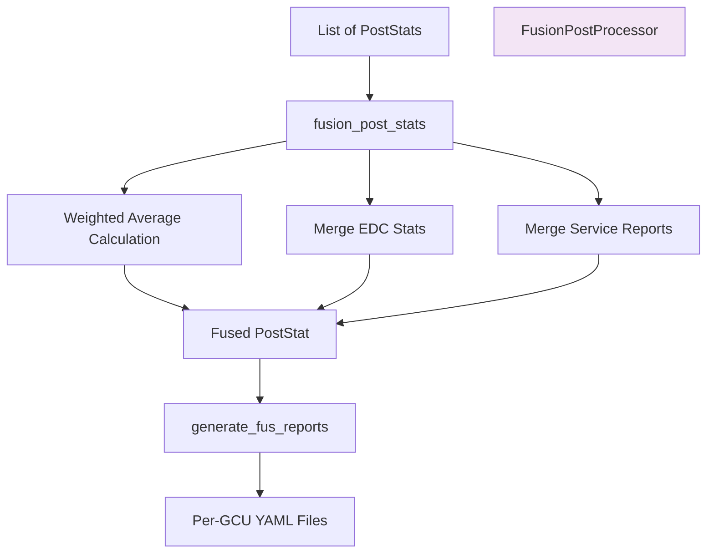
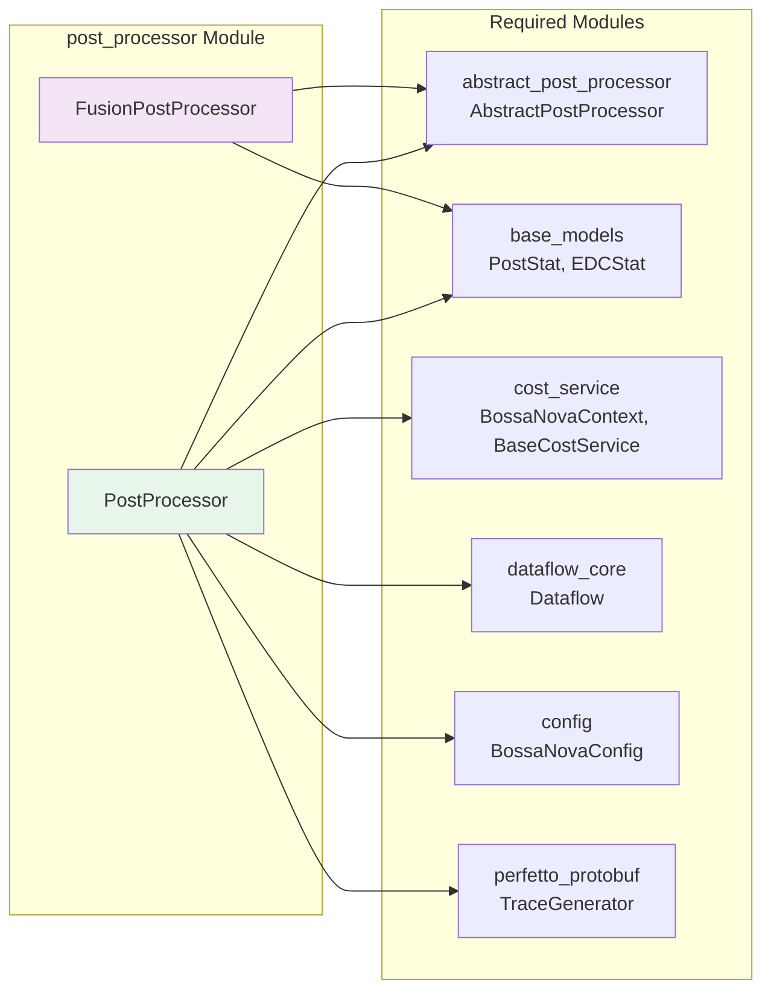
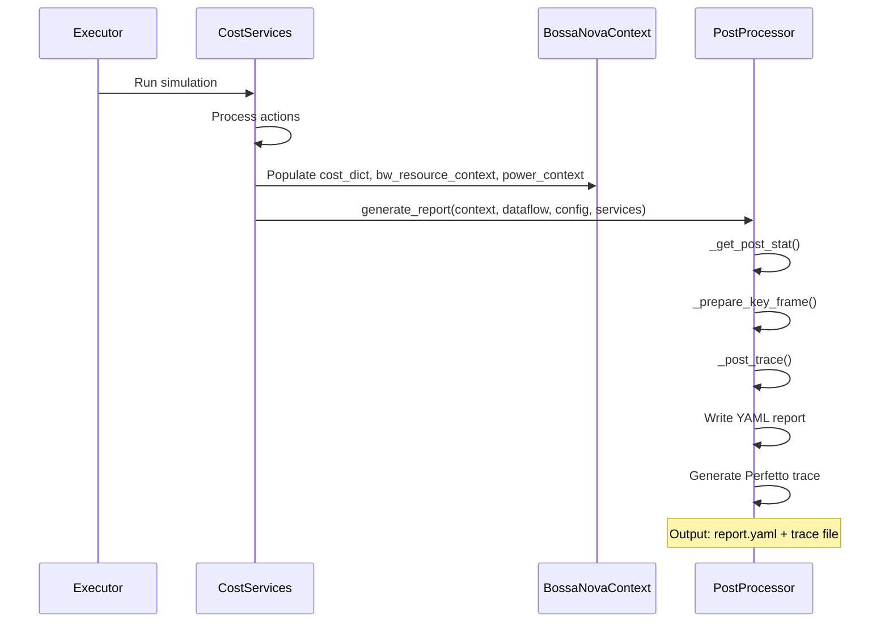
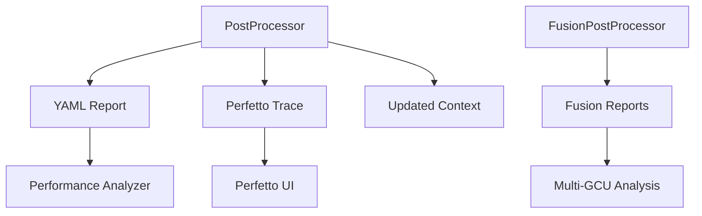

# Post Processor Module

## Overview

The `post_processor` module is a core component of the [data_visual](data_visual.md) module that handles post-processing of simulation results. It provides two main implementations:

1. **PostProcessor**: Processes single-GCU simulation results and generates comprehensive reports
2. **FusionPostProcessor**: Merges results from multiple GCUs to provide unified performance metrics

This module transforms raw computational data from the simulation pipeline into structured reports and Perfetto-compatible trace files for performance analysis and visualization.

## Module Context

The post_processor module is part of the data_visual hierarchy:



## Architecture

### Component Overview



### PostProcessor Architecture

The `PostProcessor` class performs comprehensive analysis through a multi-stage pipeline:



### FusionPostProcessor Architecture

The `FusionPostProcessor` merges results from multiple GCUs:



## Core Components

### PostProcessor

**File**: `nova-platform/nova_platform/data_visual/post_processor.py`

**Purpose**: Single-GCU post-processing and report generation

#### Key Methods

##### `__init__(outdir="./", tgen=None)`
Initializes the post-processor with output directory and optional trace generator.

**Parameters**:
- `outdir`: Directory for output files
- `tgen`: TraceGenerator instance for trace creation

##### `get_trace_generator() -> TraceGenerator`
Returns the trace generator instance.

**Returns**: `TraceGenerator` - The trace generator for Perfetto-compatible output

**Implements**: `AbstractPostProcessor.get_trace_generator()`

##### `generate_report(context, dataflow, config, service_list)`
Main entry point for report generation. Orchestrates the entire post-processing pipeline.

**Parameters**:
- `context`: `BossaNovaContext` - Simulation context with cost data
- `dataflow`: `Dataflow` - Execution graph structure
- `config`: `BossaNovaConfig` - System configuration
- `service_list`: `List[BaseCostService]` - Cost services for specialized reports

**Returns**: `Dict` - Complete report data

**Process Flow**:
1. Calculate post statistics via `_get_post_stat()`
2. Store in `context.post_stat` and `self.post_stat`
3. Generate service-specific reports
4. Create trace data via `_post_trace()`
5. Prepare key frames via `_prepare_key_frame()`
6. Write YAML report to `{outdir}/report.yaml`

#### Internal Methods

##### `_get_post_stat(dataflow, context, config) -> PostStat`
Calculates comprehensive performance statistics.

**Algorithm**:
1. **Critical Path Analysis**: Uses `_get_longest()` to find the longest path through the DAG
2. **Latency Calculation**: 
   - `action_end_time`: End time of critical path
   - `l3_end_time`: Last L3 memory operation completion
   - `total_latency`: Maximum of the above
3. **Bandwidth Utilization**: Aggregates bandwidth usage across all resources
   - Calculates utilization percentage for each resource type
   - Stores in `PostStat` attributes (e.g., `l3_rw_bw_util`, `esl_bw_util`)

**Returns**: `PostStat` - Complete performance statistics

**Key Formulas**:
```python
util = total_bandwidth_usage / (total_latency * max_bandwidth)
```

##### `_get_longest(action_id, cost_dict, dag, visited) -> Tuple[float, List]`
Recursively computes the longest path from an action to terminal nodes.

**Parameters**:
- `action_id`: ID of current action
- `cost_dict`: Dictionary of `CostBook` objects with latency data
- `dag`: Directed acyclic graph of actions
- `visited`: Cache of visited nodes

**Returns**: `(latency, path)` - Maximum latency and the path to achieve it

**Algorithm**:
```python
curr_latency = cost_dict[action_id].latency
next_max_latency = 0
next_child_stack = []

for child_id in dag.successors(action_id):
    latency, child_stack = _get_longest(child_id, ...)
    if latency > next_max_latency:
        next_max_latency = latency
        next_child_stack = child_stack

return curr_latency + next_max_latency, [action_id] + next_child_stack
```

##### `_get_ref(action_id, dag, cost_dict) -> float`
Computes the reference time (start time) for an action.

**Parameters**:
- `action_id`: ID of the action
- `dag`: Execution graph
- `cost_dict`: Cost data

**Returns**: `float` - Start time of the action

**Algorithm**:
```python
if action_id in visited_ref:
    return visited_ref[action_id]

parents = dag.predecessors(action_id)
if parents:
    ref = max(_get_ref(parent, ...) for parent in parents)
else:
    ref = 0

visited_ref[action_id] = cost_dict[action_id].latency + ref
return visited_ref[action_id]
```

##### `_prepare_key_frame(context, dataflow, config)`
Identifies critical time points for visualization.

**Output**: 
- `self.key_frame_global_dict`: Global key frames mapped to active actions
- `self.key_frame_per_cluster_list`: Per-cluster key frames

**Process**:
1. For each action, calculate `(x, dx)` = `(ref_time, duration)`
2. Add start and end times to key frame sets
3. Map actions to key frames where they're active

##### `_post_trace(context, dataflow, config)`
Generates Perfetto trace data.

**Traces Generated**:
1. **Bandwidth Utilization**: Counter tracks for each resource (L3, SIC I/O, ESL, D2D)
2. **Power Consumption**: L3 power and EDC current measurements
3. **EDC Analysis**: DTU and SOC current profiles with filtering

**Process**:
```python
for (lvl, rw, die_id, cluster_id, esl_port_id, bw_resource) in context.bw_resource_context.get_unique_bw_resource_list():
    track = context.get_cluster_tgen(die_id, cluster_id).create_counter_track(...)
    for frame in bw_resource.timeline.data:
        track.count(frame.begin, frame.allocated_bw/max_bw)
```

### FusionPostProcessor

**File**: `nova-platform/nova_platform/data_visual/post_processor.py`

**Purpose**: Multi-GCU result fusion and aggregation

#### Key Methods

##### `__init__(outdir="./")`
Initializes the fusion processor.

**Parameters**:
- `outdir`: Directory for fusion reports

##### `fusion_post_stats(post_stats: List[PostStat]) -> PostStat`
Merges multiple `PostStat` objects into a single fused result.

**Parameters**:
- `post_stats`: List of `PostStat` from different GCUs

**Returns**: `PostStat` - Fused statistics

**Fusion Logic**:

1. **Total Latency**: Sum of all latencies
   ```python
   total_latency = sum(ps.total_latency for ps in post_stats)
   ```

2. **Action End Time**: Sum of all action end times
   ```python
   action_end_time = sum(ps.action_end_time for ps in post_stats)
   ```

3. **Weighted Averages**: For utilization metrics
   ```python
   def w_avg(attr):
       return sum(getattr(ps, attr) * ps.total_latency for ps in post_stats) / total_latency
   ```

4. **EDC Merging**: Combines energy consumption data
   - Merges DTU and SOC reports
   - Aggregates total latency and accumulated energy
   - Averages EDC improvement percentages

5. **Service Reports**: Merges specialized metrics
   - Aggregates non-cache services by summing
   - Uses latest cache service report (preserves most recent state)

##### `fusion_post_stats_list(fus_post_stats, caseinfo_post_stats) -> List[PostStat]`
Fuses two lists of post-stats for each GCU.

**Parameters**:
- `fus_post_stats`: List of current fused stats
- `caseinfo_post_stats`: List of new case stats

**Returns**: List of updated fused stats

**Usage**: Used for iterative fusion across multiple simulation cases

##### `generate_fus_reports(post_stats)`
Generates per-GCU fusion reports.

**Process**:
```python
for gcu_id, post_stat in enumerate(post_stats):
    fus_report = asdict(post_stat)
    fus_report_str = yaml.dump(fus_report, ...)
    write to {outdir}/fus_report/fus_report_gcu{gcu_id}.yaml
```

#### Static Methods

##### `merge_service_report_dicts(service_report_dicts) -> Dict`
Aggregates service-specific metrics.

**Logic**:
- **Non-cache services**: Sum all metric values
- **Cache services**: Use the last report (preserves final state)

**Returns**: Merged dictionary of service metrics

##### `merge_edc_stats(edc_stats: List[EDCStat]) -> EDCStat`
Combines EDC (Energy-Delay Product) statistics.

**Process**:
1. **Merge Reports**: Combine DTU and SOC current profiles
   - Group by current level
   - Aggregate counts and durations
   - Calculate min/max/avg durations

2. **Top Currents**: Select top 5 current levels

3. **Aggregate Metrics**:
   - `edc_total_latency`: Sum of all latencies
   - `edc_acc_dict`: Combined accumulated energy
   - `edc_incr_percent`: Average EDC improvement

**Returns**: `EDCStat` - Merged EDC statistics

## Data Structures

### PostStat

**Defined in**: `nova-platform.nova_platform.base_model`

**Fields**:
```python
total_latency: float              # Total execution time
action_end_time: float            # Critical path end time
core_util: float                  # Core utilization percentage
l3_rw_bw_util: float              # L3 read-write bandwidth utilization
sic_io_r_bw_util: float           # SIC I/O read bandwidth utilization
sic_io_w_bw_util: float           # SIC I/O write bandwidth utilization
sic_io_rw_bw_util: float          # SIC I/O read-write bandwidth utilization
esl_bw_util: float                # ESL bandwidth utilization
workload_balance: float           # Workload distribution balance
service_report_dict: Dict[str, Any]  # Service-specific reports
edc: EDCStat                      # Energy consumption statistics
d2d_tx_rw_bw_util: float          # D2D transmit read-write bandwidth utilization
```

### EDCStat

**Defined in**: `nova-platform.nova_platform.base_model`

**Fields**:
```python
dtu_edc_report: List[Dict]        # DTU current profile report
soc_edc_report: List[Dict]        # SOC current profile report
edc_total_latency: float          # Total EDC measurement time
edc_acc_dict: Dict[float, float]  # Accumulated energy per current level
edc_incr_percent: float           # EDC improvement percentage
```

## Integration with Other Modules

### Dependencies



### Input Flow



### Output Flow



## Usage Examples

### Single GCU Processing

```python
from nova_platform.data_visual.post_processor import PostProcessor
from nova_platform.cost_service.compute.base_compute_model import BossaNovaContext
from nova_platform.dataflow.dataflow import Dataflow
from nova_platform.config import BossaNovaConfig
from nova_platform.cost_service.compute.compute_cost_service import ComputeCostService
from nova_platform.cost_service.cache.cache_cost_service import CacheCostService
from nova_platform.cost_service.power.power_cost_service import PowerCostService

# Initialize post-processor
processor = PostProcessor(outdir="./results", tgen=trace_generator)

# Prepare inputs
context = BossaNovaContext()
dataflow = Dataflow(action_list)
config = BossaNovaConfig(...)
services = [
    ComputeCostService(config),
    CacheCostService(config),
    PowerCostService(config)
]

# Generate report
report = processor.generate_report(
    context=context,
    dataflow=dataflow,
    config=config,
    service_list=services
)

# Access results
print(f"Total Latency: {context.post_stat.total_latency}")
print(f"Core Utilization: {context.post_stat.core_util}")
```

### Multi-GCU Fusion

```python
from nova_platform.data_visual.post_processor import FusionPostProcessor

# Assume we have post_stats from 4 GCUs
post_stats = [post_stat_gcu0, post_stat_gcu1, post_stat_gcu2, post_stat_gcu3]

# Initialize fusion processor
fusion = FusionPostProcessor(outdir="./fused_results")

# Fuse results
fused_post_stat = fusion.fusion_post_stats(post_stats)

# Generate per-GCU reports
fusion.generate_fus_reports(post_stats)

# Access fused metrics
print(f"Fused Total Latency: {fused_post_stat.total_latency}")
print(f"Average Core Util: {fused_post_stat.core_util}")
```

### Iterative Fusion

```python
# Fuse results from multiple simulation cases
fus_post_stats = [None] * num_gcus
caseinfo_post_stats = [None] * num_gcus

# For each case
for case in cases:
    # Run simulation for each GCU
    for gcu_id in range(num_gcus):
        # ... run simulation ...
        caseinfo_post_stats[gcu_id] = post_stat
    
    # Fuse with previous results
    fus_post_stats = fusion.fusion_post_stats_list(
        fus_post_stats, caseinfo_post_stats
    )

# Generate final reports
fusion.generate_fus_reports(fus_post_stats)
```

## Performance Characteristics

### Time Complexity

- **`_get_post_stat()`**: O(V + E) where V=actions, E=dependencies
  - Critical path: O(V + E) via DFS
  - Bandwidth analysis: O(R) where R=resource count
  
- **`_prepare_key_frame()`**: O(V * K) where K=average key frames per action
  - Typically K is small (< 10)
  
- **`_post_trace()`**: O(R * F) where R=resources, F=frames per resource

- **`fusion_post_stats()`**: O(N * M) where N=GCUs, M=metric count
  - Linear in number of GCUs

### Memory Usage

- **PostProcessor**: 
  - `visited_ref`: O(V) - cached reference times
  - `key_frame_global_dict`: O(K_global) - global key frames
  - `key_frame_per_cluster_list`: O(K_cluster * C) - per-cluster key frames

- **FusionPostProcessor**:
  - Minimal memory - operates on references to input data

### Optimization Opportunities

1. **Parallel Processing**: 
   - `_post_trace()` can be parallelized per-cluster
   - Fusion can process GCUs in parallel

2. **Memory Optimization**:
   - Key frame dictionaries can be large for long traces
   - Consider filtering for very large simulations

3. **I/O Optimization**:
   - Trace generation is I/O intensive
   - Use SSD storage for output directories

## Configuration

### Relevant Config Parameters

**From `BossaNovaConfig.power`**:
- `edc_current_interval`: Current measurement granularity (A)
- `edc_filter_glitch`: Minimum duration filter (ns)

**From `BossaNovaConfig.inst_num`**:
- `NUM_OF_DIE`: Number of dies for multi-device scenarios
- `NUM_OF_CLUSTER`: Clusters per die

## Error Handling

### Common Issues

1. **Zero Total Latency**:
   - Cause: Empty dataflow or all actions have zero latency
   - Handling: Weighted average functions check for zero denominator

2. **Missing Trace Generator**:
   - Cause: `tgen=None` in PostProcessor constructor
   - Handling: `_post_trace()` requires valid `context.tgen`

3. **Empty PostStats List**:
   - Cause: No simulation results to fuse
   - Handling: Returns default `PostStat()` with zero values

4. **Key Frame Memory Explosion**:
   - Cause: Very large dataflows with many actions
   - Mitigation: Consider filtering or sampling key frames

## Testing Considerations

### Unit Tests

1. **Critical Path Calculation**:
   - Test with simple DAGs (linear, tree, diamond)
   - Verify longest path matches expected

2. **Bandwidth Utilization**:
   - Test with known bandwidth allocations
   - Verify utilization percentages

3. **Fusion Logic**:
   - Test weighted average calculations
   - Verify EDC merging behavior
   - Test cache service report preservation

4. **Trace Generation**:
   - Verify counter track creation
   - Test frame boundary handling

### Integration Tests

1. **End-to-End Pipeline**:
   - Full simulation → post-processing → report generation
   - Verify all output files created correctly

2. **Multi-GCU Workflow**:
   - Multiple GCUs → Fusion → Final reports
   - Verify consistency across GCUs

## Best Practices

### When to Use PostProcessor

- Single GCU simulation results
- Detailed performance analysis
- Trace generation for debugging
- Service-specific report generation

### When to Use FusionPostProcessor

- Multi-GCU simulation campaigns
- Comparative analysis across GCUs
- Aggregated performance metrics
- Unified reporting

### Performance Tips

1. **Reuse TraceGenerator**: Pass existing `tgen` to avoid recreation
2. **Batch Processing**: Process multiple GCUs before fusion
3. **Output Management**: Use appropriate `outdir` for organization
4. **Resource Monitoring**: Watch memory usage for large key frame sets

### Code Organization

```python
# Good: Clear separation of concerns
processor = PostProcessor(outdir="./results")
report = processor.generate_report(...)

# Good: Fusion after all GCUs complete
fusion = FusionPostProcessor(outdir="./fused")
fused = fusion.fusion_post_stats(all_post_stats)

# Avoid: Mixing single and multi-GCU logic
# Bad: Creating new processor inside loop
```

## Future Enhancements

### Planned Features

1. **Parallel Trace Generation**:
   - Multi-threaded `_post_trace()` for large clusters
   - Async I/O for report writing

2. **Custom Metrics**:
   - Plugin system for user-defined statistics
   - Extensible fusion strategies

3. **Interactive Reports**:
   - HTML dashboard generation
   - Interactive trace visualization

4. **Advanced Filtering**:
   - Configurable key frame sampling
   - Trace compression options

### API Improvements

1. **Builder Pattern**:
   ```python
   processor = (PostProcessorBuilder()
       .with_output_dir("./results")
       .with_trace_generator(tgen)
       .with_metrics(['latency', 'bandwidth', 'power'])
       .build())
   ```

2. **Configuration Objects**:
   ```python
   config = PostProcessConfig(
       output_dir="./results",
       generate_trace=True,
       key_frame_interval=1000
   )
   ```

## Related Documentation

- [data_visual.md](data_visual.md) - Parent module overview
- [abstract_post_processor.md](abstract_post_processor.md) - Base interface
- [cost_service.md](cost_service.md) - Input data sources
- [base_models.md](base_models.md) - Data structures
- [perfetto_protobuf.md](perfetto_protobuf.md) - Trace generation

## Summary

The post_processor module is a critical component in the Nova Platform's simulation pipeline, transforming raw computational data into actionable insights. It provides:

- **Comprehensive Analysis**: Latency, utilization, power, and energy metrics
- **Visualization Support**: Perfetto-compatible traces for timeline analysis
- **Multi-GCU Fusion**: Unified performance metrics across devices
- **Extensible Architecture**: Easy to extend for new metrics and formats

Through its well-defined architecture and clear separation of concerns, the module enables both detailed single-GCU analysis and large-scale multi-GCU performance studies.
