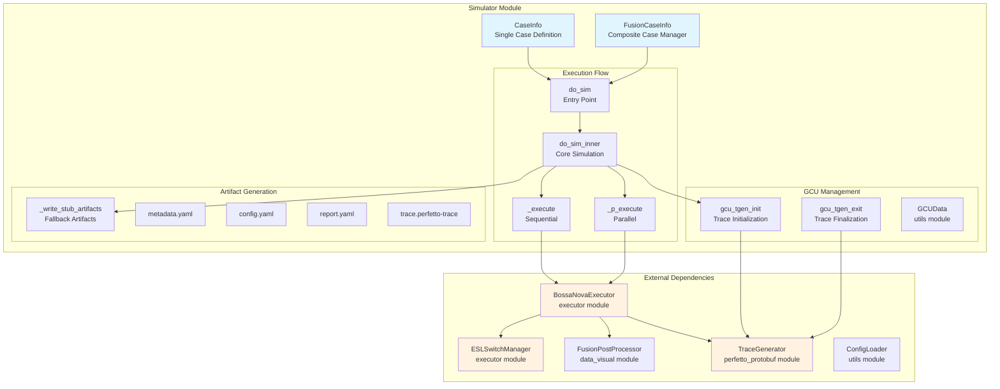
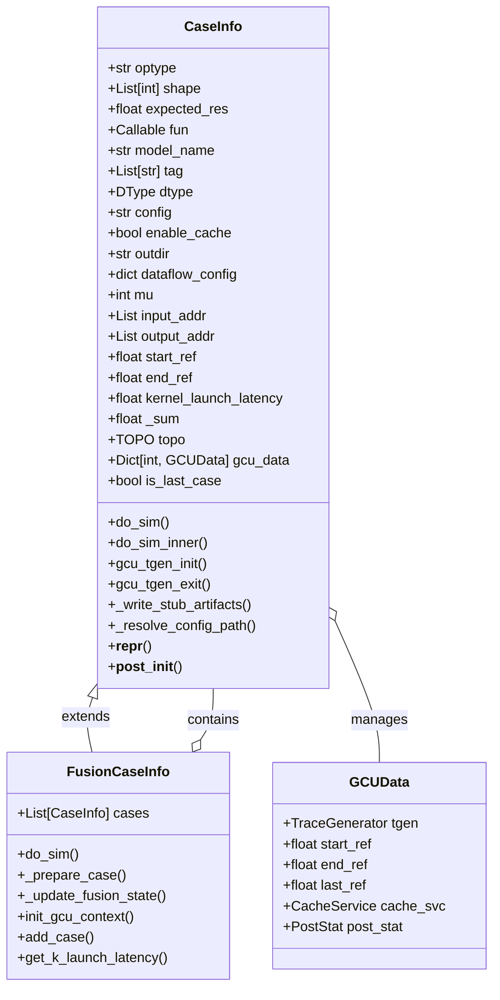
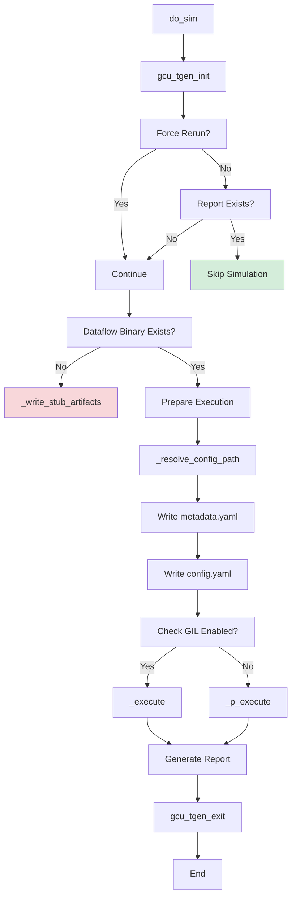
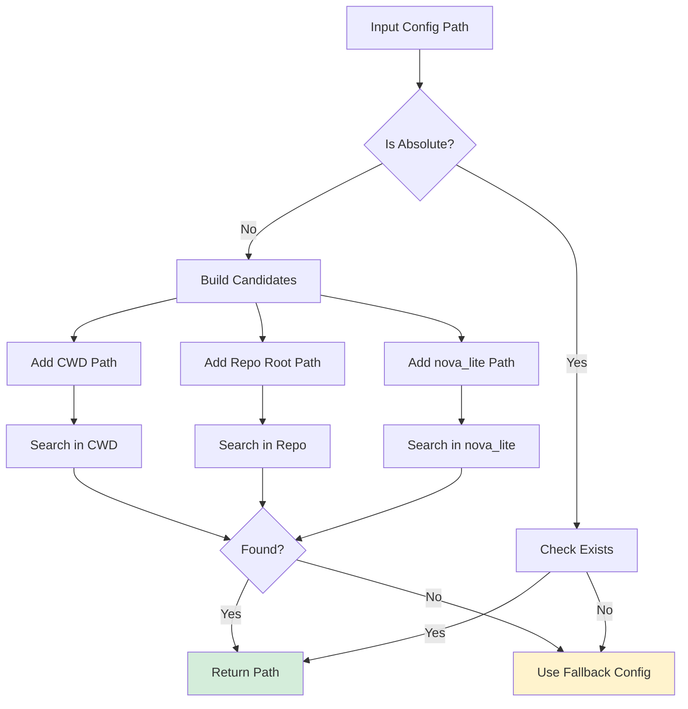
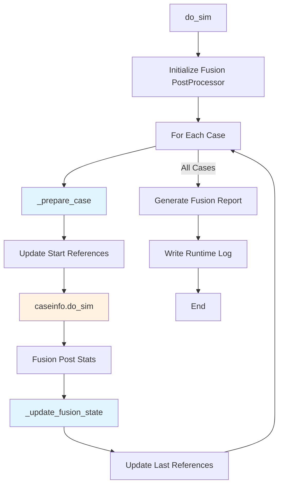
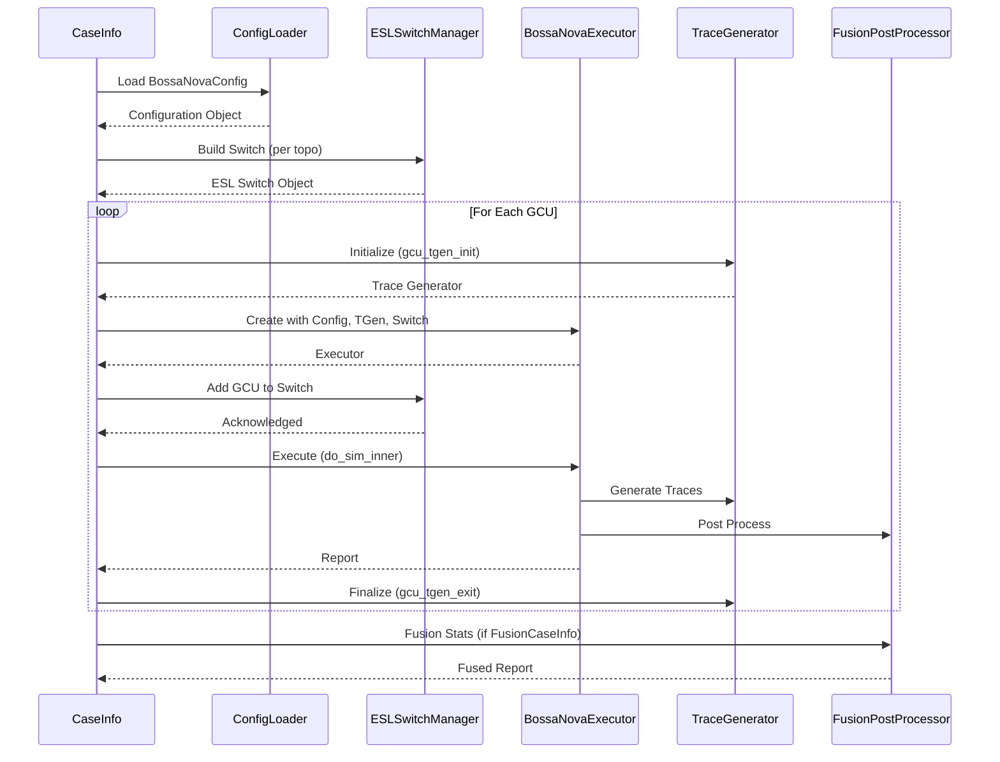

# Simulator Module

## Overview

The simulator module is the core orchestration layer of the Nova Platform that manages the execution of computational workloads across multiple GCU (Graphics Compute Unit) configurations. It provides a framework for simulating, executing, and analyzing performance characteristics of various operations in a distributed computing environment.

The module handles:
- **Case Management**: Defines and manages individual simulation cases with configurable parameters
- **Multi-GCU Coordination**: Orchestrates parallel execution across multiple GCUs with synchronization
- **Trace Generation**: Creates performance traces for detailed analysis
- **Fusion Support**: Enables fusion of multiple cases for composite workload simulation
- **Configuration Management**: Resolves and validates hardware and simulation configurations

## Architecture

### High-Level System Overview



### Component Relationships



## Core Components

### CaseInfo

The `CaseInfo` class represents a single simulation case with all necessary parameters for execution.

**Key Responsibilities:**
- Defines operation type, shape, and configuration
- Manages GCU-specific data and trace generators
- Orchestrates simulation execution across GCUs
- Generates metadata and configuration artifacts

**Execution Flow:**


**Configuration Resolution:**


### FusionCaseInfo

The `FusionCaseInfo` class extends `CaseInfo` to support composite workloads consisting of multiple sequential cases.

**Key Features:**
- Manages a collection of `CaseInfo` objects
- Maintains shared GCU state across cases
- Performs post-processing fusion
- Tracks cumulative timing and performance metrics

**Fusion Flow:**


## Execution Modes

### Sequential Execution (`_execute`)

Used when Python GIL (Global Interpreter Lock) is enabled.

**Process:**
1. Creates a priority queue for task scheduling
2. Executes GCU tasks in priority order
3. Manages inter-GCU dependencies via reference timestamps
4. Collects reports from all GCUs

**Priority Queue Logic:**
- Tasks are prioritized by execution order
- Reference timestamps ensure proper synchronization
- Wait states trigger priority adjustments

### Parallel Execution (`_p_execute`)

Used when GIL is disabled, enabling true parallelism.

**Process:**
1. Creates a thread barrier for synchronization
2. Spawns thread pool for concurrent GCU execution
3. Each thread runs a GCU executor independently
4. Barrier ensures all GCUs complete before finalization
5. Collects reports and updates shared state

**Advantages:**
- Faster execution for multi-GCU configurations
- Better resource utilization
- Reduced total simulation time

## Integration Points

### External Module Dependencies

The simulator module integrates with several key components:

1. **executor module** (`nova-platform.nova_platform.executor`)
   - `BossaNovaExecutor`: Core execution engine for each GCU
   - `ESLSwitchManager`: Manages ESL (Electronic System Level) switches for inter-GCU communication
   - `BarrierManager`: Handles synchronization primitives

2. **data_visual module** (`nova-platform.nova_platform.data_visual`)
   - `FusionPostProcessor`: Aggregates and fuses performance statistics from multiple cases

3. **perfetto_protobuf module** (`nova-platform.nova_platform.perfetto_protobuf`)
   - `TraceGenerator`: Creates Perfetto-compatible performance traces

4. **config module** (`nova-platform.nova_platform.config`)
   - `BossaNovaConfig`: Hardware and simulation configuration
   - `TOPO`: Topology enumeration (STANDALONE, 2DIE, etc.)

5. **utils module** (`nova-platform.nova_platform.utils`)
   - `GCUData`: Per-GCU state container
   - `ConfigLoader`: Configuration file parsing
   - `BaseEnum`: Enumerations support

### Data Flow Between Components



## Configuration Management

### Configuration Resolution Strategy

The simulator uses a multi-tier configuration resolution strategy:

1. **Explicit Path**: If provided path is absolute, use directly
2. **Relative Search**: Search in common locations:
   - Current working directory
   - Repository root
   - Repository/config directory
   - nova_lite directory
3. **Fallback**: Use default configuration if not found

### Supported Topologies

```python
class TOPO(Enum):
    STANDALONE = (1, 1)   # 1 GCU, 1 device
    TWODIE = (2, 2)       # 2 GCUs, 2 devices
    # Additional topologies...
```

## Artifact Generation

### Output Structure

```
<outdir>/
├── metadata.yaml          # Case metadata
├── config.yaml            # Hardware configuration
├── gcu00/
│   ├── metadata.yaml      # GCU-specific metadata
│   ├── config.yaml        # GCU-specific config
│   ├── report.yaml        # Performance report
│   └── trace.perfetto-trace  # Performance trace
├── gcu01/
│   └── ...
└── runtime_log.txt        # Fusion runtime log (if fusion)
```

### Metadata Format

```yaml
optype: "gemm"
shape: [1024, 1024, 1024]
dtype: "FP16"
config: "libra_1DIE_3.2TB_24SIP_256OST.yaml"
enable_cache: false
topo: "STANDALONE"
# ... additional fields
```

### Report Format

```yaml
status: success
total_latency: 1.234e-3
# ... additional metrics
```

## Usage Patterns

### Single Case Simulation

```python
from nova_platform.simulator.case import CaseInfo
from nova_platform.base_model import DType
from nova_platform.config import TOPO

case = CaseInfo(
    optype="gemm",
    shape=[1024, 1024, 1024],
    dtype=DType.FP16,
    config="libra_1DIE.yaml",
    topo=TOPO.STANDALONE,
    outdir="./output/single_case"
)

case.do_sim()
```

### Fusion Case Simulation

```python
from nova_platform.simulator.case import CaseInfo, FusionCaseInfo

# Create multiple cases
case1 = CaseInfo(optype="gemm", shape=[512, 512, 512])
case2 = CaseInfo(optype="add", shape=[512, 512])
case3 = CaseInfo(optype="softmax", shape=[512, 512])

# Create fusion case
fusion = FusionCaseInfo(
    optype="layer_norm",
    shape=[512, 512],
    cases=[case1, case2, case3]
)

fusion.do_sim()
```

### Parallel Execution

```python
import os
# Disable GIL for parallel execution
os.environ["PYTHON_GIL"] = "0"

case = CaseInfo(
    optype="allreduce",
    shape=[1024],
    topo=TOPO.TWODIE,
    outdir="./output/parallel"
)

case.do_sim()
```

## Error Handling

### Common Failure Scenarios

1. **Missing Dataflow Binary**
   - Detection: Binary not found at `build/dataflow_gen`
   - Fallback: Generates stub artifacts with zero latency
   - Environment Override: `NOVA_SIM_FORCE_REAL=1` to force real execution

2. **Config Not Found**
   - Resolution: Multi-location search with fallback
   - Warning: Logged with fallback path

3. **Simulation Failure**
   - Logging: Full traceback captured
   - Exception: Propagated to caller
   - Partial Results: May be available in output directory

### Stub Artifacts

When dataflow generator is unavailable:

```yaml
# report.yaml
status: skipped
total_latency: 0
```

This allows downstream processing to continue without failure.

## Performance Considerations

### GIL Impact

- **GIL Enabled**: Sequential execution via priority queue
- **GIL Disabled**: Parallel execution via thread pool
- **Recommendation**: Disable GIL for multi-GCU configurations

### Caching

The `enable_cache` flag controls whether cache simulation results are reused:
- `True`: Cache service maintains state across cases
- `False`: Fresh simulation for each case

### Trace Generation Overhead

Trace generation adds significant overhead:
- Disable for batch processing if traces not needed
- Use `gcu_tgen_init()` and `gcu_tgen_exit()` strategically

## Best Practices

1. **Configuration Management**
   - Store configs in `config/` directory
   - Use relative paths for portability
   - Validate configs before simulation

2. **Output Organization**
   - Use descriptive `outdir` paths
   - Include topology and operation in path
   - Clean up old results before batch runs

3. **Parallel Execution**
   - Verify GIL is disabled
   - Ensure sufficient thread resources
   - Monitor for thread contention

4. **Fusion Cases**
   - Order cases logically (compute → communication)
   - Monitor cumulative timing
   - Use fusion for composite workloads

5. **Error Recovery**
   - Check for existing reports before rerunning
   - Use `force_rerun=True` for clean runs
   - Inspect stub artifacts for missing binaries

## Testing Considerations

### Unit Testing

- Mock `BossaNovaExecutor` to isolate simulator logic
- Test configuration resolution paths
- Verify metadata generation

### Integration Testing

- Test with actual dataflow generator binary
- Validate multi-GCU synchronization
- Verify trace generation and fusion

### Performance Testing

- Measure overhead of trace generation
- Compare sequential vs parallel execution
- Validate cache service impact

## Future Enhancements

### Planned Improvements

1. **Dynamic Topology**: Support for runtime topology changes
2. **Enhanced Fusion**: More sophisticated case fusion strategies
3. **Progressive Tracing**: Conditional trace generation based on thresholds
4. **Resource Monitoring**: Real-time resource utilization tracking
5. **Checkpoint/Resume**: Ability to pause and resume long simulations

### Extensibility Points

- Custom `CaseInfo` subclasses for domain-specific cases
- Pluggable post-processors for custom analysis
- Alternative execution strategies via strategy pattern
- Custom ESL switch implementations

## Related Documentation

- [Executor Module](executor.md) - Execution engine details
- [Cost Service Module](cost_service.md) - Performance cost models
- [Data Visual Module](data_visual.md) - Visualization and post-processing
- [Config Module](config.md) - Configuration schemas
- [Nova Lite Module](nova_lite.md) - High-level simulation pipeline

## References

- Perfetto Trace Format: https://perfetto.dev/docs/
- BossaNova Architecture: [Internal Architecture Document]
- GCU Topology Specifications: [Hardware Specification]
