# Utils Module

## Overview

The `utils` module provides foundational utilities and helper classes that support the Nova Platform ecosystem. This module contains essential infrastructure components for configuration management, data serialization, memory management, and utility functions used across the platform.

The module is organized into several sub-modules, each serving a specific purpose:

1. **base_utils** - Core utility classes including singleton pattern, hashable lists, and base data structures
2. **config_utils** - Configuration loading and deserialization framework
3. **fusion_utils** - Memory allocation and tensor/operation information management for fusion operations
4. **gcu_utils** - GCU (Generic Compute Unit) data structures

## Architecture

```mermaid
graph TD
    subgraph Utils Module
        base_utils[base_utils.py]
        config_utils[config_utils.py]
        fusion_utils[fusion_utils.py]
        gcu_utils[gcu_utils.py]
    end
    
    subgraph Core Components
        SingletonMeta
        BaseDataclass
        hash_list
        ConfigLoader
        Deserializable
        BaseEnum
        MemoryAllocator
        TensorInfo
        ScalarInfo
        OperationInfo
        GCUData
    end
    
    base_utils --> SingletonMeta
    base_utils --> BaseDataclass
    base_utils --> hash_list
    
    config_utils --> ConfigLoader
    config_utils --> Deserializable
    config_utils --> BaseEnum
    
    fusion_utils --> MemoryAllocator
    fusion_utils --> TensorInfo
    fusion_utils --> ScalarInfo
    fusion_utils --> OperationInfo
    
    gcu_utils --> GCUData
    
    subgraph External Dependencies
        yaml
        dataclasses
        enum
        typing
        optrace_benchmark
        tests.test_base
        nova_platform.base_model
        nova_platform.config
    end
    
    fusion_utils --> optrace_benchmark
    fusion_utils --> tests.test_base
    fusion_utils --> nova_platform.base_model
    fusion_utils --> nova_platform.config
```



## Module Structure

The utils module consists of the following sub-modules:

### 1. [base_utils](#base_utils-sub-module)
Provides foundational utility classes:
- **SingletonMeta**: Metaclass for implementing the singleton pattern
- **hash_list**: A list subclass that supports hashing for use as dictionary keys
- **BaseDataclass**: Base class for dataclasses with improved string representation

### 2. [config_utils](#config_utils-sub-module)
Handles configuration management and deserialization:
- **ConfigLoader**: YAML loader with support for file inclusion and expression evaluation
- **Deserializable**: Interface for custom deserialization logic
- **BaseEnum**: Enhanced enum with case-insensitive lookup
- **dict_to_dataclass**: Utility for converting dictionaries to dataclass instances
- **load_config**: Main function for loading configuration files

### 3. [fusion_utils](#fusion_utils-sub-module)
Supports fusion operations and memory management:
- **MemoryAllocator**: Manages virtual memory addresses for tensors
- **TensorInfo**: Metadata container for tensor operations
- **ScalarInfo**: Wrapper for scalar values
- **OperationInfo**: Comprehensive operation metadata including inputs, outputs, and case information
- **get_caseinfo_list**: Parses optrace files to generate operation lists
- **display_fusion_info**: Debug utility for visualizing fusion operations

### 4. [gcu_utils](#gcu_utils-sub-module)
Provides data structures for GCU operations:
- **GCUData**: Container for GCU-related data including trace generators, cache services, and timing information

## Integration with Other Modules

The utils module integrates with several other modules in the Nova Platform:

- **base_models**: Uses `DType` from base_models for data type handling in fusion_utils
- **config**: Uses `TOPO` enum from config module for topology specification
- **benchmark**: Uses optrace_benchmark for parsing operation traces
- **cost_service**: Uses utils for configuration and data structures
- **executor**: Uses utils for configuration loading and data structures

## Key Design Patterns

### Singleton Pattern
The `SingletonMeta` metaclass provides a thread-safe way to ensure only one instance of a class exists:
```python
class MyClass(metaclass=SingletonMeta):
    pass
```

### Configuration Loading
The `ConfigLoader` supports YAML file inclusion and expression evaluation:
```yaml
# config.yaml
base: !include base_config.yaml
param: !eval 2**10
```

### Memory Allocation
The `MemoryAllocator` manages virtual addresses for tensor operations, preventing address collisions:
```python
allocator = MemoryAllocator()
addresses = allocator.allocate(ssa_ids, shapes, dtype)
```

## Usage Examples

### Loading Configuration
```python
from nova_platform.utils.config_utils import load_config
from nova_platform.config import BossaNovaConfig

config = load_config("config.yaml", BossaNovaConfig)
```

### Parsing Operation Traces
```python
from nova_platform.utils.fusion_utils import get_caseinfo_list

caseinfo_list, op_info_list = get_caseinfo_list(
    "trace.optrace", 
    topo=TOPO.STANDALONE, 
    enable_cache=True
)
```

### Memory Allocation
```python
from nova_platform.utils.fusion_utils import MemoryAllocator
from nova_platform.base_model import DType

allocator = MemoryAllocator()
addresses = allocator.allocate(
    ssa_ids=[1, 2, 3],
    shapes=[[1, 512, 64, 64], [1, 512, 64, 64], [1, 512, 64, 64]],
    dtype=DType.FP16
)
```

## Next Steps

For detailed information about each sub-module, see:
- [base_utils Sub-module Documentation](utils_base_utils.md)
- [config_utils Sub-module Documentation](utils_config_utils.md)
- [fusion_utils Sub-module Documentation](utils_fusion_utils.md)
- [gcu_utils Sub-module Documentation](utils_gcu_utils.md)
