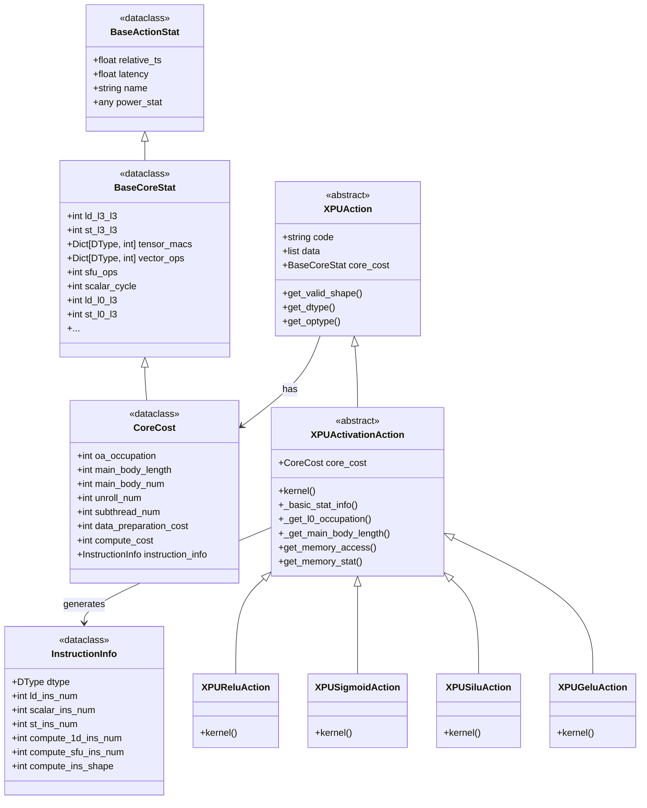
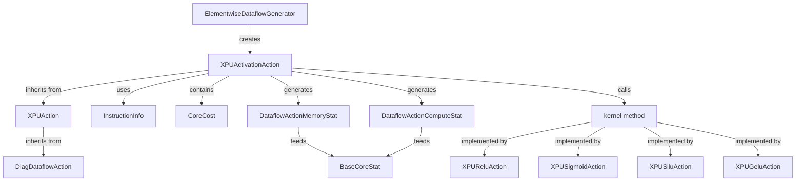
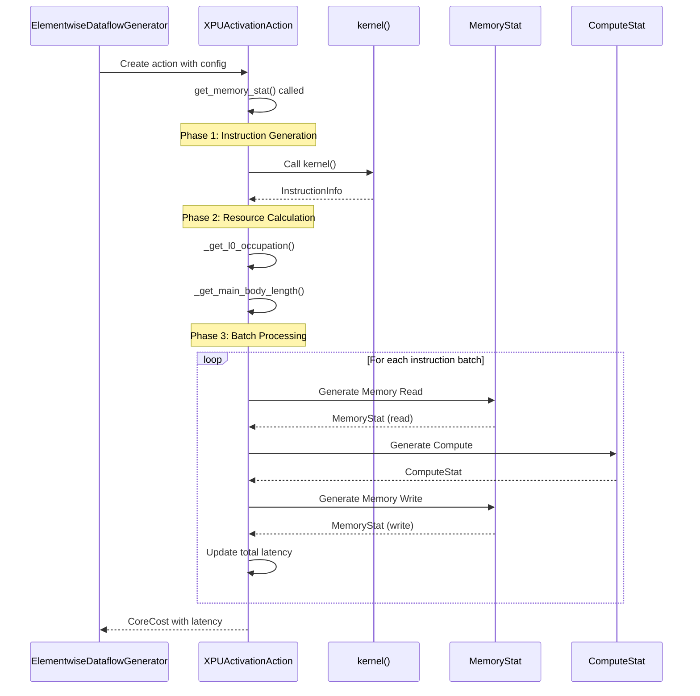
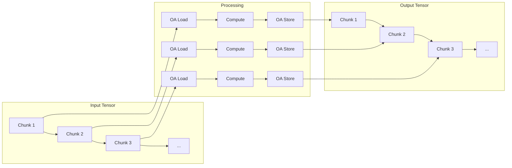

# XPU Activation Action Module

## Overview

The `xpu_activation_action` module implements XPU-specific activation function operations within the Nova Platform's dataflow action framework. This module provides concrete implementations for common neural network activation functions (ReLU, Sigmoid, SiLU, GELU) that can be executed on XPU hardware.

**Module Path**: `nova-platform.nova_platform.dataflow.action.xpu_activation_action`

## Core Purpose

This module defines how activation operations are modeled, scheduled, and executed on XPU hardware by:
- Calculating instruction-level compute costs for activation functions
- Generating memory access patterns for input/output tensors
- Estimating latency and resource utilization
- Providing hardware-specific performance characteristics

## Architecture

### Class Hierarchy



### Component Relationships



## Core Components

### InstructionInfo

**Purpose**: Captures the instruction-level characteristics of an activation operation.

**Key Fields**:
- `dtype`: Data type (FP16, FP32, etc.) used for computation
- `ld_ins_num`: Number of load instructions
- `scalar_ins_num`: Number of scalar instructions
- `st_ins_num`: Number of store instructions
- `compute_1d_ins_num`: Number of 1D compute instructions
- `compute_sfu_ins_num`: Number of special function unit (SFU) instructions
- `compute_ins_shape`: Number of elements processed per instruction

**Usage Pattern**:
```python
# Generated by kernel() method
instruction_info = InstructionInfo(
    dtype=DType.FP16,
    ld_ins_num=100,
    scalar_ins_num=18,
    st_ins_num=100,
    compute_1d_ins_num=0,
    compute_sfu_ins_num=100,
    compute_ins_shape=256
)
```

### CoreCost

**Purpose**: Extends `BaseCoreStat` to provide XPU-specific cost metrics for activation operations.

**Key Fields**:
- `oa_occupation`: Occupancy of Output Array (OA) in bytes
- `main_body_length`: Length of the main computation loop
- `main_body_num`: Number of main body iterations
- `unroll_num`: Loop unroll factor
- `subthread_num`: Number of subthreads
- `data_preparation_cost`: Cost of data preparation
- `compute_cost`: Total compute latency
- `instruction_info`: Reference to instruction characteristics

**Inherited Fields** (from BaseCoreStat):
- `ld_l0_l3`, `st_l0_l3`: Memory access between L0 and L3
- `vector_ops`: Vector operation counts per dtype
- `sfu_ops`: Special function unit operations
- `scalar_cycle`: Scalar operation cycles

### XPUActivationAction (Abstract Base)

**Purpose**: Provides the common framework for all XPU activation operations.

**Key Responsibilities**:
1. **Instruction Generation**: Calls `kernel()` to generate `InstructionInfo`
2. **Resource Calculation**: Determines OA occupation and loop characteristics
3. **Memory Access Pattern**: Generates address sequences for input/output
4. **Latency Estimation**: Computes total latency from memory, compute, and store operations

**Core Methods**:

#### `_basic_stat_info()`
Populates `CoreCost` with basic statistics:
- Sets vector dtype
- Calculates vector operations count
- Computes memory access volumes (ld_l0_l3, st_l0_l3)

#### `_get_l0_occupation()`
Determines OA occupancy:
```python
# Fixed for all activation functions
self.core_cost.oa_occupation = 3 * BYPTES_PER_OA  # 2 inputs, 1 output
```

#### `_get_main_body_length()`
Calculates loop characteristics:
```python
self.core_cost.main_body_length = 64  # Fixed value
self.main_body_num = ld_ins_num / main_body_length
```

#### `get_memory_access()`
Generates `DataflowActionMemoryAccess` objects:
- Input tensor: read access
- Output tensor: write access
- Uses `_iter_addr()` and `_iter_access_gen()` for address iteration

#### `get_memory_stat()`
**Main orchestration method** that:
1. Calls `kernel()` to get instruction info
2. Calculates resource occupancy
3. Iterates through instruction batches
4. Generates memory and compute statistics
5. Estimates total latency

**Algorithm**:
```python
for i in range(0, ld_ins_num, main_body_length):
    # 1. Memory read (VLD)
    lhs_read = DataflowActionMemoryStat(...)
    yield lhs_read    # Memory read latency
    
    # 2. Compute operations
    compute_stat = DataflowActionComputeStat(...)
    yield compute_stat    # Compute latency
    
    # 3. Memory write (VST)
    out_write = DataflowActionMemoryStat(...)
    yield out_write    # Memory write latency
    
    # 4. Update total latency (max of all paths)
    total_latency = max(total_latency, 
                       compute_path, 
                       read_path, 
                       write_path)
```

### Concrete Implementations

#### XPUReluAction
**Operation**: `output = max(input, 0)`

**Instruction Profile**:
- Uses 1D compute instructions (2 per iteration)
- No SFU instructions
- Moderate scalar operations

**Kernel Logic**:
```python
for each OA-sized chunk:
    ld_ins_num += 1
    compute_1d_ins_num += 2
    st_ins_num += 1
    scalar_ins_num += 3
```

#### XPUSigmoidAction
**Operation**: `output = 1 / (1 + exp(-input))`

**Instruction Profile**:
- Uses SFU instructions for exponential
- No 1D compute instructions
- Higher scalar operations (approximation)

**Kernel Logic**:
```python
for each OA-sized chunk:
    ld_ins_num += 1
    compute_sfu_ins_num += 1
    st_ins_num += 1
    scalar_ins_num += 3
```

#### XPUSiluAction
**Operation**: `output = input * sigmoid(input)`

**Instruction Profile**:
- Uses both 1D compute and SFU instructions
- Moderate scalar operations

**Kernel Logic**:
```python
for each OA-sized chunk:
    ld_ins_num += 1
    compute_sfu_ins_num += 1
    compute_1d_ins_num += 1
    st_ins_num += 1
    scalar_ins_num += 3
```

#### XPUGeluAction
**Operation**: `output = 0.5 * input * (1 + tanh(sqrt(2/pi) * (input + 0.044715 * input^3)))`

**Instruction Profile**:
- Uses SFU instructions for tanh
- No 1D compute instructions
- High scalar operations (complex approximation)

**Kernel Logic**:
```python
for each OA-sized chunk:
    ld_ins_num += 1
    compute_sfu_ins_num += 1
    st_ins_num += 1
    scalar_ins_num += 3
```

## Data Flow

### Execution Pipeline



### Memory Access Pattern



## Integration Points

### Upstream Dependencies

1. **ElementwiseDataflowGenerator** (`executor.dataflow_gen`)
   - Creates activation actions based on operation type
   - Maps string names to action classes
   - Generates tensor containers and dataflow structure

2. **XPUAction** (`dataflow.action.xpu_action`)
   - Provides base functionality for XPU operations
   - Implements tensor shape and dtype extraction
   - Defines common iteration methods

### Downstream Consumers

1. **BossaNovaExecutor** (`executor.nova_platform_executor`)
   - Executes generated dataflows
   - Collects statistics from actions
   - Aggregates performance metrics

2. **ComputeCostService** (`cost_service.compute.compute_cost_service`)
   - Consumes `CoreCost` statistics
   - Calculates power and energy costs
   - Generates performance reports

3. **Dataflow** (`dataflow.dataflow`)
   - Contains action lists
   - Manages action dependencies
   - Orchestrates execution order

## Configuration

### Required Config Parameters

The module relies on `BossaNovaConfig` with:

```python
config = {
    "memory": {
        "l0": {
            "OA_SIZE": 512  # Bytes per Output Array
        }
    },
    "compute": {
        "thread_1d_throughput": {
            "FP16": 256,  # Elements per cycle
            "FP32": 128,
            # ...
        },
        "thread_sfu_throughput": 256  # SFU operations per cycle
    },
    "inst_num": {
        "NUM_OF_CORE_PER_CLUSTER": 8,
        "NUM_OF_CLUSTER": 2,
        "NUM_OF_DIE": 1
    }
}
```

### Constants

- `BYTES_PER_OA = 512`: Fixed size of Output Array in bytes
- `main_body_length = 64`: Fixed loop length for all activations

## Performance Characteristics

### Latency Breakdown

Total latency is the maximum of three parallel paths:

```
Total Latency = max(
    Read Path:    stat_ref + vld_latency,
    Compute Path: compute_ref + compute_latency,
    Write Path:   stat_ref + vld_leading_latency + out_latency
)
```

### Memory Access Volumes

For an activation on tensor of size N elements:
- **Read**: N * bpe bytes
- **Write**: N * bpe bytes
- **Total**: 2 * N * bpe bytes

### Compute Operations

| Operation | 1D Ops | SFU Ops | Scalar Ops |
|-----------|--------|---------|------------|
| ReLU      | 2N     | 0       | 3N/elements_per_OA |
| Sigmoid   | 0      | N       | 3N/elements_per_OA |
| SiLU      | N      | N       | 3N/elements_per_OA |
| GELU      | 0      | N       | 3N/elements_per_OA |

## Usage Example

```python
from nova_platform.config import BossaNovaConfig
from nova_platform.dataflow.action.xpu_activation_action import XPUSigmoidAction
from nova_platform.dataflow.action.diag_action import DiagTensorContainer, DiagTensor, TileInfo, BufCnt
from nova_platform.base_model import DataflowActionType, DType

# 1. Setup configuration
config = BossaNovaConfig(...)

# 2. Create input/output tensors
input_tensor = DiagTensor(
    id=0,
    dims=[1024, 1024],
    offsets=[0, 0],
    stride_dims=[1024, 1],
    bpe=2  # FP16
)
output_tensor = DiagTensor(
    id=1,
    dims=[1024, 1024],
    offsets=[0, 0],
    stride_dims=[1024, 1],
    bpe=2
)

# 3. Create action
action = XPUSigmoidAction(
    code="sigmoid_fp16",
    config=config,
    action_id=0,
    action_type=DataflowActionType.XPU,
    engine_id=0,
    engine_sub_id=0,
    inputs=[DiagTensorContainer(0, [input_tensor])],
    outputs=[DiagTensorContainer(1, [output_tensor])],
    dataflow_config={},
    child_action_ids=[],
    parent_action_ids=[],
    depth=0,
    setup_parent_action_id=-1,
    setup_child_action_id=-1,
    exe_sem_id=0,
    setup_sem_id=-1,
    trigger_id=DiagTriggerID(0, []),
    input_hints=[],
    die_id=0,
    tile_info=TileInfo(
        cube_dim=[1, 1, 1],
        grid_dim=[1, 1, 1],
        block_dim=[1, 1, 1],
        tile_shape=[1, 1, 1],
        l2_buf_cnt=BufCnt(),
        l1_buf_cnt=BufCnt(),
    ),
    data=[0, 0]
)

# 4. Compute statistics
from nova_platform.cost_service.compute.base_compute_model import BossaNovaContext
context = BossaNovaContext()
core_cost = action.compute(context)

# 5. Access results
print(f"Total latency: {core_cost.latency} seconds")
print(f"Compute cost: {core_cost.compute_cost} seconds")
print(f"Vector ops: {core_cost.vector_ops}")
```

## Testing Considerations

### Unit Test Scenarios

1. **Instruction Count Verification**
   - Verify kernel() generates correct instruction counts
   - Test with various tensor sizes
   - Validate elements_per_OA calculation

2. **Memory Access Pattern**
   - Verify address iteration covers all elements
   - Check no overlap or gaps in access
   - Validate read/write separation

3. **Latency Calculation**
   - Test with known input sizes
   - Verify max() logic for parallel paths
   - Check cumulative latency across batches

4. **Data Type Support**
   - Test FP16, FP32, INT8, etc.
   - Verify bpe calculations
   - Check dtype-specific throughput

### Integration Test Scenarios

1. **End-to-End Dataflow**
   - Generate dataflow via ElementwiseDataflowGenerator
   - Execute through BossaNovaExecutor
   - Validate performance metrics

2. **Multi-Action Pipelines**
   - Chain multiple activation actions
   - Verify dependency handling
   - Check aggregate statistics

## Performance Optimization

### Current Limitations

1. **Fixed main_body_length = 64**
   - May not be optimal for all tensor sizes
   - Could be tuned based on hardware characteristics

2. **Fixed OA occupation = 3 * 512 bytes**
   - Assumes 2 inputs + 1 output
   - May not match all activation variants

3. **Scalar instruction overhead**
   - Fixed 3 scalar ops per iteration
   - May vary based on implementation

### Optimization Opportunities

1. **Dynamic Loop Length**
   - Adjust main_body_length based on tensor size
   - Optimize for specific hardware configurations

2. **Instruction Fusion**
   - Combine multiple scalar operations
   - Reduce instruction count

3. **Memory Access Coalescing**
   - Optimize address patterns
   - Reduce memory latency

## Related Modules

- **[xpu_action](xpu_action.md)**: Base class for XPU operations
- **[xpu_elementwise_action](xpu_elementwise_action.md)**: Element-wise operations (add, mul)
- **[xpu_gemm_action](xpu_gemm_action.md)**: Matrix multiplication operations
- **[ElementwiseDataflowGenerator](executor_dataflow_gen.md)**: Action factory for element-wise ops
- **[ComputeCostService](cost_service_compute.md)**: Cost calculation and analysis

## References

- Nova Platform Architecture Specification
- XPU Hardware Programming Guide
- Dataflow Action Framework Design Document
- Performance Modeling and Estimation Guidelines
