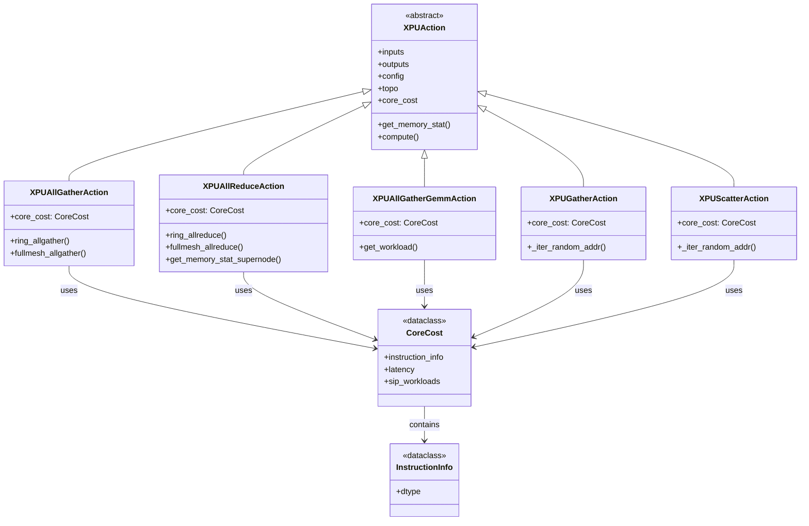
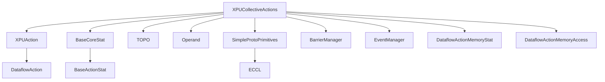

# XPU Collective Actions Module

## Overview

The **xpu_collective_actions** module implements collective communication operations for XPU (accelerated processing unit) architectures. These operations are fundamental for distributed deep learning workloads, enabling efficient data exchange and synchronization across multiple processing units.

This module is part of the [dataflow_actions](dataflow_actions.md) module hierarchy and provides specialized implementations for collective operations such as AllGather, AllReduce, Gather, Scatter, and fused AllGather-GEMM operations.

## Module Purpose

The module provides:
- **Collective Communication Primitives**: Core implementations of distributed communication patterns
- **Topology-Aware Operations**: Optimized algorithms for different network topologies (FullMesh, Supernode)
- **Memory Access Modeling**: Detailed modeling of memory access patterns and bandwidth requirements
- **Latency Calculation**: Accurate prediction of communication latency based on hardware characteristics
- **Integration with Cost Services**: Seamless integration with the cost service framework for performance analysis

## Architecture

### Class Hierarchy



## Core Components

### 1. XPUAllGatherAction

**File**: `nova-platform/nova_platform/dataflow/action/xpu_allgather_action.py`

**Purpose**: Implements the AllGather collective operation where all ranks receive data from all other ranks.

**Key Features**:
- **Ring AllGather**: Optimized for Supernode topologies (4, 8, 16, 32 nodes)
- **FullMesh AllGather**: Optimized for FullMesh8 topology
- **Channel-based Communication**: Uses multiple channels for parallel data transfer
- **Memory Statistics Generation**: Provides detailed memory access patterns

**Algorithm Details**:

#### Ring AllGather (Supernode)
```python
# For each channel (8 channels total):
# 1. Direct send/copy from local input to output buffer
# 2. Ring propagation: receive from previous, send to next (rank-2 iterations)
# 3. Final receive operation
```

#### FullMesh AllGather
```python
# 1. Address broadcast to all peers
# 2. Reduce-scatter operation
# 3. All-gather operation
# 4. Synchronization barriers
```

**Memory Access Pattern**:
- **Input**: Read from L3 memory at base address
- **Intermediate**: L3 temporary buffers for ring operations
- **Output**: Write to L3 memory at distributed addresses
- **Bandwidth Factor**: 16x for ESL bandwidth optimization

### 2. XPUAllReduceAction

**File**: `nova-platform/nova_platform/dataflow/action/xpu_allreduce_action.py`

**Purpose**: Implements the AllReduce collective operation where all ranks perform reduction (sum, max, etc.) on data from all ranks.

**Key Features**:
- **Ring AllReduce**: Multi-ring reduction-scatter + all-gather
- **FullMesh AllReduce**: Three-phase operation (address broadcast, reduce-scatter, all-gather)
- **Barrier Synchronization**: Uses BarrierManager for rank coordination
- **Event-based Coordination**: EventManager for cross-rank timing

**Algorithm Details**:

#### FullMesh AllReduce
```python
# Phase 1: Address Broadcast
for peer in peer_ranks:
    - Write address to L3
    - Broadcast to peer via ESL

# Phase 2: Reduce-Scatter
for peer in peer_ranks:
    - Read from peer's data segment
    - Reduce and write to local segment

# Phase 3: All-Gather
for peer in peer_ranks:
    - Read from local segment
    - Write to peer's data segment

# Phase 4: Flag Synchronization
- Write completion flags
- Wait for all peers
```

**Memory Statistics**:
- **L0 → L3**: Initial data staging
- **L3 → L3_REMOTE**: ESL-mediated peer-to-peer transfers
- **Bandwidth Factor**: Mesh-dependent (1/mesh_num for multi-mesh)

### 3. XPUAllGatherGemmAction

**File**: `nova-platform/nova_platform/dataflow/action/xpu_allgather_gemm_action.py`

**Purpose**: Implements fused AllGather + GEMM operation for optimized communication-compute overlap.

**Key Features**:
- **Fused Operation**: Combines communication and computation
- **Workload Tiling**: Divides GEMM into tiles for pipelining
- **Double-Buffering**: Alternates between AllGather and GEMM phases
- **Barrier Synchronization**: Coordinates across all SIPs

**Algorithm Details**:

```python
# For each rank iteration:
for i in range(rank_num):
    # 1. Compute GEMM on current tile
    gemm_latency = compute_gemm(tile_i)
    
    # 2. AllGather next tile (if not last iteration)
    if i < rank_num - 1:
        allgather_latency = allgather_next_tile(tile_i+1)
    
    # 3. Synchronize across all SIPs
    barrier.wait()
    
    # 4. Update ready references
    trunk_ready_ref[tile_i+1] = allgather_latency
```

**Workload Splitting**:
- Divides GEMM by rank count × 2
- Each rank processes `slice_per_rank` tiles
- Overlaps computation with communication

### 4. XPUGatherAction

**File**: `nova-platform/nova_platform/dataflow/action/xpu_gather_action.py`

**Purpose**: Implements gather operation where data is collected from specified indices.

**Key Features**:
- **Random Access Pattern**: Models irregular memory access
- **Instruction Mapping**: Maps gather operations to hardware instructions
- **Distribution Support**: Supports both Gaussian and uniform distributions
- **Memory Access Optimization**: Uses OA (Output Accumulator) blocks

**Algorithm Details**:

```python
# For each index slice:
for i in range(0, ld_index_ins_num, subthread_num):
    # 1. Load index data from L3
    index_read = load_index(num_subthreads * BYTES_PER_OA)
    
    # 2. Load table data based on indices
    for j in range(0, table_reads_per_index):
        table_read = load_table(table_datalane_size)
        table_write = store_output(table_datalane_size)
    
    # 3. Track latency
    total_latency = max(total_latency, index_read.latency, table_latency)
```

**Instruction Counting**:
- `ld_index_l3_ins_num`: Index load instructions
- `ld_table_l3_ins_num`: Table load instructions
- `st_table_l3_ins_num`: Table store instructions
- `scalar_ins_num`: Scalar computation instructions

### 5. XPUScatterAction

**File**: `nova-platform/nova_platform/dataflow/action/xpu_scatter_action.py`

**Purpose**: Implements scatter operation where data is distributed to specified indices.

**Key Features**:
- **Inverse of Gather**: Writes to random locations based on indices
- **Update Tensor**: Supports scatter-add operations
- **Memory Access Pattern**: Similar to gather but with write operations

**Algorithm Details**:

```python
# For each index slice:
for i in range(0, ld_index_ins_num, subthread_num):
    # 1. Load index data
    index_read = load_index()
    
    # 2. Load update values
    for j in range(0, table_reads_per_index):
        update_read = load_update()
        
        # 3. Write to scattered locations
        output_write = store_to_random_location()
```

## Data Structures

### CoreCost

```python
@dataclass
class CoreCost(BaseCoreStat):
    instruction_info: InstructionInfo = field(default_factory=InstructionInfo)
    sip_workloads: list = field(default_factory=list)
    # Additional fields for specific operations:
    # - oa_occupation (Gather/Scatter)
    # - main_body_length (Gather/Scatter)
    # - elements_per_cycle (Gather)
```

**Fields**:
- `instruction_info`: Hardware instruction details
- `sip_workloads`: Workload distribution across SIPs
- `latency`: Computed operation latency
- `tensor_dtype`: Data type of tensors

### InstructionInfo

```python
@dataclass
class InstructionInfo:
    dtype: DType = DType.FP16
    # Additional fields for Gather/Scatter:
    # - bpe
    # - ld_index_l3_ins_num
    # - ld_table_l3_ins_num
    # - st_table_l3_ins_num
    # - scalar_ins_num
```

## Topology Support

### Supernode Topologies (4, 8, 16, 32 nodes)

**Characteristics**:
- Ring-based communication
- 8 communication channels
- Channel-based rank mapping
- Optimized for hierarchical networks

**Usage**:
- AllGather: Ring algorithm
- AllReduce: Multi-ring with barriers

### FullMesh8 Topology

**Characteristics**:
- 8 nodes per mesh
- 2 meshes per chip
- Direct peer-to-peer communication
- ESL (Ethernet Switch Layer) mediated

**Usage**:
- AllGather: FullMesh algorithm with address broadcast
- AllReduce: Three-phase operation with flags

## Integration Points

### Dependencies



### Related Modules

- **[base_models](base_models.md)**: Defines `DataflowActionType`, `AddrDomain`, `DType`
- **[cost_service](cost_service.md)**: Provides `BaseCoreStat` and cost computation framework
- **[benchmark](benchmark.md)**: Provides `Operand`, `Workload`, `SimpleProtoPrimitives`
- **[executor](executor.md)**: Provides `BarrierManager`, `EventManager`
- **[config](config.md)**: Provides `TOPO` topology definitions

## Usage Examples

### Example 1: AllGather Operation

```python
from nova_platform.dataflow.action.xpu_allgather_action import XPUAllGatherAction
from nova_platform.config import TOPO, BossaNovaConfig

# Create action
action = XPUAllGatherAction(
    inputs=[input_tensor],
    outputs=[output_tensor],
    config=BossaNovaConfig(),
    topo=TOPO.SUPERNODE16,
    case_id="case_001",
    ref=1000
)

# Generate memory statistics
for mem_stat in action.get_memory_stat():
    print(f"Memory operation: {mem_stat.name}, latency: {mem_stat.latency}")

# Compute core cost
core_cost = action.compute(context)
print(f"Total latency: {core_cost.latency}")
```

### Example 2: AllReduce with FullMesh

```python
from nova_platform.dataflow.action.xpu_allreduce_action import XPUAllReduceAction

action = XPUAllReduceAction(
    inputs=[input_tensor],
    outputs=[output_tensor],
    config=config,
    topo=TOPO.FULLMESH8,
    case_id="case_002",
    ref=2000
)

# FullMesh algorithm generates multiple memory stats
for mem_stat in action.get_memory_stat():
    # Address broadcast, reduce-scatter, all-gather phases
    print(f"Phase: {mem_stat.name}")
```

### Example 3: Fused AllGather-GEMM

```python
from nova_platform.dataflow.action.xpu_allgather_gemm_action import XPUAllGatherGemmAction

action = XPUAllGatherGemmAction(
    inputs=[matrix_a, matrix_b],
    outputs=[matrix_c],
    config=config,
    topo=TOPO.SUPERNODE8,
    case_id="case_003",
    ref=3000
)

# Generates both communication and compute statistics
for mem_stat in action.get_memory_stat():
    print(f"Operation: {mem_stat.name}")

core_cost = action.compute(context)
print(f"Fused operation latency: {core_cost.latency}")
```

## Performance Characteristics

### Latency Factors

1. **Data Size**: Linear scaling with tensor dimensions
2. **Rank Count**: Affects ring iterations and peer operations
3. **Topology**: Different algorithms for different networks
4. **Channel Count**: Parallel channels reduce latency
5. **Bandwidth Factors**: ESL bandwidth optimization

### Memory Access Patterns

| Operation | Read Pattern | Write Pattern | Memory Domains |
|-----------|-------------|---------------|----------------|
| AllGather | Sequential (input) | Distributed (output) | L3 → L3 |
| AllReduce | Random (peers) | Random (peers) | L3 ↔ L3_REMOTE |
| Gather | Indexed (table) | Sequential (output) | L0 ↔ L3 |
| Scatter | Sequential (update) | Indexed (output) | L0 ↔ L3 |

## Best Practices

1. **Topology Selection**: Choose appropriate topology for your hardware
2. **Data Alignment**: Ensure data is aligned to OA block boundaries (512 bytes)
3. **Channel Utilization**: Maximize channel parallelism for Supernode topologies
4. **Barrier Synchronization**: Use barriers for multi-phase operations
5. **Memory Layout**: Optimize stride patterns for contiguous access

## Limitations

1. **Topology Support**: Limited to FullMesh8 and Supernode variants
2. **Reduction Operations**: Currently supports sum reduction only
3. **Data Types**: Primarily optimized for FP16
4. **Scalability**: Ring algorithms scale linearly with rank count

## Future Enhancements

1. **Additional Topologies**: Support for more network configurations
2. **Reduction Types**: Add support for max, min, product reductions
3. **Auto-tuning**: Dynamic algorithm selection based on data size
4. **Overlap Optimization**: Better compute-communication overlap
5. **Memory Optimization**: Reduced intermediate buffer requirements

## Related Documentation

- [Dataflow Actions Overview](dataflow_actions.md)
- [Cost Service Framework](cost_service.md)
- [Executor Framework](executor.md)
- [Benchmark Framework](benchmark.md)
- [Configuration System](config.md)

## References

- **ECCL**: Enhanced Collective Communication Library
- **ESL**: Ethernet Switch Layer for peer-to-peer communication
- **SIP**: System Integration Processor
- **OA**: Output Accumulator (hardware block)
- **L0/L3**: Memory hierarchy levels
