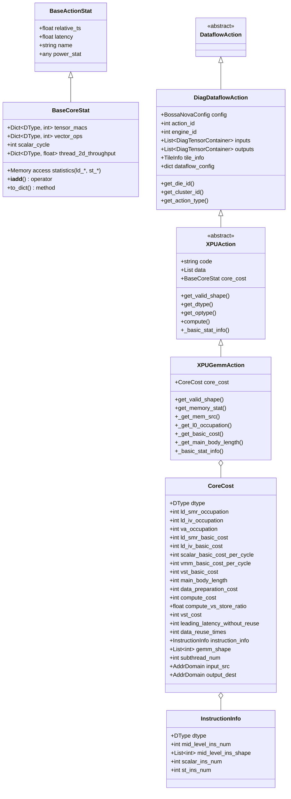
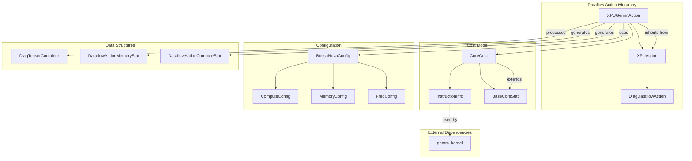
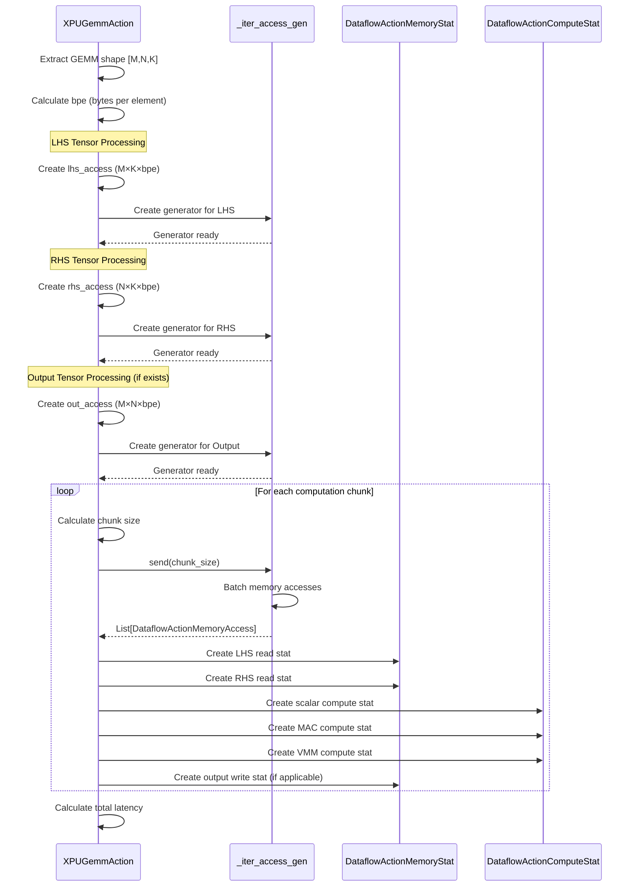
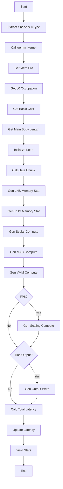

# XPUGemmAction Module

## Overview

The `xpu_gemm_action` module implements the GEMM (General Matrix Multiply) operation for XPU (eXtensible Processing Unit) accelerators. This module is a core component of the Nova Platform's dataflow action system, responsible for modeling and analyzing the performance characteristics of matrix multiplication operations on specialized hardware.

**Module Path**: `nova-platform/nova_platform/dataflow/action/xpu_gemm_action.py`

**Core Components**:
- `XPUGemmAction`: Main action class that models GEMM operations
- `CoreCost`: Performance statistics and cost model for GEMM operations
- `InstructionInfo`: Metadata about GEMM instruction characteristics
- `gemm_kernel()`: Helper function for calculating instruction-level statistics

## Architecture

### Class Hierarchy



### Component Relationships



## Core Components

### 1. InstructionInfo

A dataclass that encapsulates GEMM instruction characteristics.

**Properties**:
- `dtype` (DType): Data type for the operation (FP16, INT8, FP8, etc.)
- `mid_level_ins_num` (int): Number of mid-level instructions
- `mid_level_ins_shape` (List[int]): Shape of mid-level instructions [M, N, K]
- `scalar_ins_num` (int): Number of scalar instructions
- `st_ins_num` (int): Number of store instructions

**Purpose**: Captures the micro-architectural details of GEMM operations at the instruction level.

### 2. CoreCost

Extends `BaseCoreStat` to provide detailed performance metrics for GEMM operations.

**Key Properties**:

**Memory Occupancy**:
- `ld_smr_occupation` (int): Load SMR (Shared Memory Register) occupation in bytes
- `ld_iv_occupation` (int): Load IV (Intermediate Value) occupation in bytes
- `va_occupation` (int): Vector Accumulator occupation in bytes

**Basic Costs**:
- `ld_smr_basic_cost` (int): Basic SMR load cost
- `ld_iv_basic_cost` (int): Basic IV load cost
- `scalar_basic_cost_per_cycle` (int): Scalar operations per cycle
- `vmm_basic_cost_per_cycle` (int): Vector Matrix Multiply operations per cycle
- `vst_basic_cost` (int): Vector store basic cost

**Performance Metrics**:
- `main_body_length` (int): Main computation loop length
- `data_preparation_cost` (int): Data preparation overhead
- `compute_cost` (int): Total compute cost
- `compute_vs_store_ratio` (float): Ratio of compute to store operations
- `vst_cost` (int): Vector store cost
- `leading_latency_without_reuse` (int): Latency without data reuse
- `data_reuse_times` (int): Number of data reuse iterations

**Instruction Metadata**:
- `instruction_info` (InstructionInfo): Instruction-level statistics
- `gemm_shape` (List[int]): GEMM operation shape [M, N, K]

**Configuration**:
- `subthread_num` (int): Number of subthreads (default: 4)
- `input_src` (AddrDomain): Input data source domain
- `output_dest` (AddrDomain): Output data destination domain

### 3. XPUGemmAction

Main action class that models GEMM operations and generates performance statistics.

**Inheritance**: `XPUAction` → `DiagDataflowAction` → `DataflowAction`

**Key Methods**:

#### `get_valid_shape()`
Extracts the valid GEMM shape from the action's data field.

**Returns**: `[M, N, K]` shape list

**Data Field Mapping**:
- `data[4] & 0xFFFF` → M
- `data[4] >> 16` → N
- `data[5]` → K

#### `get_memory_stat()`
Generates memory and compute statistics for the GEMM operation.

**Returns**: Generator of `DataflowActionMemoryStat` and `DataflowActionComputeStat`

**Algorithm Flow**:
1. Extract GEMM shape and dtype
2. Calculate instruction info using `gemm_kernel()`
3. Determine memory source/destination domains
4. Calculate L0 memory occupation
5. Compute basic costs
6. Determine main body length
7. Generate memory access patterns for:
   - LHS (left-hand side) tensor reads
   - RHS (right-hand side) tensor reads
   - Output tensor writes
8. Generate compute statistics:
   - Scalar operations
   - MAC (Multiply-Accumulate) operations
   - VMM (Vector Matrix Multiply) operations
   - FP8 scaling operations (if applicable)
9. Calculate total latency

#### `_get_mem_src()`
Determines memory source and destination based on configuration.

**Configuration Options**:
- `bench_gemm_op_version` = 1 or 2: Uses `SHARED` domain for both input and output
- `bench_gemm_op_version` = 3: Uses `LOCAL` for input, `L3` for output

#### `_get_l0_occupation()`
Calculates L0 memory buffer requirements.

**Calculations**:
- `ld_smr_occupation` = M × K × bytes_per_element
- `ld_iv_occupation` = N × K × bytes_per_element
- `va_occupation` = M × N × bytes_per_element

#### `_get_basic_cost()`
Computes basic operation costs per cycle.

**Calculations**:
- `scalar_basic_cost_per_cycle` = scalar_ins_num / mid_level_ins_num
- `vmm_basic_cost_per_cycle` = M × N × K
- `compute_vs_store_ratio` = mid_level_ins_num / st_ins_num

#### `_get_main_body_length()`
Determines the main computation loop length based on L0 buffer capacity.

**Formula**:
```
main_body_length = min(
    L0_IV_SIZE / ld_iv_occupation,
    L0_SMR_SIZE / ld_smr_occupation
)
```

#### `_basic_stat_info()`
Calculates aggregate statistics for the operation.

**Metrics**:
- `tensor_macs`: M × N × K × mid_level_ins_num
- `vector_ops`: scalar_ins_num (or + M × N × mid_ins_num for FP8)
- `ld_l0_shared`: (M × K + N × K) × bpe × mid_level_ins_num
- `st_l0_shared`: M × N × bpe × st_ins_num

### 4. gemm_kernel() Function

A standalone function that calculates instruction-level statistics for a given GEMM shape.

**Parameters**:
- `m` (int): M dimension
- `n` (int): N dimension
- `k` (int): K dimension
- `dtype` (DType): Data type (default: FP16)

**Returns**: `InstructionInfo` object

**Algorithm**:
The function simulates the GEMM kernel execution with different slice sizes based on dtype:

**For FP16**:
- Slice: M=64, N=64, K=32
- Bytes per element: 2

**For INT8/FP8**:
- Slice: M=64, N=64, K=64
- Bytes per element: 1

**Counting Logic**:
The function iterates through nested loops (M, N, K) and counts:
- `computer_count`: Number of compute operations
- `st_count`: Number of store operations
- `scalar_count`: Number of scalar operations

**Returns**: `InstructionInfo(dtype, computer_count, [ins_shape_m, ins_shape_n, ins_shape_k], scalar_count, st_count)`

## Data Flow

### Memory Access Pattern Generation



### Performance Calculation Flow



## Integration with Nova Platform

### Position in Dataflow System

The `XPUGemmAction` is part of the dataflow action hierarchy:

```
DataflowAction (Base)
  └── DiagDataflowAction
      └── XPUAction (Abstract)
          └── XPUGemmAction (Concrete)
```

### Usage in Dataflow Generators

The action is typically instantiated by dataflow generators in the executor module:

```python
# From executor/dataflow_gen.py
class GemmDataflowGenerator(DataflowGenerator):
    def generate(self, ...) -> XPUGemmAction:
        # Configure action parameters
        action = XPUGemmAction(
            code="gemm_fp16",
            data=[...],
            config=config,
            inputs=[lhs_container, rhs_container],
            outputs=[output_container],
            ...
        )
        return action
```

### Performance Analysis

The action integrates with the cost service system:

1. **Memory Cost Service**: Uses `DataflowActionMemoryStat` to calculate memory access costs
2. **Compute Cost Service**: Uses `DataflowActionComputeStat` to calculate compute costs
3. **Power Cost Service**: Uses `BaseCoreStat` for power modeling

## Configuration

### Required Configuration Fields

The action requires a `BossaNovaConfig` with:

```python
config = BossaNovaConfig(
    compute=ComputeConfig(
        thread_2d_throughput={
            DType.FP16: <throughput>,
            DType.INT8: <throughput>,
            DType.FP8: <throughput>
        }
    ),
    memory=MemoryConfig(
        l0=MemoryL0Config(
            IV_SIZE=<bytes>,
            SMR_SIZE=<bytes>
        )
    ),
    # ... other configs
)

dataflow_config = {
    "bench_gemm_op_version": 1  # or 2 or 3
}
```

## Performance Characteristics

### Memory Requirements

The L0 buffer requirements depend on the GEMM shape and dtype:

```
L0_Required = max(
    (M × K + N × K) × bpe,  # For LHS and RHS
    (M × N) × bpe            # For VA
)
```

### Latency Components

Total latency is calculated as the maximum of:
1. Memory read latency + scalar compute latency
2. MAC compute latency + VMM latency
3. Output write latency

### Optimization Opportunities

1. **Data Reuse**: The `data_reuse_times` metric indicates potential for caching
2. **Compute/Store Ratio**: Higher ratios indicate better compute utilization
3. **Main Body Length**: Larger values indicate better loop optimization

## Example Usage

```python
from nova_platform.dataflow.action.xpu_gemm_action import XPUGemmAction, CoreCost
from nova_platform.base_model import DType, AddrDomain
from nova_platform.config import BossaNovaConfig

# Create configuration
config = BossaNovaConfig(...)

# Create action
action = XPUGemmAction(
    code="gemm_fp16",
    data=[0, 0, 0, 0, (64 << 16) | 64, 128],  # M=64, N=64, K=128
    config=config,
    inputs=[lhs_container, rhs_container],
    outputs=[output_container],
    dataflow_config={"bench_gemm_op_version": 1}
)

# Generate statistics
for stat in action.get_memory_stat():
    if isinstance(stat, DataflowActionMemoryStat):
        print(f"Memory: {stat.name} - {stat.total_count} bytes")
    elif isinstance(stat, DataflowActionComputeStat):
        print(f"Compute: {stat.name} - {stat.latency} cycles")

# Get final cost
final_cost = action.core_cost
print(f"Total latency: {final_cost.latency}")
print(f"Tensor MACs: {final_cost.tensor_macs}")
```

## Related Modules

- **[base_models](base_models.md)**: Defines base action types and data structures
- **[dataflow_actions](dataflow_actions.md)**: Contains other action implementations
- **[cost_service](cost_service.md)**: Provides cost calculation services
- **[executor](executor.md)**: Uses actions in dataflow generation

## References

- Nova Platform Architecture Specification
- XPU Instruction Set Architecture
- Memory Hierarchy Design Document
- Performance Modeling Guide
